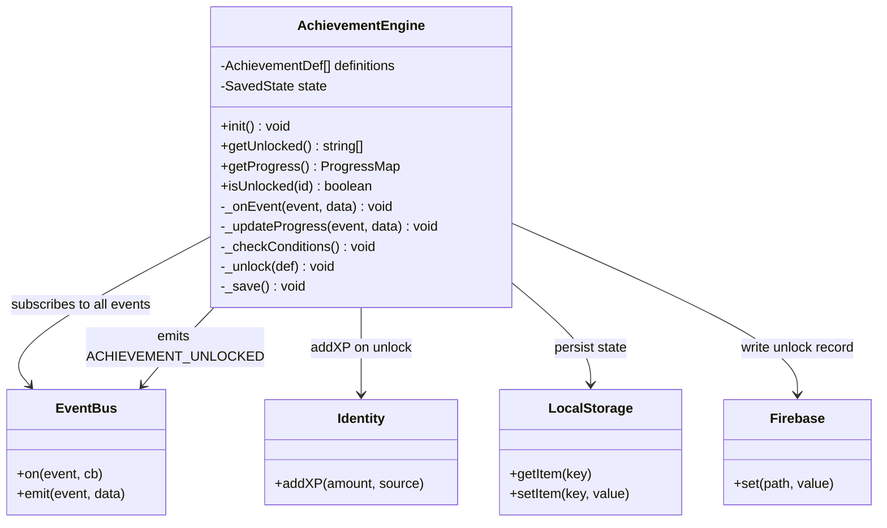
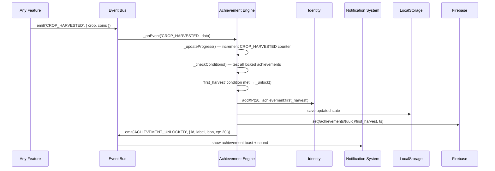
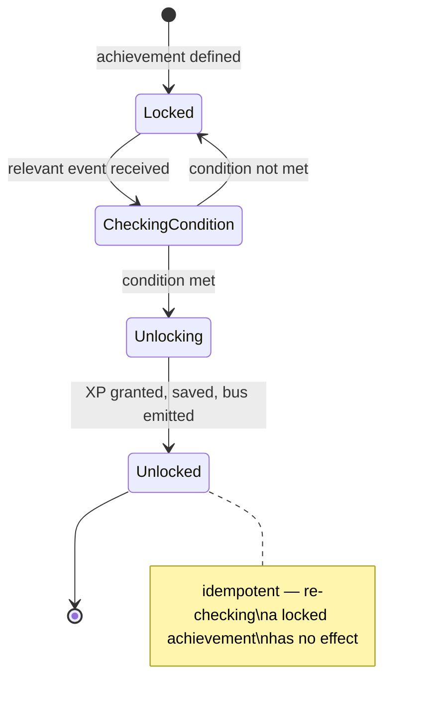

# System Design: Achievement Engine

## Purpose
Listen to the event bus, track cross-session progress toward unlock conditions, award
achievements and XP, and persist everything to localStorage and Firebase. Once it exists,
any feature can participate in the achievement system just by emitting events — no
achievement-specific code needed in the feature itself.

---

## Public API

```js
// src/systems/achievements.js

init()                              // subscribe to event bus, load saved state
getUnlocked()                       // → string[]  (achievement ids)
getProgress()                       // → ProgressMap
getDefinition(id)                   // → AchievementDef | undefined
getAllDefinitions()                  // → AchievementDef[]
isUnlocked(id)                      // → boolean
getCompletionPercent()              // → number  (0–100)
```

---

## Data shapes

```js
AchievementDef {
  id:          string,
  label:       string,          // "First Harvest"
  description: string,          // "Harvest your first crop"
  icon:        string,          // emoji or ASCII char
  xp:          number,          // XP awarded on unlock
  secret:      boolean,         // if true, hidden until unlocked
  condition:   (progress) => boolean,
}

ProgressMap {
  // keyed by event type, values are counters or flags
  CROP_HARVESTED:       number,
  GOLDEN_CROP:          number,
  CART_PLAYED:          number,
  COMMAND_RUN:          number,
  CHAT_MESSAGE:         number,
  GAME_OVER:            { [game]: number },   // games played per game
  HIGH_SCORE:           { [game]: boolean },  // ever achieved a high score
  APP_OPENED:           { [id]: number },     // open counts per app
  UPGRADE_PURCHASED:    number,
  VISITOR_ARRIVED:      number,               // total sessions (proxy)
  LEVEL_UP:             number,
}

// Stored in localStorage under: 'avos_achievements'
SavedState {
  unlocked:   string[],   // achievement ids
  progress:   ProgressMap,
}
```

---

## Achievement definitions (seed list)

| id | label | Condition | XP | Secret |
|----|-------|-----------|-----|--------|
| `first_command` | Shell Shock | Run 1 terminal command | 10 | No |
| `power_user` | Power User | Run 50 commands | 50 | No |
| `first_harvest` | Green Thumb | Harvest 1 crop | 20 | No |
| `century_harvest` | Centurion | Harvest 100 crops | 100 | No |
| `golden_touch` | Golden Touch | Harvest 1 golden crop | 150 | No |
| `survived_frost` | Cold Front | Survive a frost event | 75 | No |
| `max_plot` | Land Baron | Reach max plot size (6×6) | 200 | No |
| `first_cart` | Insert Coin | Play 1 PICO-8 cart | 20 | No |
| `cart_collector` | Collector | Play 25 different carts | 100 | No |
| `first_chat` | Social Pixel | Send 1 chat message | 25 | No |
| `chatterbox` | Chatterbox | Send 50 chat messages | 75 | No |
| `high_scorer` | High Scorer | Achieve a global high score in any game | 150 | No |
| `all_apps` | Explorer | Open every app at least once | 100 | No |
| `revival_surfer` | Surfer | Visit 10 sites in the web revival browser | 75 | No |
| `night_owl` | Night Owl | Use the OS between midnight and 4am | 50 | Yes |
| `found_secret` | Archaeologist | Find the `.secret` file | 100 | Yes |
| `konami` | ↑↑↓↓ | Enter the Konami code | 50 | Yes |
| `prestige` | Prestigious | Prestige the farming game once | 300 | No |
| `full_house` | Full House | Have every upgrade purchased simultaneously | 250 | No |
| `completionist` | Completionist | Unlock 90% of non-secret achievements | 500 | No |

---

## Diagrams

### Component relationships



### Unlock flow



### Progress tracking state machine



---

## Integration points

| Depends on | Reason |
|-----------|--------|
| Event bus | primary input — listens to all tracked event types |
| Identity system | `addXP()` on unlock |
| Firebase realtime | write unlock record for global leaderboard |

| Used by | Reason |
|---------|--------|
| Notification system | listens for `ACHIEVEMENT_UNLOCKED` to show toast |
| Profile window | displays badge grid |
| Leaderboard | total unlocks as a ranked metric |
| Farming game | some upgrades gated behind achievement count |
| Identity system | level-up check happens inside `addXP` which is called here |

---

## Implementation notes

- **Idempotent unlocks:** always check `isUnlocked(id)` before processing — the engine
  may receive the same event many times across sessions.
- **Condition evaluation:** iterate all *locked* definitions after every progress update.
  With ~20–30 definitions this is negligible. Don't over-optimize.
- **Secret achievements:** `getAllDefinitions()` returns them but without `description`
  if `secret: true` and not yet unlocked. The UI shows a `???` placeholder.
- **Progress counters:** stored as flat integers where possible for simplicity. Game
  scores and per-app opens use nested objects.
- **Init timing:** call `init()` once on app load, after the event bus is ready. All
  subscriptions happen here.
- **Offline:** achievements work entirely from localStorage. Firebase write is
  fire-and-forget — failure is silent and the achievement is still awarded locally.
