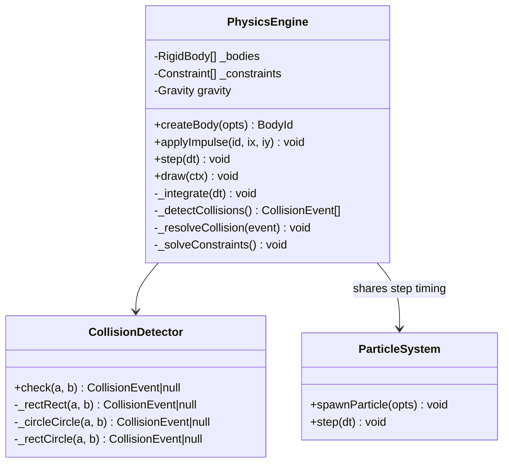
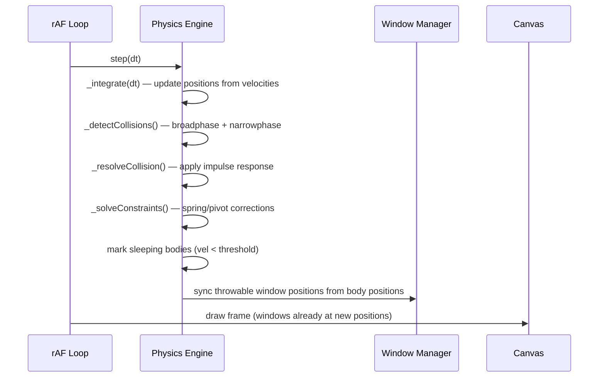
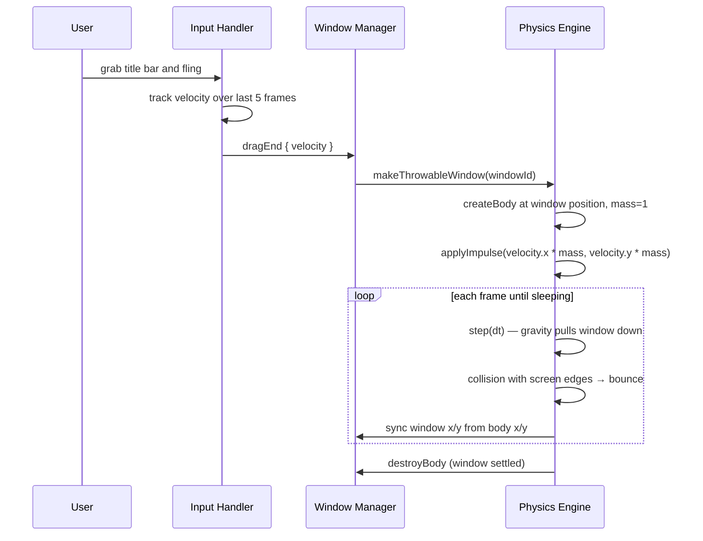

# System Design: Advanced Physics Engine

## Purpose
Extend the existing particle/spring system with rigid-body dynamics, collision
detection, and impulse resolution — enabling throwable windows with momentum,
destructible pixel art, fluid weather simulations, cloth banners, and a
physics-based platformer mini-game. Builds on top of the particle-physics
system rather than replacing it.

---

## Public API

```js
// src/systems/physics.js  (extends particle-physics)

// Bodies
createBody(opts)             // → BodyId
destroyBody(id)
getBody(id)                  // → RigidBody
getBodies()                  // → RigidBody[]

// Forces & impulses
applyForce(bodyId, fx, fy)
applyImpulse(bodyId, ix, iy)
setVelocity(bodyId, vx, vy)
setGravity(gx, gy)           // global gravity (default 0, 9.8)

// Collision
addCollider(bodyId, shape)   // 'rect' | 'circle' | 'polygon'
onCollision(handler)         // → { a, b, normal, depth }

// Constraints
addSpring(bodyIdA, bodyIdB, restLen, stiffness)
addPivot(bodyId, x, y)       // pin body to a world point
addRope(bodyIds[])           // chain of spring constraints

// Integration
step(dt)                     // advance simulation by dt ms (called from rAF)
draw(ctx)                    // optional debug overlay (draw bodies + colliders)

// Presets
makeThrowableWindow(windowId)   // attach window rect as physics body
makeCloth(x, y, cols, rows)     // grid of particles + springs
makeFluid(x, y, w, h)          // particle-based fluid region
```

---

## Data shapes

```js
RigidBody {
  id:         string,
  x:          number,          // centre x
  y:          number,          // centre y
  vx:         number,          // velocity x
  vy:         number,
  angle:      number,          // rotation radians
  angularVel: number,
  mass:       number,          // kg (1 = normal, 0 = static/immovable)
  restitution:number,          // bounciness 0–1
  friction:   number,          // 0–1
  collider:   ColliderShape,
  sleeping:   boolean,         // optimisation: skip step if at rest
}

ColliderShape =
  { type: 'rect',    w: number, h: number }
| { type: 'circle',  r: number }
| { type: 'polygon', vertices: Point[] }

CollisionEvent {
  a:       string,             // bodyId
  b:       string,
  normal:  { x, y },
  depth:   number,
  point:   { x, y },
}
```

---

## Diagrams

### Architecture



### Simulation loop



### Throwable window



### Collision resolution (impulse method)

```mermaid
flowchart TD
  A[detect overlap between A and B] --> B[compute contact normal]
  B --> C[compute relative velocity along normal]
  C --> D{moving toward each other?}
  D -- no --> E[skip, already separating]
  D -- yes --> F[compute impulse magnitude\nj = -(1+e) × vRel / (1/mA + 1/mB)]
  F --> G[apply +j to A along normal]
  F --> H[apply -j to B along normal]
  G --> I[positional correction to prevent sinking]
  H --> I
```

---

## Use cases

| Feature | Physics primitives used |
|---------|------------------------|
| Throwable windows | rigid body + bounce off screen edges |
| Window smash easter egg | body → multiple fragment bodies with spin |
| Cloth banner | grid of particles + spring constraints |
| Rain/water puddle | particle fluid simulation |
| Farming game ball | circle body + gravity |
| Platformer mini-game | character capsule + static terrain colliders |
| Pinball easter egg | circle body + flipper pivots |

---

## Integration points

| Depends on | Reason |
|-----------|--------|
| Particle/physics system | shares rAF timing, extends particle primitives |
| Window Manager | syncs throwable window positions |
| Event bus | emits COLLISION for achievement triggers |

| Used by | Reason |
|---------|--------|
| DesktopCanvas | step() and draw() called each frame |
| Window Manager | throwable window mode |
| Farming game | weather physics (rain, wind) |
| Arcade game engine | platformer and physics-based games |
| Screensaver | DVD bounce (simple case) |

---

## Implementation notes

- **Broadphase:** use a simple grid spatial hash for broadphase collision
  culling. At canvas resolution (640×360) with < 50 bodies, O(n²) is
  acceptable but the grid keeps it fast as scene complexity grows.
- **Fixed timestep:** always pass a fixed `dt` (16.67ms for 60fps) to
  `step()`. Accumulate real elapsed time and step multiple times if frames
  are slow. Cap at 3 substeps to avoid spiral of death.
- **Sleeping:** mark bodies as sleeping when `|v| < 0.1` for 60 consecutive
  frames. Sleeping bodies skip integration but still participate in
  collision detection.
- **Scope:** this is a 2D system only. No 3D physics. Canvas is pixel units.
- **Debug overlay:** `draw(ctx)` in dev mode renders collider outlines,
  velocity vectors, and sleeping indicators. Gate behind
  `process.env.NODE_ENV === 'development'`.
- **Integration with particle system:** particles use Verlet integration
  (existing). Rigid bodies use semi-implicit Euler. Run both in the same
  `step()` call for consistent timing.
