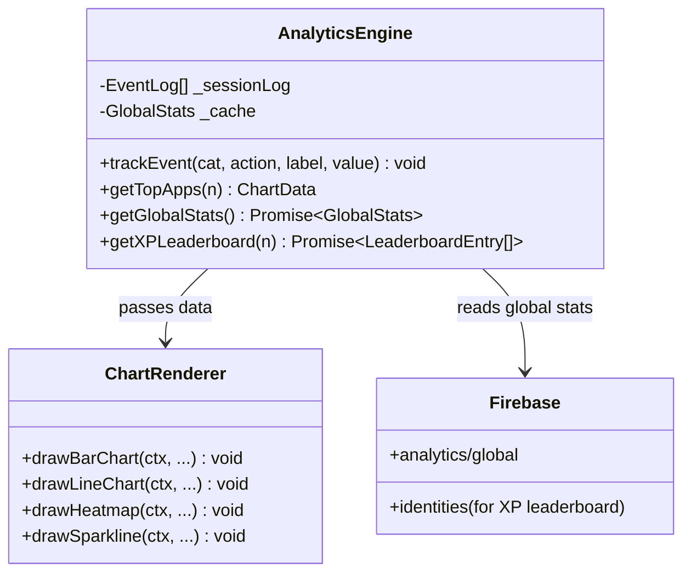
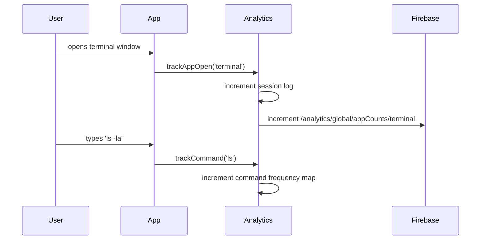
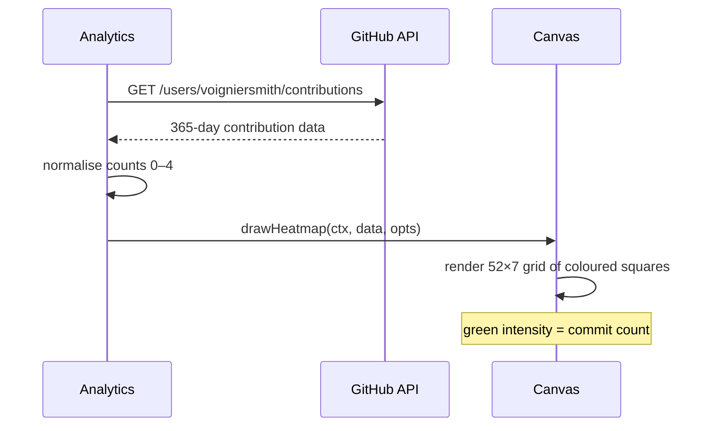

# System Design: Analytics & Visualisation Engine

## Purpose
Surface rich, live statistics about the OS and its visitors: which apps are
opened most, command frequency, global XP leaderboard, GitHub contribution
graph overlay, farming yield history, and real-time visitor count — all
rendered as pixel-art canvas charts inside a Stats/Analytics app window.

---

## Public API

```js
// src/systems/analytics.js

// Event tracking (write side)
trackEvent(category, action, label?, value?)  // log a user action
trackAppOpen(appId)
trackCommand(cmd)
trackPageView(path)

// Aggregates (read side)
getTopApps(limit?)           // → { appId, count }[]
getTopCommands(limit?)       // → { cmd, count }[]
getSessionStats()            // → SessionStats
getGlobalStats()             // → Promise<GlobalStats>  (from Firebase)
getXPLeaderboard(limit?)     // → Promise<LeaderboardEntry[]>

// Chart rendering
drawBarChart(ctx, x, y, w, h, data, opts?)
drawLineChart(ctx, x, y, w, h, series, opts?)
drawHeatmap(ctx, x, y, w, h, data, opts?)
drawSparkline(ctx, x, y, w, data)
```

---

## Data shapes

```js
SessionStats {
  startedAt:    number,
  duration:     number,        // ms
  commands:     number,        // total commands run
  appsOpened:   number,
  xpEarned:     number,
  gamesPlayed:  number,
}

GlobalStats {
  totalVisitors:  number,
  totalCommands:  number,
  totalXP:        number,
  onlineNow:      number,
  topApps:        { appId: string, count: number }[],
}

LeaderboardEntry {
  handle:   string,
  xp:       number,
  level:    number,
  rank:     number,
}

ChartData {
  labels:   string[],
  values:   number[],
  color?:   string,
}

ChartOptions {
  title?:   string,
  maxY?:    number,
  color?:   string,
  pixelFont?: boolean,
}
```

---

## Diagrams

### Architecture



### Stats window layout (canvas sketch)

```
┌──────────────── STATS ───────────────────┐
│  Visitors online: 3  │  Your level: 7    │
│                                          │
│  Top apps (this session)                 │
│  ████████████████ terminal  42           │
│  ████████████     ai        31           │
│  ████             browser   9            │
│                                          │
│  XP Leaderboard          Global commands │
│  1. pixel-fox  2847 XP   ░░░░░▓▓▓▓▓▓███│
│  2. neon-owl   1923 XP   [sparkline]    │
│  3. you        1450 XP                   │
└──────────────────────────────────────────┘
```

### Event tracking flow



### GitHub contribution heatmap



---

## Integration points

| Depends on | Reason |
|-----------|--------|
| Event bus | listens for all trackable events (APP_OPENED, COMMAND_RUN, etc.) |
| Firebase Realtime | global aggregates, XP leaderboard |
| Identity system | own XP/level for leaderboard position |

| Used by | Reason |
|---------|--------|
| Stats window | renders all charts |
| AI system | "what apps are most popular?" answers |
| Achievement engine | POWER_USER (100 commands), etc. |
| Admin/debug overlay | dev-mode stats |

---

## Implementation notes

- **Session-local tracking:** aggregate counts in memory for the current
  session. Flush to Firebase in a debounced batch every 30s and on
  `visibilitychange`.
- **Chart rendering:** all charts are drawn on the main canvas (no DOM
  charting library). Keep each renderer under 100 lines. Pixel-art aesthetic:
  no anti-aliasing, block fills, bitmap labels.
- **GitHub contributions:** GitHub's contribution graph is not a public API —
  scrape the SVG from `github.com/users/:login/contributions` via the CORS
  proxy, then parse the `data-count` attributes.
- **Privacy:** don't log PII. `trackEvent` should never receive passwords,
  messages, or personal data. Log app IDs, command names, and counts only.
- **Leaderboard cap:** display top 10. Fetch from Firebase `/identities`
  ordered by `xp` descending. Cache for 5 minutes.
- **Sparkline:** minimal 1px-per-point line chart. Used for "commands over
  time" in the stats window. 30-data-point resolution is plenty.
