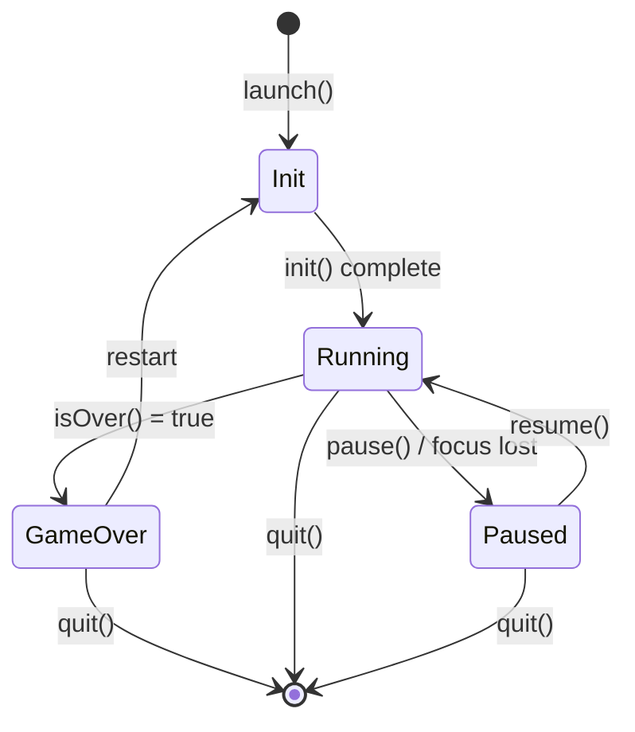
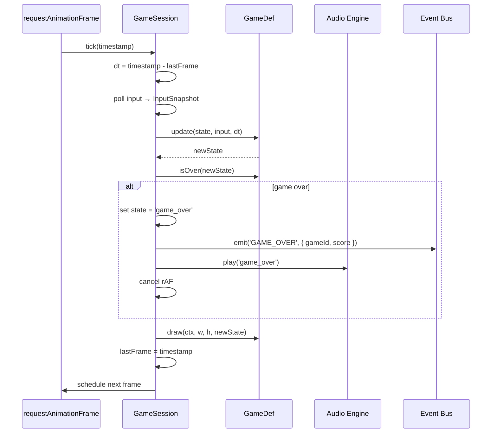
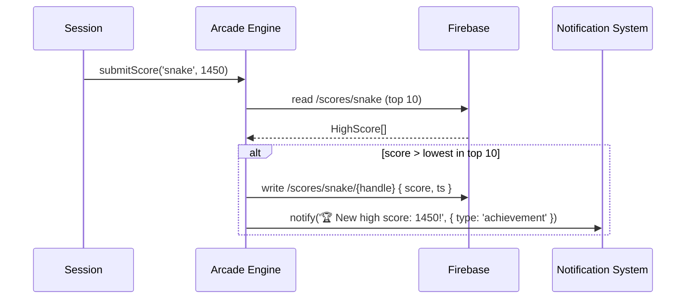

# System Design: Arcade Game Engine

## Purpose
A shared game loop and scaffolding for small canvas-rendered arcade games
(Snake, Tron, Breakout, Tic-Tac-Toe, Memory Match, and others). Each game
is a self-contained module that implements a thin `GameDef` interface; the
engine handles the rAF loop, input routing, pause/resume, high-score
persistence (Firebase), BGM handoff to the audio engine, and achievement
hooks. New games can be added by registering a `GameDef` with no changes
to the engine itself.

---

## Public API

```js
// src/systems/arcade.js

// Game registry
registerGame(def)            // register a GameDef
getGames()                   // → GameDef[]
getGame(id)                  // → GameDef | null

// Session control
launch(gameId, canvas, opts?)  // start a game session → GameSession
  // opts: { difficulty?, seed? }

// GameSession (returned by launch)
session.pause()
session.resume()
session.quit()
session.getScore()           // → number
session.getState()           // → 'running' | 'paused' | 'game_over'

// High scores
getHighScores(gameId)        // → HighScore[]   (top 10, from Firebase)
submitScore(gameId, score)   // → Promise<void>

// Arcade cabinet window
openArcade()                 // open game-picker window
```

---

## Data shapes

```js
GameDef {
  id:         string,          // 'snake', 'tron', 'breakout', ...
  name:       string,
  description:string,
  icon:       string,          // emoji
  bgmId?:     string,          // audio engine sound id for BGM
  inputMode:  'keyboard' | 'gamepad' | 'touch' | 'mouse',

  // Lifecycle hooks — implemented by each game module
  init(ctx, w, h, opts): GameState,
  update(state, input, dt): GameState,
  draw(ctx, w, h, state): void,
  isOver(state): boolean,
  getScore(state): number,
}

GameState {
  // opaque — each game defines its own shape
  // engine only reads: score (via getScore), isOver (via isOver)
}

InputSnapshot {
  keys:       Set<string>,     // currently held keys
  justPressed:Set<string>,     // pressed this frame
  justReleased:Set<string>,
  pointer:    { x, y, down },
  gamepad?:   GamepadSnapshot,
}

HighScore {
  handle:   string,
  score:    number,
  ts:       number,
}
```

---

## Diagrams

### Architecture

```mermaid
classDiagram
  class ArcadeEngine {
    -Map~string,GameDef~ _registry
    -GameSession _active
    +registerGame(def) void
    +launch(id, canvas, opts) GameSession
    +getHighScores(id) HighScore[]
    +submitScore(id, score) Promise
  }

  class GameSession {
    -GameDef _def
    -GameState _state
    -number _raf
    -InputSnapshot _input
    +pause() void
    +resume() void
    +quit() void
    +getScore() number
    -_tick(dt) void
    -_draw() void
  }

  class GameDef {
    +init(ctx, w, h, opts) GameState
    +update(state, input, dt) GameState
    +draw(ctx, w, h, state) void
    +isOver(state) boolean
    +getScore(state) number
  }

  class Firebase {
    +scores/{gameId}/{uid}
  }

  ArcadeEngine "1" *-- "0..*" GameDef
  ArcadeEngine --> GameSession : creates
  ArcadeEngine --> Firebase : high scores
  GameSession --> GameDef : calls hooks
```

### Game session lifecycle



### Per-frame loop



### High-score submission



---

## Game catalogue

| id | name | input | description |
|----|------|-------|-------------|
| snake | Snake | keyboard | classic grow-and-eat |
| tron | Tron | keyboard | light cycles |
| breakout | Breakout | mouse/touch | paddle + bricks |
| tictactoe | Tic-Tac-Toe | mouse/touch | vs AI or player 2 |
| memory | Memory Match | mouse/touch | flip-card pairs |
| pong | Pong | keyboard | two-player or AI |
| tetris | Tetris | keyboard | falling blocks |
| asteroids | Asteroids | keyboard | shoot rocks |

---

## Integration points

| Depends on | Reason |
|-----------|--------|
| Audio engine | BGM crossfade on launch, game_start/game_over SFX |
| Event bus | GAME_START, GAME_OVER, HIGH_SCORE events |
| Firebase Realtime | high-score leaderboard per game |
| Gesture/Input handler | routes keyboard/gamepad/touch to InputSnapshot |
| Achievement engine | FIRST_WIN, HIGH_SCORE_SNAKE, etc. |
| Window Manager | arcade window open/close |

| Used by | Reason |
|---------|--------|
| Arcade cabinet window | game picker + canvas host |
| Terminal | `./snake` VFS executable launches via openArcade() |
| Achievement engine | listens for GAME_OVER with score thresholds |

---

## Implementation notes

- **Fixed timestep:** pass a capped `dt` (max 100ms) to `update()` so
  pausing the tab for a minute doesn't cause a physics explosion on resume.
- **Canvas isolation:** each game gets its own `<canvas>` inside the arcade
  window — don't share the main desktop canvas.
- **Input isolation:** when a game session is `Running`, the arcade window
  captures keyboard events (`stopPropagation`) so global shortcuts don't fire.
- **GameDef is pure:** `update()` must be a pure function (state in → state out).
  Side effects (sounds, events) happen in the session wrapper, not in the game.
- **Save on quit:** persist the score and last game state to localStorage for
  "continue" functionality on games that support it (Tetris, Breakout).
- **Difficulty:** pass `opts.difficulty` ('easy'|'normal'|'hard') to `init()`.
  Games can use this to scale AI speed, ball speed, etc.
