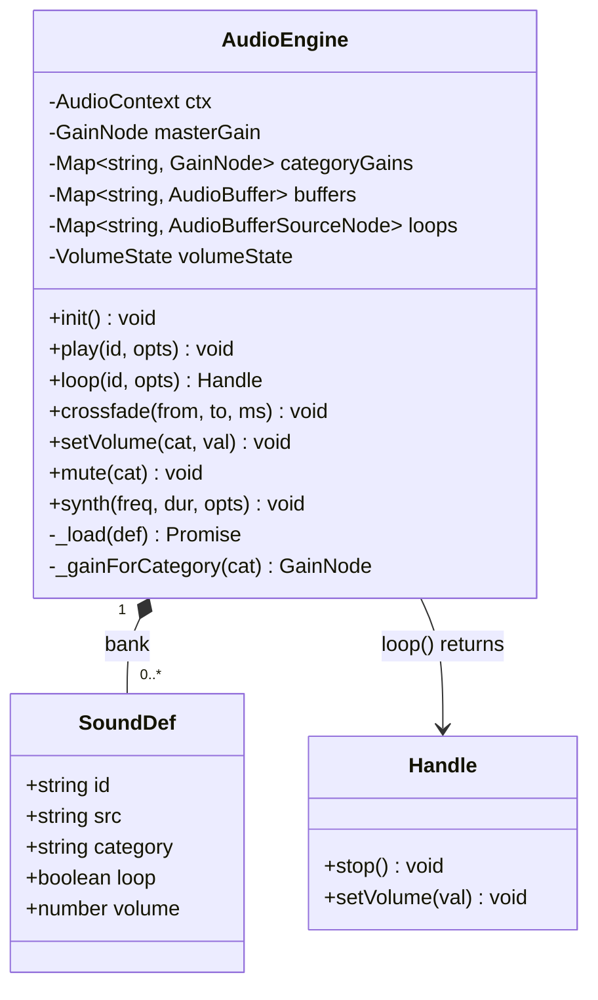
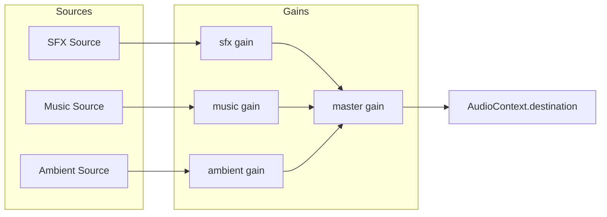
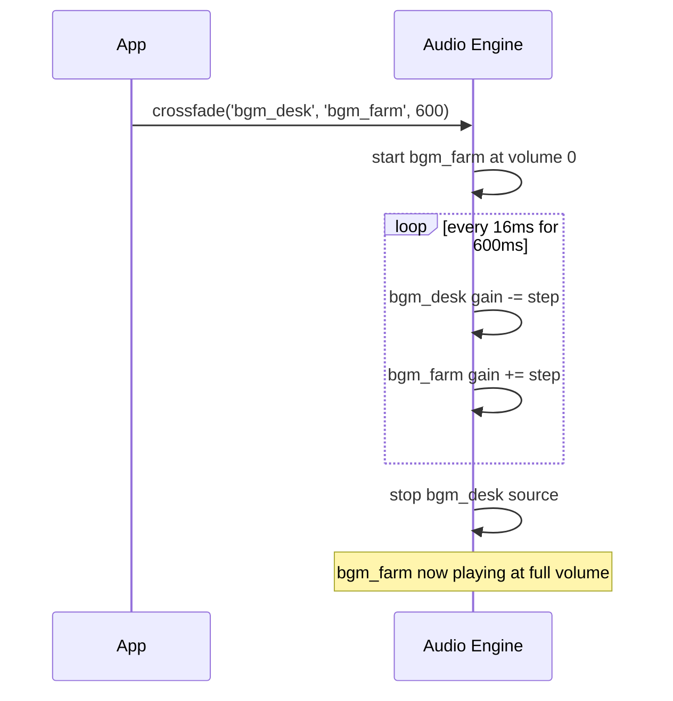
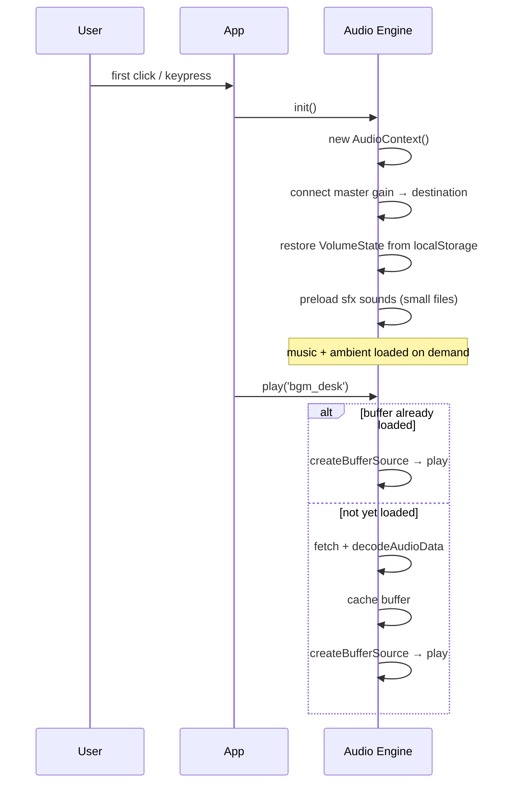

# System Design: Audio Engine

## Purpose
Extend the current 5-beep Web Audio API system into a full audio engine supporting:
a sound bank (loaded audio files), a BGM loop layer with crossfade, per-category
volume control, and mute-by-category. The existing `sounds.js` synth beeps become
the "SFX" category; new categories are Music and Ambient.

---

## Public API

```js
// src/systems/audio.js

// Playback
play(id, options?)            // play a sound from the bank once
loop(id, options?)            // play a sound looping; returns { stop(), setVolume() }
stopAll(category?)            // stop all sounds (or all in a category)
crossfade(fromId, toId, ms)   // crossfade between two looping tracks

// Volume
setVolume(category, 0–1)     // 'sfx' | 'music' | 'ambient' | 'master'
getVolume(category)           // → number
mute(category?)               // mute a category (or all)
unmute(category?)
isMuted(category?)            // → boolean

// Synth (preserves existing behaviour)
synth(frequency, duration, options?)   // play a programmatic tone

// Lifecycle
init()                        // create AudioContext on first user gesture
suspend()                     // pause everything (page hidden)
resume()                      // resume (page visible)
```

---

## Data shapes

```js
SoundDef {
  id:        string,
  src:       string,           // path in public/audio/
  category:  'sfx' | 'music' | 'ambient',
  loop?:     boolean,
  volume?:   number,           // default gain (0–1)
}

PlayOptions {
  volume?:   number,           // override default gain
  pitch?:    number,           // playbackRate multiplier; default 1.0
  pan?:      number,           // stereo pan −1 to +1; default 0
  fadeIn?:   number,           // ms fade-in; default 0
  onEnd?:    () => void,
}

VolumeState {
  master:   number,    // multiplied with all categories
  sfx:      number,
  music:    number,
  ambient:  number,
  muted: {
    master: boolean,
    sfx:    boolean,
    music:  boolean,
    ambient:boolean,
  }
}
```

---

## Sound bank (seed list)

| id | category | description |
|----|----------|-------------|
| `open` | sfx | window open (existing synth) |
| `close` | sfx | window close (existing synth) |
| `focus` | sfx | window focus click (existing synth) |
| `minimize` | sfx | minimize to taskbar (existing synth) |
| `error` | sfx | error beep (existing synth) |
| `achievement` | sfx | achievement unlock fanfare |
| `levelup` | sfx | level-up jingle |
| `coin` | sfx | farming coin pickup |
| `harvest` | sfx | crop harvest |
| `plant` | sfx | seed planted |
| `notification` | sfx | chat message or badge |
| `boot` | sfx | OS boot complete sound |
| `typing` | sfx | terminal keypress tick |
| `game_start` | sfx | arcade game start |
| `game_over` | sfx | arcade game over |
| `bgm_desk` | music | main desktop ambient chiptune loop |
| `bgm_farm` | music | farming game background track |
| `bgm_arcade` | music | arcade cabinet music |
| `bgm_browser` | music | web revival browser chill track |
| `rain` | ambient | rain ambience (farming weather event) |
| `wind` | ambient | wind ambience |
| `night` | ambient | night cricket ambient |

---

## Diagrams

### Architecture



### Audio signal chain



### BGM crossfade



### Init & lazy loading



---

## Integration points

| Depends on | Reason |
|-----------|--------|
| Event bus | listens for `ACHIEVEMENT_UNLOCKED` → play fanfare, `CROP_HARVESTED` → play coin, `CHAT_MESSAGE` → play notification |
| localStorage | persist VolumeState across sessions |

| Used by | Reason |
|---------|--------|
| All apps | `play('open')`, `play('close')` etc. on any interaction |
| Farming game | harvest, plant, weather sounds + BGM |
| Arcade games | game_start, game_over, BGM |
| Achievement engine | fanfare + level-up jingle |
| Chat room | notification on new message |
| System preferences | volume sliders write to `setVolume()` |
| Music player app | drives playback directly |

---

## Implementation notes

- **AudioContext unlock:** browsers require a user gesture before creating an
  AudioContext. `init()` should be called on the first click or keydown. Guard every
  `play()` call with `if (!ctx) return` — never error if audio hasn't been initialized.
- **Synth preservation:** the existing `sounds.js` synth beeps should be migrated into
  `synth()` calls so the original behaviour is unchanged. No regression.
- **File format:** use `.ogg` as primary (smaller, better browser support for games).
  Fall back to `.mp3`. Keep all audio files in `public/audio/` so they're served
  statically and cacheable by the service worker.
- **Preloading strategy:** eagerly preload `sfx` category (small files, used frequently).
  Lazy-load `music` and `ambient` on first `loop()` call to keep initial load fast.
- **Volume persistence:** save `VolumeState` to localStorage under `'avos_audio'`.
  Restore on `init()`.
- **Mobile:** the Web Audio API works on mobile but requires careful gesture handling.
  On mobile, trigger `init()` on the first `touchstart` event.
