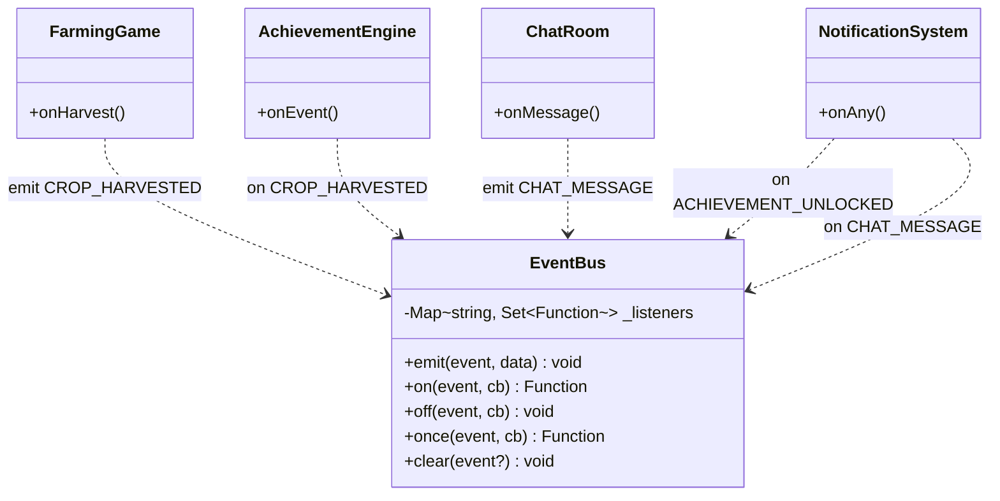
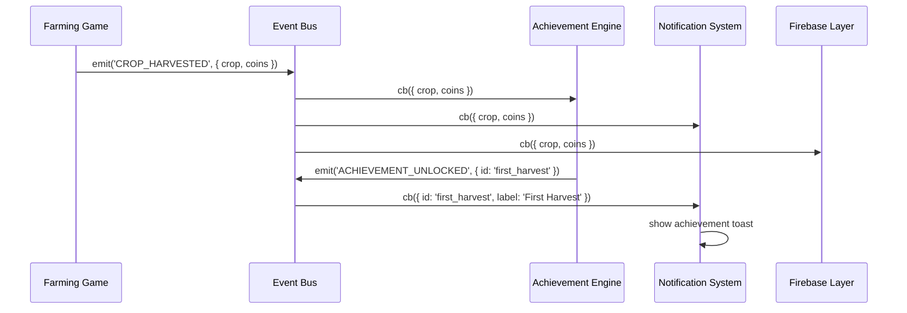
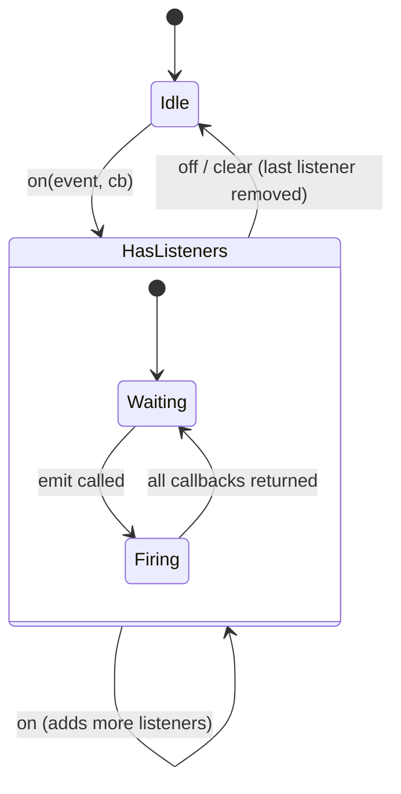

# System Design: Event Bus

## Purpose
A global pub/sub module that lets any part of the OS emit named events and any other
part react to them — without the two sides knowing about each other. The glue that
makes the achievement engine, notification badges, farming game, and chat room
composable rather than tightly coupled.

---

## Public API

```js
// src/systems/eventBus.js

emit(event, data)           // fire an event; all listeners called synchronously
on(event, callback)         // subscribe; returns unsubscribe function
off(event, callback)        // unsubscribe explicitly
once(event, callback)       // subscribe for one firing only
clear(event?)               // remove all listeners for event (or all events if omitted)
```

---

## Event catalog

```js
// Identity
'VISITOR_ARRIVED'       { handle, uuid }
'XP_GAINED'             { amount, source, total }
'LEVEL_UP'              { newLevel, oldLevel }
'IDENTITY_UPDATED'      { field, value }

// Achievements
'ACHIEVEMENT_UNLOCKED'  { id, label, icon, xp }

// Apps
'APP_OPENED'            { id }
'APP_CLOSED'            { id }

// Terminal
'COMMAND_RUN'           { cmd, raw }

// Farming game
'CROP_PLANTED'          { crop, tile }
'CROP_HARVESTED'        { crop, coins, golden }
'UPGRADE_PURCHASED'     { upgradeId, cost }
'PEST_EVENT'            { tile }
'WEATHER_EVENT'         { type }      // 'rain' | 'drought' | 'frost'
'FARM_LEVEL_UP'         { newLevel }

// P-Explorer
'CART_PLAYED'           { pid, title }
'CART_FAVORITED'        { pid, title }

// Chat
'CHAT_MESSAGE'          { uuid, handle, text, timestamp }
'CHAT_REACTION'         { messageId, emoji, uuid }

// Games
'GAME_STARTED'          { game }
'GAME_OVER'             { game, score }
'HIGH_SCORE'            { game, score }

// Social
'GHOST_CURSOR_MOVED'    { uuid, x, y }
'VISITOR_LEFT'          { uuid }

// System
'THEME_CHANGED'         { theme }
'MUTE_TOGGLED'          { muted }
'NOTIFICATION'          { type, message, icon }  // internal toast trigger
```

---

## Diagrams

### Module structure



### Emit flow



### Lifecycle



---

## Integration points

| Depends on | Reason |
|-----------|--------|
| Nothing | pure in-memory module |

| Used by | Reason |
|---------|--------|
| Every system | central communication channel |
| Achievement engine | primary input |
| Notification system | listens for toast-worthy events |
| Firebase realtime layer | listens for events to sync globally |
| Farming game | primary emitter |
| Chat room | emits/listens for messages |
| Identity system | emits XP_GAINED, LEVEL_UP |

---

## Implementation notes

- **Synchronous dispatch** — listeners are called in subscription order, synchronously.
  This keeps timing predictable within the RAF loop. If a listener needs to do async
  work (Firebase write), it should kick off the async operation and return immediately.
- **No event queuing** — events fired before any listeners are registered are lost.
  Systems that care (achievement engine) should subscribe at module init time.
- **Error isolation** — wrap each listener call in try/catch so one bad listener
  doesn't break the others.
- **`once` implementation** — wraps the callback in a function that calls `off` on
  itself before invoking the original callback.
- **Memory leaks** — the `on()` return value is an unsubscribe function. Any component
  that registers listeners on mount should call unsubscribe on unmount (or use `clear`).
- **No wildcards for now** — keep it simple. If wildcard matching is needed later,
  add a `onAny(cb)` convenience method rather than regex matching.

```js
// Full implementation is ~35 lines
const _listeners = new Map();

export function on(event, cb) {
  if (!_listeners.has(event)) _listeners.set(event, new Set());
  _listeners.get(event).add(cb);
  return () => off(event, cb);
}

export function off(event, cb) {
  _listeners.get(event)?.delete(cb);
}

export function emit(event, data) {
  for (const cb of _listeners.get(event) ?? []) {
    try { cb(data); } catch (e) { console.error(`EventBus [${event}]`, e); }
  }
}

export function once(event, cb) {
  const unsub = on(event, (data) => { unsub(); cb(data); });
  return unsub;
}

export function clear(event) {
  event ? _listeners.delete(event) : _listeners.clear();
}
```
