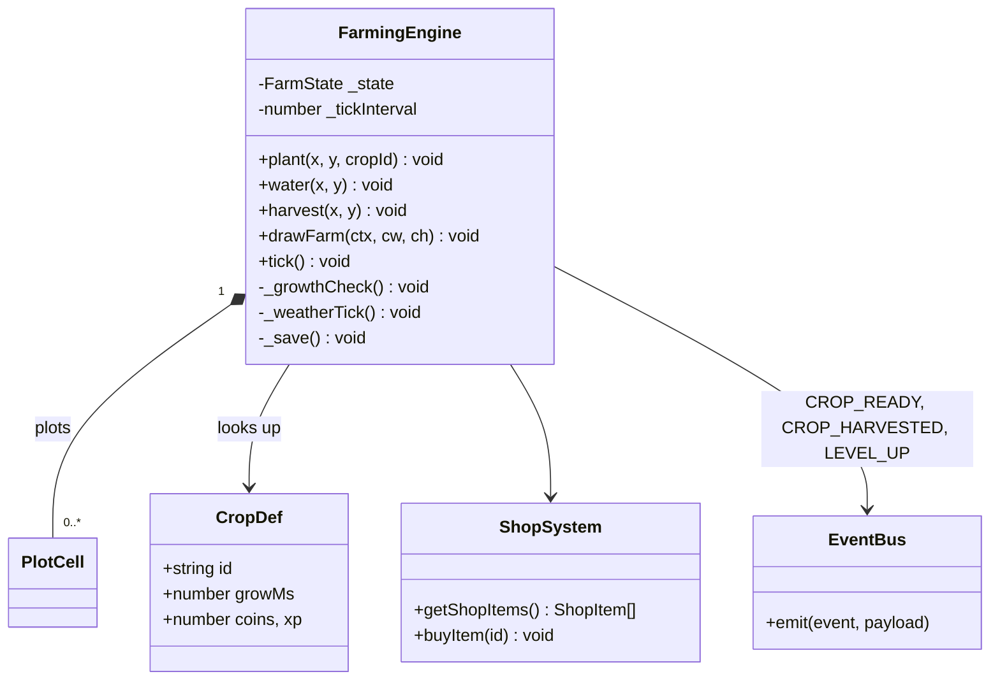
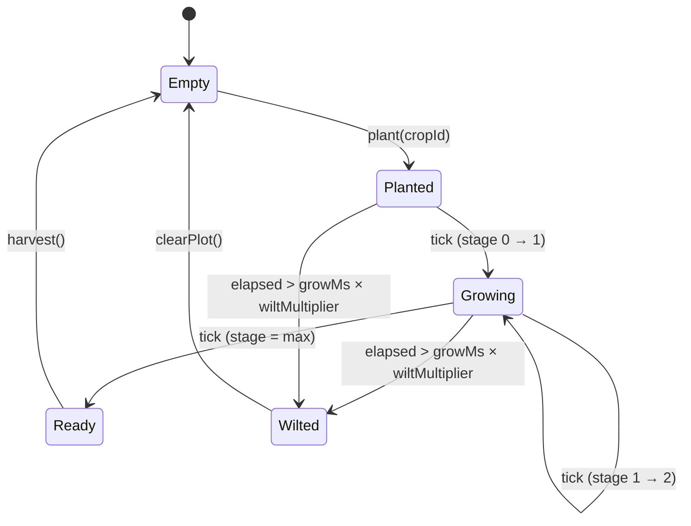
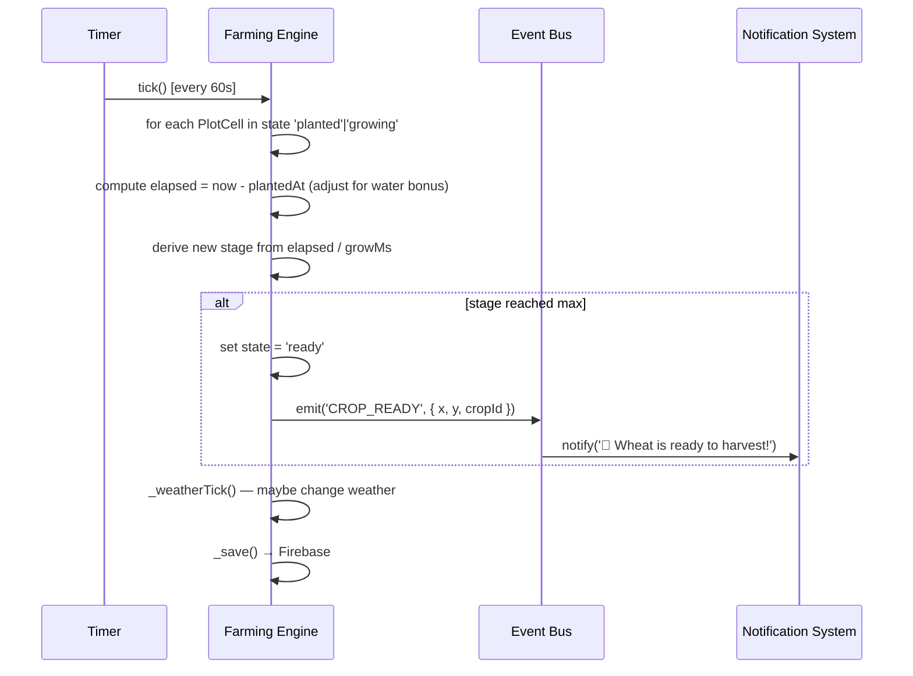
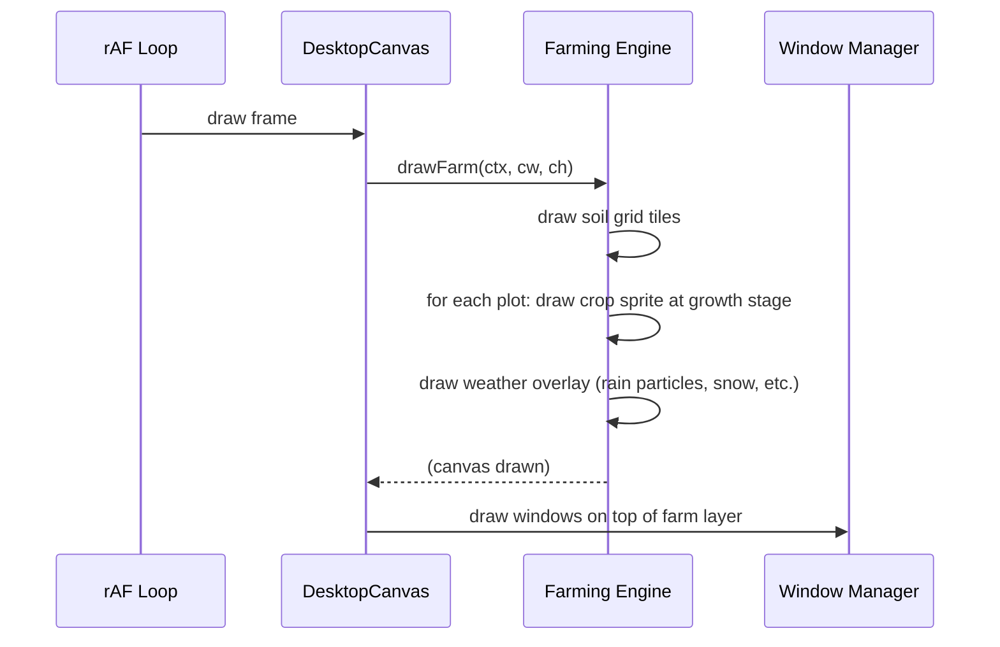
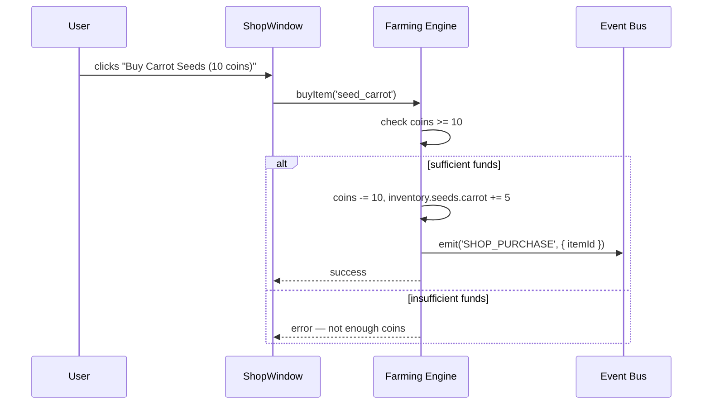

# System Design: Farming Game Engine

## Purpose
A persistent desktop-overlay farming game. Players plant crops in a grid that
lives directly on the desktop background — windows sit on top of it. Crops grow
in real-world time, are harvested for coins and XP, and the farm state is saved
to Firebase so progress persists across devices and sessions. Seasons, weather,
and an upgrades shop provide long-term progression.

---

## Public API

```js
// src/systems/farming.js

// Farm state
getFarmState()               // → FarmState
getPlot(x, y)               // → PlotCell | null
getInventory()              // → Inventory

// Actions
plant(x, y, cropId)         // plant a seed in an empty cell
water(x, y)                 // water a planted cell (speeds growth)
harvest(x, y)               // harvest a ready crop → coins + XP
clearPlot(x, y)             // remove wilted/empty plot

// Shop
getShopItems()              // → ShopItem[]
buyItem(itemId)             // spend coins, unlock upgrade or seed

// Progression
getLevel()                  // → number
getCoins()                  // → number
getSeason()                 // → 'spring' | 'summer' | 'autumn' | 'winter'
getWeather()                // → WeatherState

// Rendering hook
drawFarm(ctx, cw, ch)       // called from rAF loop before windows are drawn
```

---

## Data shapes

```js
FarmState {
  plots:      PlotCell[][],    // FARM_W × FARM_H grid
  coins:      number,
  xp:         number,
  level:      number,
  season:     string,
  weather:    WeatherState,
  upgrades:   string[],        // purchased upgrade ids
  lastSaved:  number,          // Unix ms
}

PlotCell {
  x:          number,
  y:          number,
  state:      'empty' | 'planted' | 'growing' | 'ready' | 'wilted',
  cropId:     string | null,
  plantedAt:  number,          // Unix ms
  wateredAt:  number | null,
  stage:      0 | 1 | 2 | 3,  // growth stage (maps to sprite frame)
}

CropDef {
  id:         string,          // 'wheat', 'carrot', 'pumpkin', ...
  name:       string,
  growMs:     number,          // base grow time in ms
  coins:      number,          // harvest reward
  xp:         number,
  stages:     number,          // sprite frames (usually 3)
  season?:    string,          // only growable in this season
}

WeatherState {
  type:       'sunny' | 'cloudy' | 'rain' | 'storm' | 'snow',
  until:      number,          // Unix ms when weather changes
}

ShopItem {
  id:         string,
  name:       string,
  description:string,
  cost:       number,          // coins
  type:       'seed' | 'upgrade' | 'cosmetic',
}

Inventory {
  seeds:      { [cropId]: number },
  tools:      string[],
}
```

---

## Diagrams

### Component overview



### Growth state machine (per plot)



### Tick cycle



### Desktop overlay rendering



### Shop flow



---

## Crop catalogue (seed list)

| id | name | grow time | coins | XP | season |
|----|------|-----------|-------|----|--------|
| wheat | Wheat | 5 min | 5 | 10 | any |
| carrot | Carrot | 10 min | 8 | 15 | spring |
| tomato | Tomato | 20 min | 15 | 25 | summer |
| pumpkin | Pumpkin | 60 min | 40 | 60 | autumn |
| snowdrop | Snowdrop | 15 min | 12 | 20 | winter |
| sunflower | Sunflower | 30 min | 25 | 35 | summer |
| mushroom | Mushroom | 45 min | 35 | 50 | any |
| crystal | Crystal Shard | 120 min | 100 | 150 | any |

---

## Integration points

| Depends on | Reason |
|-----------|--------|
| Firebase Realtime | persist farm state across sessions/devices |
| Event bus | emits CROP_READY, CROP_HARVESTED, LEVEL_UP, WEATHER_CHANGED |
| Audio engine | harvest, plant, coin, rain sounds |
| Particle physics | harvest burst, rain particles, snow overlay |
| Notification system | crop-ready toasts + badge |
| Achievement engine | FIRST_HARVEST, MASTER_FARMER conditions |
| Virtual filesystem | generates /home/guest/farm.log content |

| Used by | Reason |
|---------|--------|
| DesktopCanvas | calls drawFarm() each frame as background layer |
| Shop window | reads/buys items |
| VFS | farm.log content function calls getFarmState() |
| AI system | farm state injected into context for "how's my farm?" |

---

## Implementation notes

- **Real-time growth:** use `Date.now()` for all growth calculations — never
  frame-count-based. Crops grow while the tab is closed.
- **Tick interval:** run `tick()` every 60 seconds via `setInterval`. On page
  load, immediately run a catch-up tick to process growth that happened offline.
- **Water bonus:** watered crops grow 2× faster. Store `wateredAt` and apply
  `elapsed * 2` in growth formula until the bonus expires (e.g. 30 min).
- **Grid size:** start 8×5 (40 plots). Expand via upgrades ("clear north field"
  → 8×8, etc.). Grid is anchored to the bottom-left of the canvas, below the
  taskbar.
- **Pixel art sprites:** 8×8 per tile, rendered with `imageSmoothingEnabled = false`.
  Each crop has 3–4 growth stage frames. Store as a sprite sheet in `public/img/farm/`.
- **Wilt mechanic:** if a ready crop isn't harvested within `growMs × 3`, it
  wilts and yields nothing. Adds urgency without being punishing.
- **Weather effects:** rain speeds all growth by 1.5×. Storm wilts vulnerable
  crops. Snow blocks non-winter crops. Weather changes every 10–60 min (random).
- **Save strategy:** debounce Firebase saves with a 5s delay after any mutation.
  On page unload, do a synchronous `set()` as a best-effort final save.
