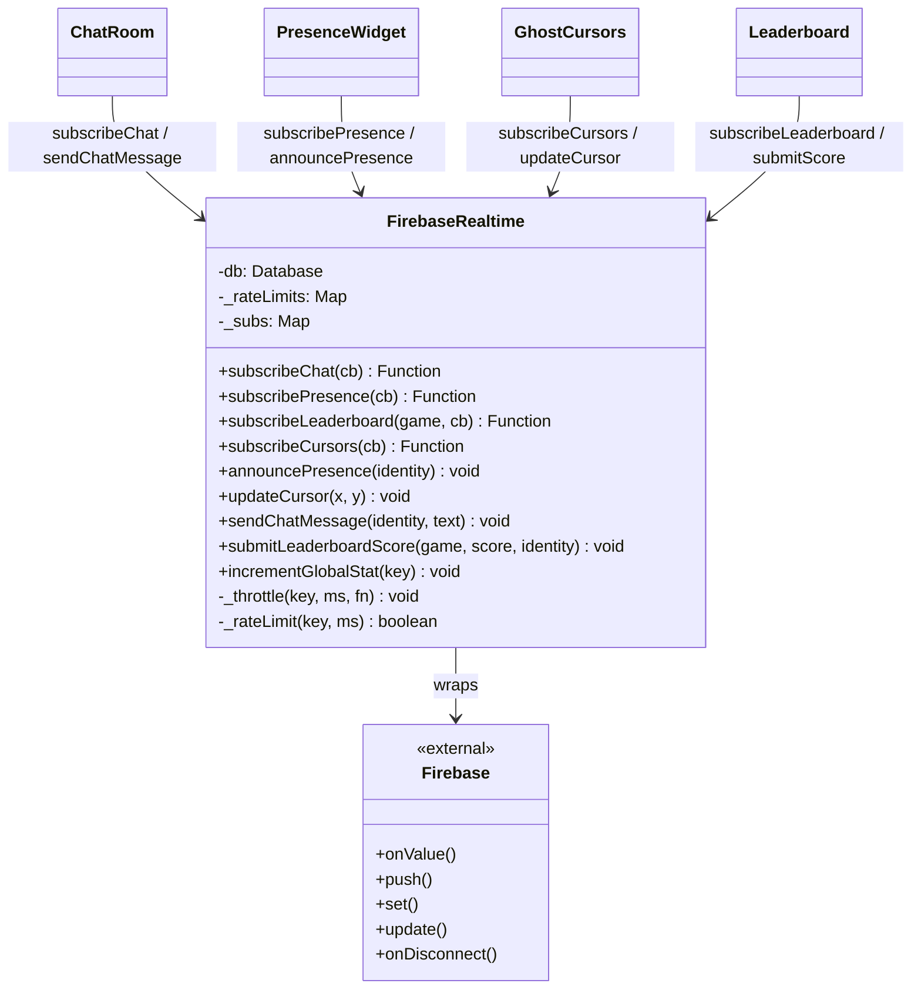
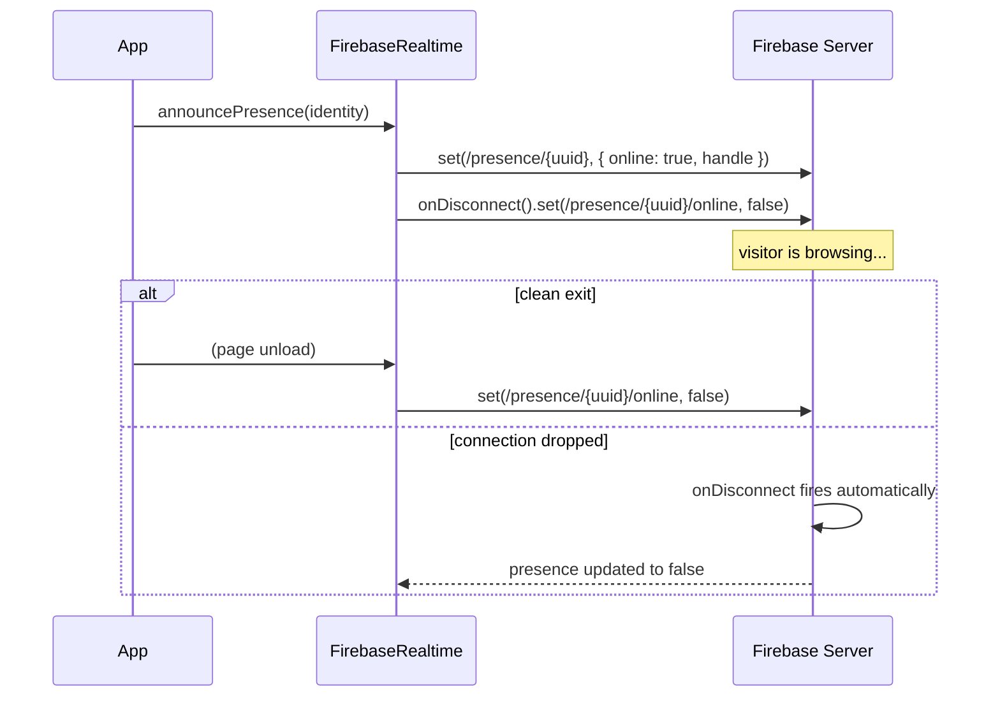
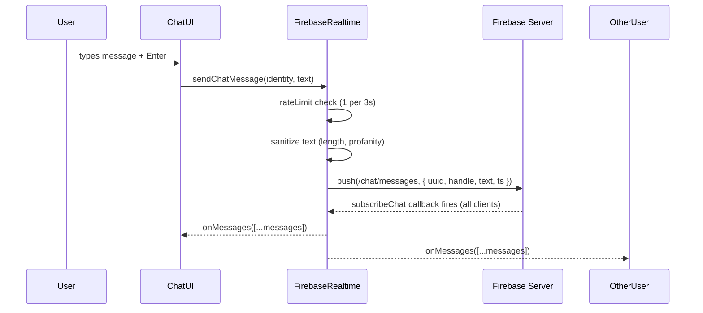
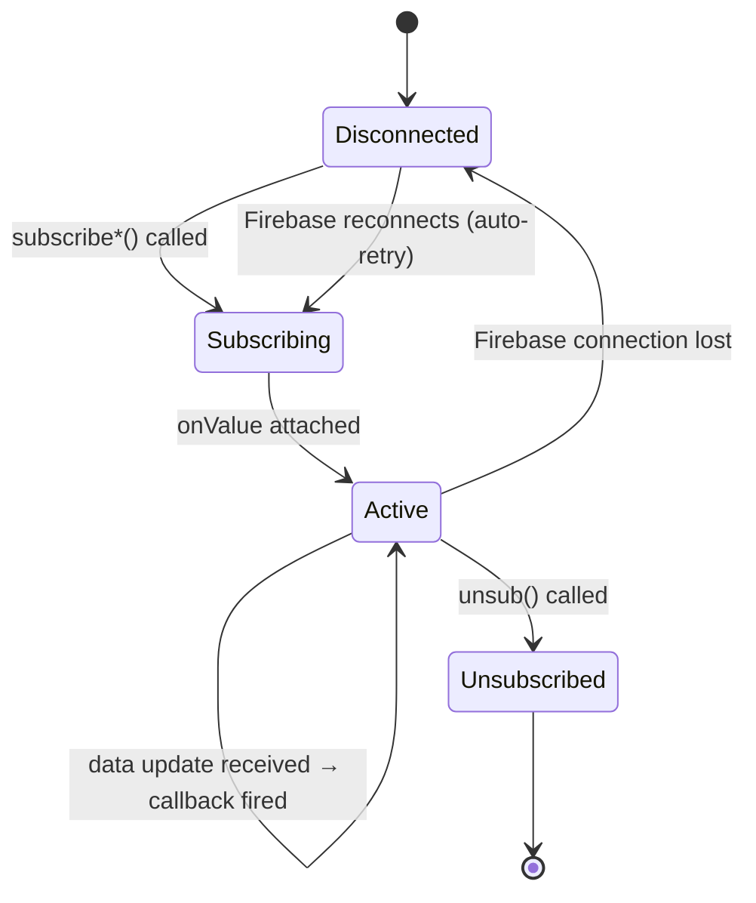

# System Design: Firebase Realtime Layer

## Purpose
Wrap Firebase Realtime Database's `onValue`, `push`, `set`, and `update` in a clean
module that handles connection state, subscription cleanup, rate-limiting, and graceful
offline fallback. The rest of the app never imports Firebase directly — only this module
does.

---

## Public API

```js
// src/systems/firebaseRealtime.js

// Subscriptions (return unsubscribe function)
subscribePresence(onUpdate)               // → unsub: who is currently online
subscribeChat(onMessages)                 // → unsub: last 100 chat messages
subscribeLeaderboard(game, onUpdate)      // → unsub: top-10 scores for a game
subscribeCursors(onUpdate)                // → unsub: all active cursor positions
subscribeGuestbook(onUpdate)              // → unsub: guestbook entries
subscribeVisitorWall(onUpdate)            // → unsub: recent visitor records

// Writes
announcePresence(identity)               // register as online; auto-disconnects on close
updateCursor(x, y)                       // throttled to 1 write / 100ms
sendChatMessage(identity, text)          // rate-limited to 1 msg / 3s
addReaction(messageId, emoji, uuid)
submitGuestbookEntry(identity, note)
submitLeaderboardScore(game, score, identity)
incrementGlobalStat(key)                 // e.g. 'totalCropsHarvested'
```

---

## Database schema

```
/
├── identity/
│   └── {uuid}/
│       ├── handle        string
│       ├── avatarIdx     number
│       ├── createdAt     string
│       ├── lastSeenAt    string
│       └── level         number
│
├── presence/
│   └── {uuid}/
│       ├── handle        string
│       ├── online        boolean   ← set to false via onDisconnect()
│       └── lastSeen      string
│
├── chat/
│   ├── messages/
│   │   └── {pushId}/
│   │       ├── uuid      string
│   │       ├── handle    string
│   │       ├── avatarIdx number
│   │       ├── text      string
│   │       └── ts        number    ← Unix ms timestamp
│   └── reactions/
│       └── {messageId}/
│           └── {emoji}   number    ← count
│
├── cursors/
│   └── {uuid}/
│       ├── x             number    ← logical canvas coords
│       └── y             number
│
├── leaderboards/
│   └── {game}/
│       └── {pushId}/
│           ├── uuid      string
│           ├── handle    string
│           ├── score     number
│           └── ts        number
│
├── guestbook/
│   └── {pushId}/
│       ├── uuid          string
│       ├── handle        string
│       ├── avatarIdx     number
│       ├── note          string    ← max 140 chars
│       └── ts            number
│
├── visitors/
│   └── {pushId}/
│       ├── uuid          string
│       ├── handle        string
│       └── ts            number
│
└── stats/
    ├── totalPageLoads          number  ← already exists
    ├── totalCommands           number  ← already exists
    ├── totalCropsHarvested     number
    ├── totalCartsPlayed        number
    ├── totalChatMessages       number
    └── commands/
        └── {cmd}               number  ← already exists
```

---

## Diagrams

### Module architecture



### Presence lifecycle



### Chat message flow



### Subscription management



---

## Security rules (Firebase)

```json
{
  "rules": {
    "identity": {
      "$uuid": {
        ".read": true,
        ".write": "auth == null"
      }
    },
    "presence": {
      ".read": true,
      "$uuid": { ".write": true }
    },
    "chat": {
      "messages": {
        ".read": true,
        ".write": true,
        ".indexOn": ["ts"]
      },
      "reactions": {
        ".read": true,
        ".write": true
      }
    },
    "cursors": {
      ".read": true,
      "$uuid": { ".write": true }
    },
    "leaderboards": {
      ".read": true,
      ".write": true,
      "$game": { ".indexOn": ["score"] }
    },
    "guestbook": {
      ".read": true,
      ".write": true
    },
    "visitors": {
      ".read": true,
      ".write": true
    },
    "stats": {
      ".read": true,
      ".write": true
    }
  }
}
```

---

## Integration points

| Depends on | Reason |
|-----------|--------|
| Identity system | uuid + handle needed for all writes |
| Event bus | emits `CHAT_MESSAGE`, `VISITOR_ARRIVED` on incoming real-time data |

| Used by | Reason |
|---------|--------|
| Chat room | messages, reactions |
| Presence widget | who's online |
| Ghost cursors | real-time cursor positions |
| Leaderboards | score submission + display |
| Guestbook | entry submission + display |
| Visitor wall | recent visitor records |
| Achievement engine | global achievement counts |
| Farming game | global crop harvest counter |
| Stats dashboard | all global stats |

---

## Implementation notes

- **Offline-first:** every write is wrapped in try/catch and fails silently. The app
  must never show an error or freeze because Firebase is unavailable.
- **Rate limiting:** a simple `Map<key, lastMs>` check before any user-triggered write.
  Chat: 1 message/3s. Cursor: 1 update/100ms. Leaderboard: 1 submit/10s per game.
- **Chat cleanup:** keep only the last 100 messages. Query with `limitToLast(100)` on
  subscribe. Run a cleanup Cloud Function or client-side trim on push (if messages > 100,
  delete oldest). Client-side trim is simpler for now.
- **Cursor cleanup:** cursors are ephemeral — clean up via `onDisconnect().remove()` so
  stale cursors vanish when a visitor leaves.
- **Message sanitization:** strip leading/trailing whitespace, truncate to 200 chars,
  simple regex for obvious spam patterns. Do NOT do heavy filtering client-side;
  treat it as best-effort.
- **No auth:** the rules above use no auth. This means anyone can write anything.
  Acceptable for a personal portfolio — the blast radius of abuse is low. Add Firebase
  App Check later if spam becomes an issue.
