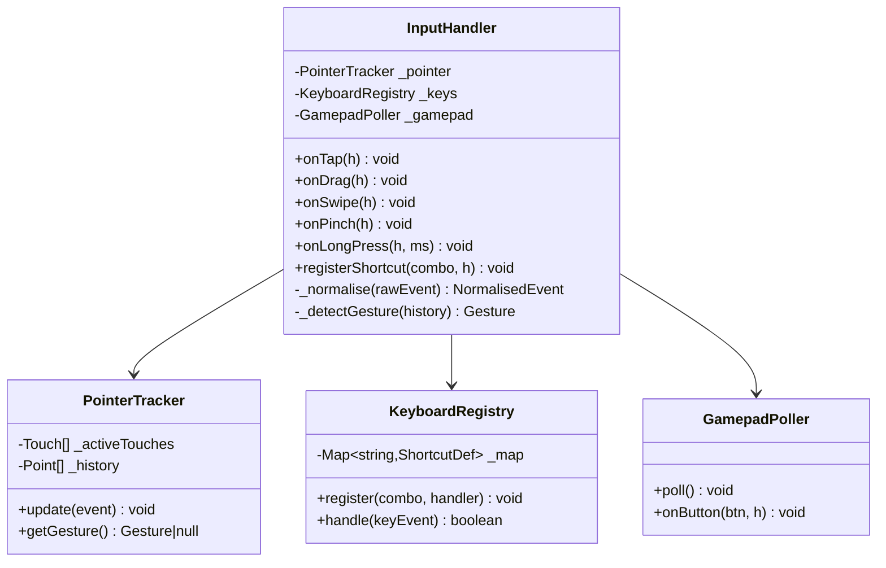
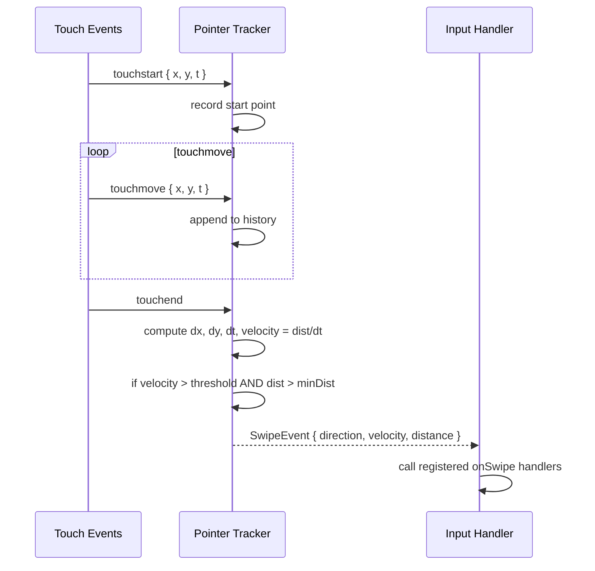

# System Design: Gesture & Input Handler

## Purpose
Unify all pointer and keyboard input across desktop and mobile into a single
normalised event layer. Currently input is handled ad-hoc (raw mouse/touch
listeners scattered across DesktopCanvas and MobileCanvas). This system
abstracts pointer events into semantic gestures (tap, drag, swipe, pinch,
long-press) and provides a keyboard shortcut registry, so any feature can
bind actions without knowing the input source.

---

## Public API

```js
// src/systems/input.js

// Pointer gestures (canvas coordinates)
onTap(handler)                // single tap / click
onDoubleTap(handler)          // double tap / dblclick
onLongPress(handler, ms?)     // held for ms (default 500)
onDrag(handler)               // drag start/move/end with delta
onSwipe(handler)              // directional flick (mobile + trackpad)
onPinch(handler)              // two-finger scale
onHover(handler)              // mousemove (desktop only)
onRightClick(handler)         // contextmenu / two-finger tap

// Keyboard shortcuts
registerShortcut(combo, handler, options?)
  // combo: 'ctrl+k', 'alt+f4', 'shift+?'
  // options: { global?, description?, when? }
unregisterShortcut(combo)
getShortcuts()                // → ShortcutDef[]  (for help overlay)

// Gamepad
onGamepadButton(button, handler)
onGamepadAxis(axis, handler)
isGamepadConnected()          // → boolean

// Utilities
getPointerPos()               // → { x, y }  (last known canvas position)
isTouch()                     // → boolean (touch device)
isMouse()                     // → boolean
```

---

## Data shapes

```js
TapEvent {
  x:        number,          // canvas px
  y:        number,
  target?:  string,          // hotspot id under pointer, if any
}

DragEvent {
  phase:    'start' | 'move' | 'end',
  x:        number,
  y:        number,
  dx:       number,          // delta from last move event
  dy:        number,
  totalDx:  number,          // delta from drag start
  totalDy:  number,
  target?:  string,
}

SwipeEvent {
  direction: 'up' | 'down' | 'left' | 'right',
  velocity:  number,         // px/ms
  distance:  number,         // px
  x:         number,         // start x
  y:         number,         // start y
}

PinchEvent {
  phase:    'start' | 'move' | 'end',
  scale:    number,          // relative to pinch start
  centerX:  number,
  centerY:  number,
}

ShortcutDef {
  combo:       string,
  description: string,
  global:      boolean,      // fires even when input focused
  when?:       () => boolean // guard function
}
```

---

## Diagrams

### Architecture



### Pointer normalisation

```mermaid
flowchart TD
  A[Raw DOM event\nmousedown / touchstart / pointerdown] --> B{Event type}
  B -- mouse --> C[Extract clientX/Y\nscale to canvas coords]
  B -- touch --> D[Extract touches[0]\nscale to canvas coords]
  B -- pointer --> E[Extract pointerId\nscale to canvas coords]

  C --> F[Push to history]
  D --> F
  E --> F

  F --> G{Gesture classifier}
  G -- 1 touch, no move, < 200ms --> H[Tap]
  G -- 1 touch, > 500ms hold --> I[LongPress]
  G -- 1 touch, fast move --> J[Swipe]
  G -- 1 touch, slow move --> K[Drag]
  G -- 2 touches --> L[Pinch]
```

### Swipe detection



### Keyboard shortcut dispatch

```mermaid
flowchart TD
  A[keydown event] --> B[build combo string\ne.g. 'ctrl+shift+k']
  B --> C{combo in registry?}
  C -- no --> D[pass through to browser]
  C -- yes --> E{when() guard passes?}
  E -- no --> D
  E -- yes --> F[call handler]
  F --> G[event.preventDefault]
```

---

## Gesture vocabulary (mobile)

| Gesture | Action |
|---------|--------|
| Tap | open app / activate hotspot |
| Double-tap | fullscreen / zoom |
| Long-press | context menu |
| Swipe up from bottom | home / close |
| Swipe down from top | notification tray |
| Swipe left/right | switch workspace |
| Pinch out | zoom canvas |
| Two-finger tap | right-click equivalent |
| Two-finger swipe up | expose (all open apps) |

## Default keyboard shortcuts (desktop)

| Combo | Action |
|-------|--------|
| `ctrl+alt+t` | open terminal |
| `ctrl+alt+a` | open AI assistant |
| `alt+f4` | close focused window |
| `super+d` | show/hide desktop |
| `super+left/right` | snap window |
| `ctrl+shift+?` | keyboard shortcut help |
| `ctrl+\`` | cycle through open windows |

---

## Integration points

| Depends on | Reason |
|-----------|--------|
| Canvas element | attaches raw DOM listeners |
| Window Manager | passes drag/tap to correct window's hit region |

| Used by | Reason |
|---------|--------|
| DesktopCanvas | delegates all pointer events |
| MobileCanvas | delegates all touch events |
| Window Manager | drag-to-move, resize handle detection |
| Arcade games | gamepad + keyboard input |
| Farming game | tap-to-plant, tap-to-harvest |
| Screensaver | wakeup on any input |

---

## Implementation notes

- **Single listener:** attach one `pointerdown`/`pointermove`/`pointerup` set
  to the canvas element. Never attach per-feature listeners — route everything
  through this system.
- **Canvas scaling:** always divide raw `clientX/Y` by the canvas CSS-to-logical
  scale factor to get canvas-space coordinates before passing to consumers.
- **Passive listeners:** use `{ passive: false }` only when `preventDefault` is
  needed (e.g. swipe to prevent page scroll). Use `{ passive: true }` everywhere
  else for scroll performance.
- **Velocity threshold for swipe:** `velocity > 0.3 px/ms AND distance > 30px`.
  Tune these empirically.
- **Long-press cancel:** if pointer moves more than 8px during hold, cancel the
  long-press timer.
- **Gamepad:** use `requestAnimationFrame` polling via `navigator.getGamepads()`.
  Map standard gamepad layout (indices 0–3 = face buttons, 12–15 = d-pad).
