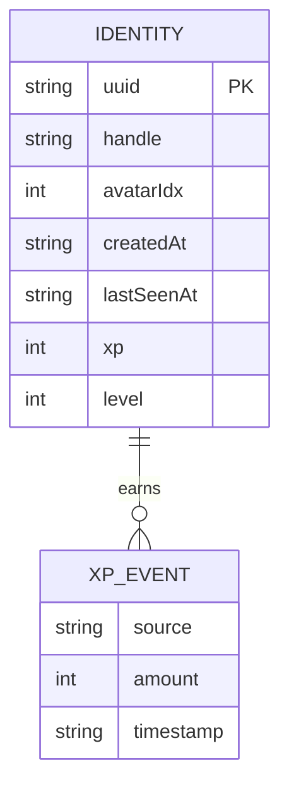
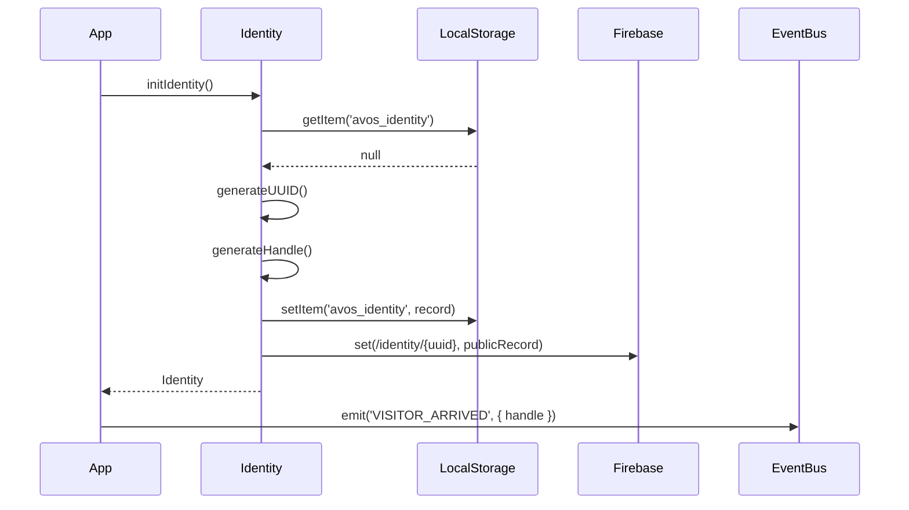
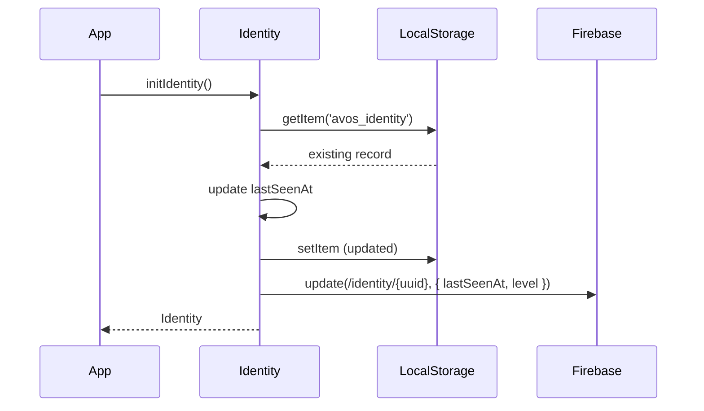

# System Design: Identity

## Purpose
Provide a stable, anonymous identity for each visitor. No login required — a UUID is
generated on first visit and persisted to localStorage. Everything social (chat handles,
leaderboards, achievements, presence, ghost cursors) reads from this single source.

---

## Public API

```js
// src/systems/identity.js

getIdentity()                  // → Identity | null (null only before init)
initIdentity()                 // → Identity  (creates if missing, loads if exists)
updateIdentity(partial)        // → Identity  (merge-update handle, avatarIdx, etc.)
addXP(amount, source)          // → { xp, level, didLevelUp }
getLevel()                     // → number
getLevelThreshold(level)       // → number  (XP needed to reach that level)
```

---

## Data shapes

```js
// Stored in localStorage under key: 'avos_identity'
Identity {
  uuid:        string,    // crypto.randomUUID() — generated once, never changes
  handle:      string,    // "pixel-fox-2847" — auto-generated, user-editable
  avatarIdx:   number,    // 0–15, index into pixel avatar set
  createdAt:   string,    // ISO timestamp
  lastSeenAt:  string,    // ISO timestamp, updated on each init
  xp:          number,    // total XP earned across all sessions
  level:       number,    // derived from xp, cached for display
}

// Written to Firebase under: /identity/{uuid}  (subset — no sensitive local data)
FirebaseIdentityRecord {
  handle:      string,
  avatarIdx:   number,
  createdAt:   string,
  lastSeenAt:  string,
  level:       number,
}
```

---

## Diagrams

### Data model



### First-visit flow



### Return-visit flow



### XP & levelling

```mermaid
stateDiagram-v2
  [*] --> Level1 : first visit (0 XP)
  Level1 --> Level2  : 100 XP
  Level2 --> Level3  : 300 XP
  Level3 --> Level4  : 600 XP
  Level4 --> Level5  : 1000 XP
  Level5 --> LevelN  : +500 XP per level thereafter

  state Level1 {
    Unlocks: default cursor, 3x3 farm plot
  }
  state Level3 {
    Unlocks: custom handle, avatar picker
  }
  state Level5 {
    Unlocks: prestige badge, extra farm row
  }
```

---

## Integration points

| Depends on | Reason |
|-----------|--------|
| Firebase realtime | write identity record on first visit, update on level-up |
| Event bus | emits `VISITOR_ARRIVED`, `XP_GAINED`, `LEVEL_UP` |

| Used by | Reason |
|---------|--------|
| Chat room | source of handle + avatarIdx for messages |
| Achievement engine | reads uuid for per-user unlock storage |
| Leaderboards | uuid as key, handle as display name |
| Presence system | uuid used as presence key in Firebase |
| Ghost cursors | uuid identifies whose cursor is whose |
| Farming game | level gates plot size and upgrades |
| Profile window | displays and edits identity fields |

---

## Implementation notes

- **Handle generation:** `<adjective>-<animal>-<4-digit number>` from small hardcoded
  word lists (~20 adjectives × ~20 animals = 400 combos, collision risk low enough for
  this scale). User can override at level 3.
- **UUID fallback:** if `crypto.randomUUID` is unavailable (old browsers), fall back to
  `Math.random()` hex string.
- **XP thresholds:** use a simple quadratic curve — `threshold(n) = 100 * n * (n+1) / 2`.
  Level 1→2 = 100 XP, 2→3 = 300 total, 3→4 = 600 total, etc.
- **Firebase write is best-effort** — if Firebase isn't configured or the write fails,
  identity still works fully from localStorage. Never block on Firebase.
- **No auth** — uuid is trust-based. A malicious user could spoof another uuid but
  there's nothing sensitive to protect, so this is fine.
