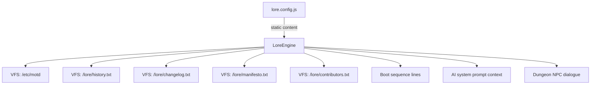
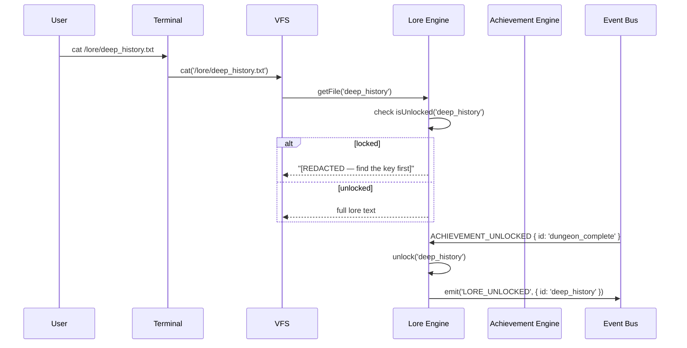
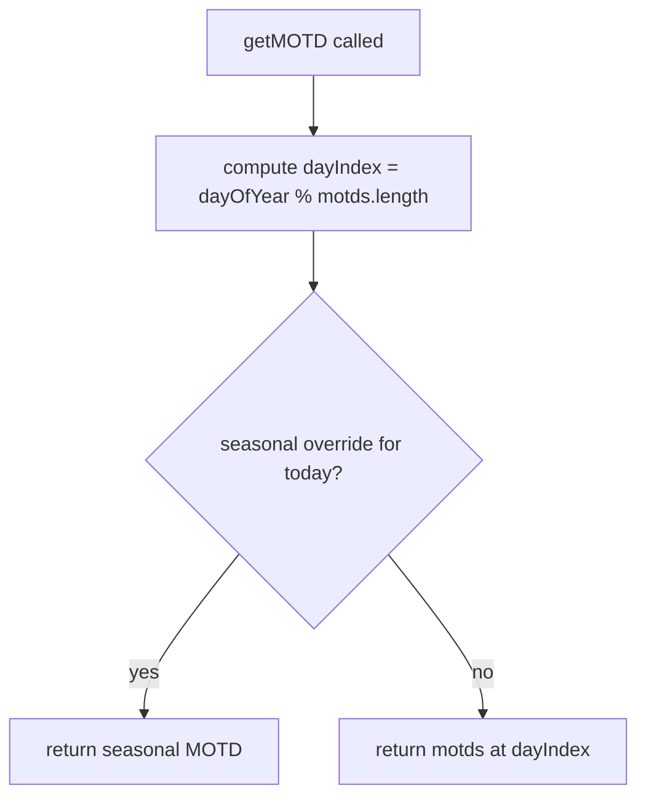

# System Design: Lore & Narrative Engine

## Purpose
Author and serve the fictional backstory of AVOS: the OS history, fake
changelog, MOTD rotation, in-world documentation, and conditional narrative
unlocks. The narrative layer makes the OS feel like a lived-in world rather
than a portfolio wrapper. Content lives in config files (not hardcoded in
components) and is served to the VFS, terminal, and any app that wants
flavour text.

---

## Public API

```js
// src/systems/lore.js

// Content retrieval
getMOTD()                    // → string  (today's message)
getFile(loreId)              // → string  (full text of a lore document)
getChangelog()               // → ChangelogEntry[]
getNPCDialogue(npcId, ctx?)  // → string  (context-aware NPC line)
getRandomQuip(category?)     // → string  (one-liner for UI flavour)
getBootMessages()            // → string[]  (lines shown during boot sequence)

// Conditional unlocks
isUnlocked(narrativeId)      // → boolean
unlock(narrativeId)          // reveal a piece of lore
getLocked()                  // → NarrativeDef[]  (undiscovered lore)

// Authoring helpers (dev only)
listAllIds()                 // → string[]  (all lore document ids)
```

---

## Data shapes

```js
LoreDocument {
  id:         string,
  title:      string,
  content:    string | (() => string),
  unlockCondition?: string,   // achievement id or 'always'
  category:   'motd' | 'history' | 'changelog' | 'npc' | 'manual' | 'flavour',
}

ChangelogEntry {
  version:    string,         // e.g. 'v0.3.1'
  codename:   string,         // e.g. 'EMBER'
  date:       string,
  changes:    string[],
}

NarrativeDef {
  id:         string,
  title:      string,
  hint:       string,         // shown when locked ('???')
  unlockCondition: string,
}
```

---

## Diagrams

### Content graph



### Conditional unlock flow



### MOTD rotation



---

## Lore document catalogue

| id | vfs path | unlock |
|----|----------|--------|
| `history` | /lore/history.txt | always |
| `changelog` | /lore/changelog.txt | always |
| `manifesto` | /lore/manifesto.txt | always |
| `contributors` | /lore/contributors.txt | always |
| `deep_history` | /lore/deep_history.txt | dungeon_complete |
| `os_manual` | /lore/manual.txt | always |
| `incident_log` | /lore/incident_log.txt | achievement: first_error |
| `secret_memo` | /lore/memo.txt | cat /home/guest/.secret |
| `motd` | /etc/motd | always (daily rotation) |
| `hostname` | /etc/hostname | always |
| `os_release` | /etc/os-release | always |

---

## Sample content (seed)

**MOTD rotation (excerpt):**
```
"Remember: rm -rf is a permanent solution to a temporary problem."
"AVOS v0.3.1 — now with 12% more existential dread."
"Today's uptime: infinite. Yesterday's: also infinite."
"You look tired. Have you tried turning yourself off and on again?"
"Security tip: your password is probably your cat's name. Change it."
```

**Boot messages:**
```
"Initialising kernel... OK"
"Mounting /dev/nostalgia... OK"
"Starting pixel renderer... OK"
"Loading questionable life choices... OK"
"AVOS v0.3.1 ready. Type 'help' to begin."
```

---

## Integration points

| Depends on | Reason |
|-----------|--------|
| Event bus | listens for ACHIEVEMENT_UNLOCKED to trigger narrative unlocks |
| Achievement engine | unlock conditions reference achievement ids |

| Used by | Reason |
|---------|--------|
| VFS | all /lore/ and /etc/ files delegate to lore engine |
| Terminal | boot sequence, MOTD display on login |
| AI system | lore docs injected into system prompt context |
| Dungeon crawler | NPC dialogue |
| Scheduler | MOTD daily rotation |

---

## Implementation notes

- **Static content:** all lore text lives in `src/data/lore.config.js` as
  plain strings. No CMS, no markdown rendering needed — it's terminal output.
- **Line length:** keep all lore text at ≤72 chars per line for clean
  terminal display without wrapping.
- **Tone:** dry wit, slightly ominous, self-aware. Avoid cringe. The OS
  knows it's a portfolio; lean into that.
- **Locked content display:** when a locked file is `cat`ted, return a
  short redacted message with a hint: `[ACCESS DENIED — complete {hint} to
  unlock]`.
- **Changelog format:** version numbers should match real commits/deploys.
  Update `changelog.txt` content when deploying new features. The fake
  changelog and the real git history should roughly align.
