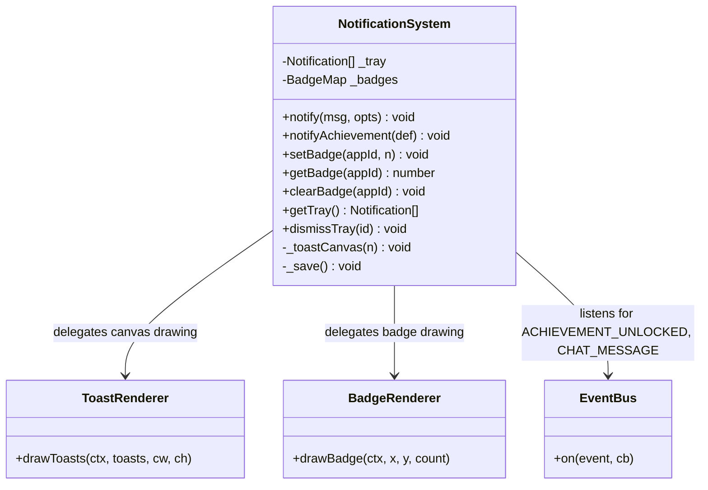
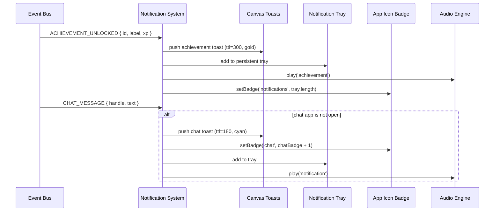
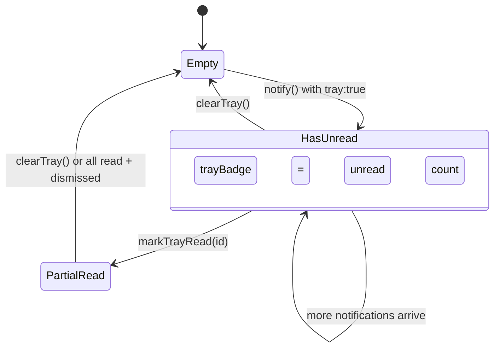
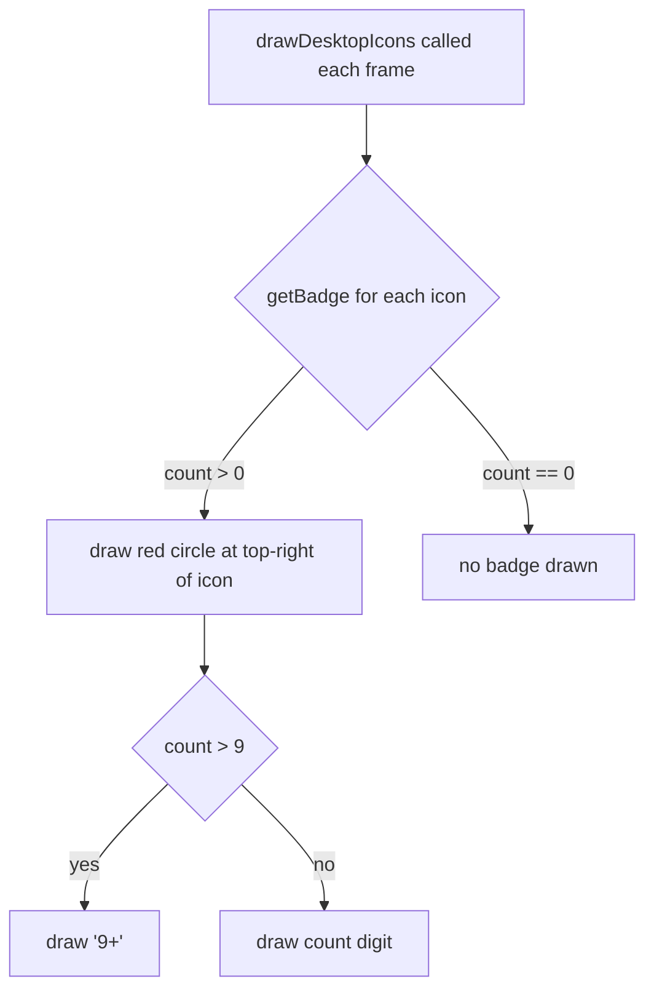

# System Design: Notification System

## Purpose
Extend the existing 3-second auto-dismiss toast system into a full OS-level notification
layer: typed toasts (info/success/error/achievement), badge counts on desktop icons and
mobile app icons, a dismissible notification tray, and optional browser push
notifications via Firebase Cloud Messaging.

---

## Public API

```js
// src/systems/notifications.js

// Toasts (rendered on canvas)
notify(message, options?)        // show a toast
notifyAchievement(def)           // special achievement toast with icon + XP
notifyError(message)             // red error toast
notifySuccess(message)           // green success toast

// Badges
setBadge(appId, count)           // set badge count on an icon (0 = clear)
getBadge(appId)                  // → number
clearBadge(appId)                // clear badge
clearAllBadges()                 // clear all badges

// Tray
getTray()                        // → Notification[] (persistent list)
clearTray()                      // dismiss all tray entries
dismissTray(id)                  // dismiss one entry
markTrayRead(id)                 // mark as read without dismissing

// Push (optional, requires FCM)
requestPushPermission()          // → boolean (granted)
subscribePush(topic)             // subscribe to a FCM topic
unsubscribePush(topic)
```

---

## Data shapes

```js
Notification {
  id:        string,           // uuid
  type:      'info' | 'success' | 'error' | 'achievement' | 'chat' | 'system',
  message:   string,
  icon?:     string,           // emoji or ASCII char
  appId?:    string,           // which app to badge
  ts:        number,           // Unix ms
  read:      boolean,
  ttl?:      number,           // frames until auto-dismiss (canvas toasts only)
}

BadgeMap {
  [appId: string]: number      // badge count per app icon
}

NotifyOptions {
  type?:     string,           // default 'info'
  icon?:     string,
  appId?:    string,           // increment badge on this app
  ttl?:      number,           // frames; default 180 (3s at 60fps)
  sound?:    boolean,          // default true
  tray?:     boolean,          // add to persistent tray; default true for chat/achievement
}
```

---

## Diagrams

### Component overview



### Toast types (visual spec)

```
┌─────────────────────────────┐
│ ▌ [icon] message text here  │  ← info (cyan left bar)
└─────────────────────────────┘

┌─────────────────────────────┐
│ ▌ ✓ operation successful    │  ← success (green left bar)
└─────────────────────────────┘

┌─────────────────────────────┐
│ ▌ ✕ something went wrong    │  ← error (red left bar)
└─────────────────────────────┘

┌─────────────────────────────┐
│ ▌ 🏆 First Harvest  +20 XP  │  ← achievement (gold left bar, larger)
└─────────────────────────────┘
```

### Notification flow



### Tray state machine



### Badge rendering (canvas)



---

## Integration points

| Depends on | Reason |
|-----------|--------|
| Event bus | listens for ACHIEVEMENT_UNLOCKED, CHAT_MESSAGE, LEVEL_UP, GAME_SCORE |
| Audio engine | plays sounds on notification |
| draw.js / canvas | renders toasts and badges in the RAF loop |
| localStorage | persists tray state and badge counts across sessions |

| Used by | Reason |
|---------|--------|
| DesktopCanvas / MobileCanvas | calls drawToasts, drawBadges each frame |
| Chat room | increments chat badge when window not focused |
| Achievement engine | shows achievement toast via notifyAchievement() |
| Farming game | crop-ready notifications |
| System events | error/success feedback for any user action |

---

## Implementation notes

- **Tray persistence:** save `_tray` (last 20 entries) and `_badges` to localStorage
  under `'avos_notifications'`. Restore on init.
- **Badge clearing:** when a user opens an app, call `clearBadge(appId)` in the
  `APP_OPENED` event handler (or in the app's open callback).
- **Achievement toast:** slightly taller than normal toasts, gold left bar, shows
  `+{xp} XP`. Stays visible for 5 seconds (300 frames) instead of 3.
- **Tray access:** on desktop, the tray opens as a small popover window (or panel)
  when clicking a notification bell icon in the taskbar. On mobile, it's accessible
  from the notification center (swipe down from status bar).
- **Push notifications:** FCM integration is optional and additive. Only the
  `requestPushPermission` / `subscribePush` functions need FCM. The rest of the
  system works without it. Gate this behind `isPushSupported()`.
- **Rate limiting:** if the same `appId` fires notifications rapidly (e.g. many chat
  messages), batch them into one badge increment rather than N toasts. Debounce
  toast firing per `appId` with a 500ms window.
