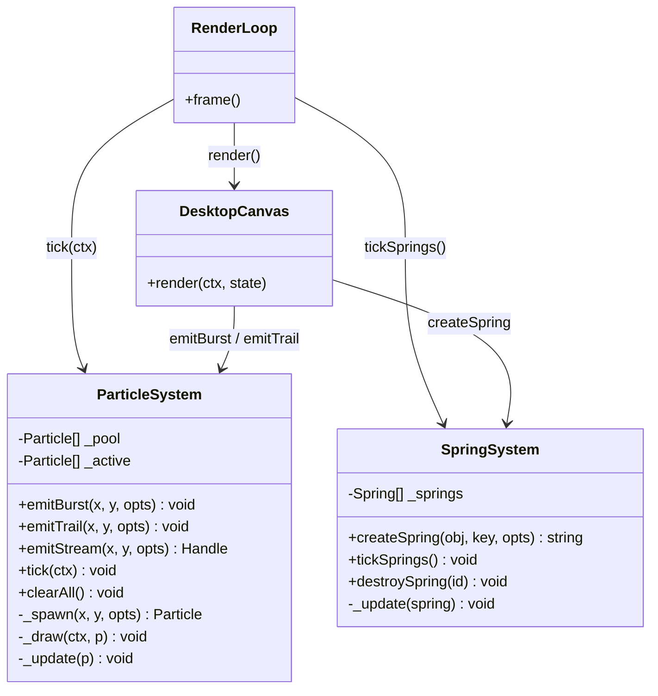
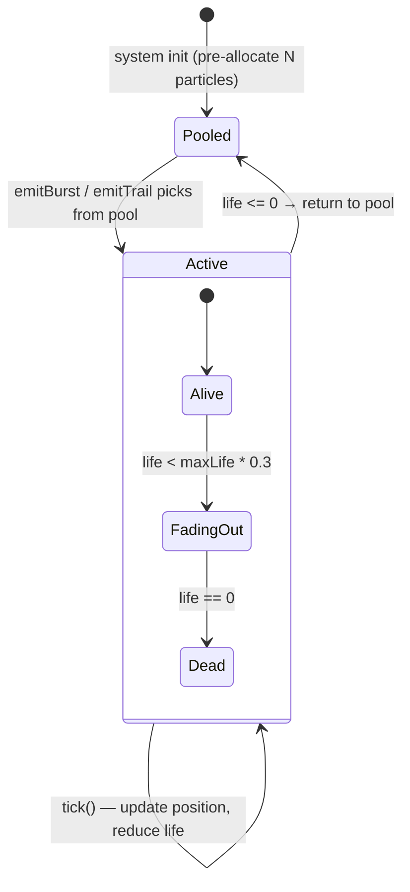

# System Design: Particle & Physics System

## Purpose
A lightweight canvas-based particle emitter and spring physics simulator that plugs
into the existing RAF render loop. Powers: harvest coin bursts, achievement confetti,
window wobble, cursor trails, weather effects (rain/snow), and game explosions — all
sharing the same ~100-line engine.

---

## Public API

```js
// src/systems/particles.js  — particle emitter
emitBurst(x, y, options)     // spawn N particles at once (harvest, achievement, explosion)
emitTrail(x, y, options)     // spawn 1 particle per call (cursor trail, rain drop)
emitStream(x, y, options)    // continuous emitter; returns { stop() } handle
tick(ctx)                    // advance all particles by 1 frame and draw them
                             // called once per RAF frame from the render loop
clearAll()                   // remove all active particles

// src/systems/physics.js  — spring simulator
createSpring(target, key, options)   // attach a spring to obj[key] toward a target value
tickSprings()                        // advance all springs by 1 frame
                                     // called once per RAF frame
destroySpring(id)                    // remove a spring
```

---

## Data shapes

```js
Particle {
  x:        number,   // canvas logical coords
  y:        number,
  vx:       number,   // velocity
  vy:       number,
  ax:       number,   // acceleration (gravity component)
  ay:       number,
  life:     number,   // remaining frames (counts down to 0)
  maxLife:  number,   // initial life (for alpha fade calculation)
  size:     number,   // radius in logical px
  color:    string,   // CSS color string
  alpha:    number,   // 0–1, derived from life/maxLife unless overridden
  shape:    'circle' | 'square' | 'pixel',
}

EmitOptions {
  count:    number,         // default 8
  colors:   string[],       // picks randomly; default theme accent colors
  speed:    number,         // initial speed magnitude; default 2
  spread:   number,         // angle spread in radians; default 2π (full circle)
  angle:    number,         // base angle in radians; default -π/2 (upward)
  gravity:  number,         // ay per frame; default 0.1
  drag:     number,         // velocity multiplier per frame; default 0.97
  life:     number,         // frames; default 40
  size:     number,         // default 2
  shape:    string,         // default 'pixel'
}

Spring {
  id:         string,
  obj:        object,       // the object whose property is being animated
  key:        string,       // property name on obj
  target:     number,       // value to spring toward
  stiffness:  number,       // default 0.15
  damping:    number,       // default 0.75
  velocity:   number,       // internal
  onRest?:    () => void,   // called when spring settles
}
```

---

## Preset recipes

```js
// Coin burst on crop harvest
emitBurst(tileX, tileY, {
  count: 6, colors: ['#ffd700', '#ffec8b'],
  speed: 1.5, gravity: 0.12, life: 35, shape: 'pixel'
})

// Achievement confetti
emitBurst(canvasW/2, canvasH/2, {
  count: 40, colors: ['#ff004d','#ffd700','#00e436','#29adff','#ff77a8'],
  speed: 4, spread: Math.PI*2, gravity: 0.08, life: 80, size: 3
})

// Rain drop (call per frame from weather system)
emitTrail(randomX, 0, {
  colors: ['#29adff'], speed: 3, angle: Math.PI*0.55,
  spread: 0.1, gravity: 0, drag: 1, life: 20, size: 1, shape: 'pixel'
})

// Snow flake
emitTrail(randomX, 0, {
  colors: ['#ffffff','#c0e8ff'], speed: 0.8, angle: Math.PI/2,
  spread: 0.4, gravity: 0.01, life: 60, size: 1, shape: 'pixel'
})

// Window wobble (spring)
createSpring(win, 'wobbleX', 0, { stiffness: 0.3, damping: 0.6 })
win.wobbleX = dragDeltaX * 0.1  // set displacement on drag
// render loop: draw window at win.x + win.wobbleX

// Cursor trail
emitTrail(mouseX, mouseY, {
  colors: [C.cyan], life: 15, size: 1.5, gravity: 0, drag: 0.9, shape: 'pixel'
})
```

---

## Diagrams

### System overview



### Particle lifecycle



### Integration with render loop

```mermaid
sequenceDiagram
  participant RAF as requestAnimationFrame
  participant Loop as Render Loop
  participant Springs as Spring System
  participant Particles as Particle System
  participant Canvas as Canvas Context

  RAF->>Loop: frame()
  Loop->>Springs: tickSprings()
  note over Springs: update all spring velocities and positions
  Loop->>Canvas: render windows (uses spring offsets for wobble)
  Loop->>Particles: tick(ctx)
  note over Particles: update positions, reduce life, draw on top
  Loop->>RAF: requestAnimationFrame(frame)
```

---

## Integration points

| Depends on | Reason |
|-----------|--------|
| draw.js | uses same canvas context; reads `C` colors for default palettes |
| RAF render loop | `tick()` and `tickSprings()` must be called every frame |

| Used by | Reason |
|---------|--------|
| Farming game | crop harvest bursts, golden crop sparkle, weather effects |
| Achievement engine | confetti on unlock (via `ACHIEVEMENT_UNLOCKED` event) |
| Desktop | window wobble springs, trash can explosion |
| Cursor system | cursor trail particles |
| Arcade games | explosion effects, score popups |
| Weather system | rain / snow / falling leaves |
| Chat room | message pop-in animation |

---

## Implementation notes

- **Object pooling:** pre-allocate a fixed array of Particle objects (e.g. 200) and
  reuse them. Avoids GC pressure during heavy bursts. Particles beyond the pool size are
  simply dropped rather than allocating new objects.
- **Draw order:** particles should be drawn *after* windows (so they appear on top) but
  *before* the taskbar and toasts.
- **Spring rest detection:** a spring is considered "at rest" when `|velocity| < 0.01`
  and `|current - target| < 0.01`. Call `onRest()` and remove from the active list.
- **Performance budget:** target < 200 active particles at any time. `emitBurst` with
  `count` > 50 should be rare (achievement confetti only).
- **Coordinate system:** particles use the same logical canvas coordinates as everything
  else in the render loop (pre-scale). No special handling needed.
- **Mobile:** same system works; just be more conservative with counts (halve them on
  mobile canvas where the resolution is lower).
