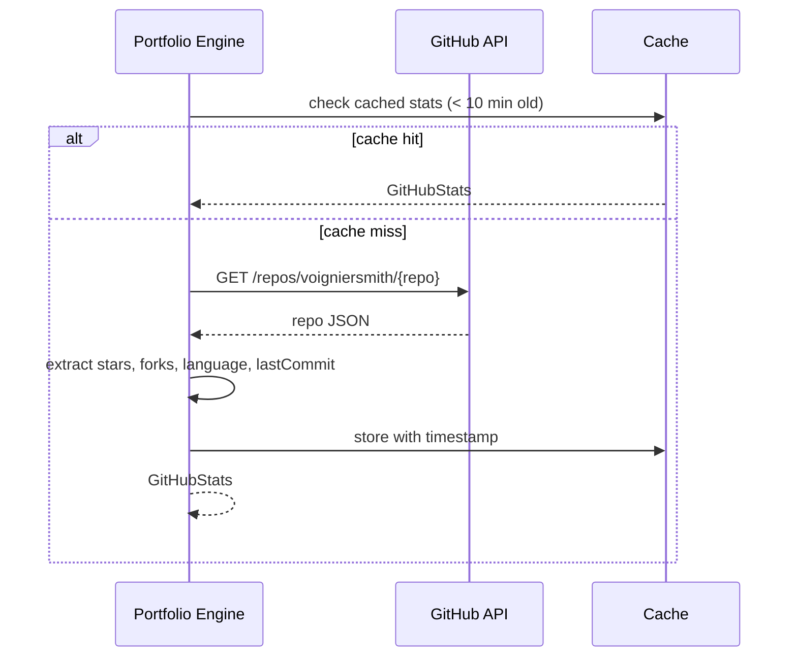
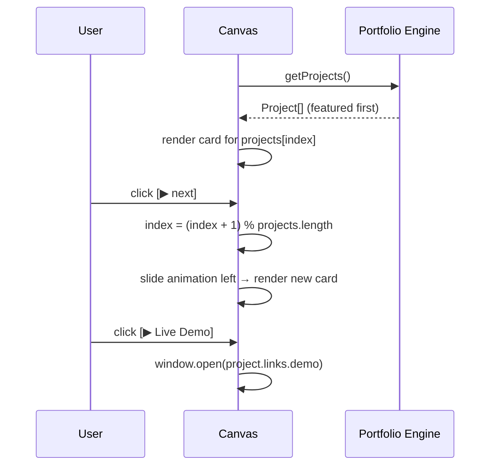

# System Design: Portfolio Display Engine

## Purpose
Render portfolio content — projects, experience, skills, and contact info —
in rich OS-native UI: project card carousels, live GitHub stats, tech-stack
badge renderers, a résumé viewer, and a recruiter-mode that strips the OS
chrome for a clean professional presentation. Replaces the current
text-only terminal output for portfolio content.

---

## Public API

```js
// src/systems/portfolio.js

// Data access (wraps portfolio.config.js)
getProjects()                // → Project[]
getProject(slug)             // → Project | null
getExperience()              // → ExperienceEntry[]
getSkills()                  // → SkillCategory[]
getContact()                 // → ContactInfo

// GitHub live stats
fetchGitHubStats(repo?)      // → Promise<GitHubStats>
fetchContributions()         // → Promise<ContribData>

// Recruiter mode
enterRecruiterMode()         // switch to clean non-OS presentation
exitRecruiterMode()
isRecruiterMode()            // → boolean

// Window openers (convenience)
openProjectCard(slug)        // open project detail window
openResume()                 // open résumé viewer window
openContact()                // open contact window
```

---

## Data shapes

```js
Project {
  slug:         string,
  title:        string,
  description:  string,
  longDesc?:    string,
  tech:         string[],
  links: {
    demo?:   string,
    github?: string,
    npm?:    string,
  },
  screenshots?: string[],
  featured:     boolean,
}

ExperienceEntry {
  company:    string,
  role:       string,
  start:      string,        // 'YYYY-MM'
  end:        string | 'present',
  bullets:    string[],
  tech:       string[],
}

GitHubStats {
  repo:       string,
  stars:      number,
  forks:      number,
  lastCommit: string,        // ISO date
  language:   string,
  openIssues: number,
}

SkillCategory {
  name:    string,
  skills:  { name: string, level: 1|2|3|4|5 }[],
}
```

---

## Diagrams

### Project card window (canvas sketch)

```
┌────────────── PROJECT: AVOS ─────────────┐
│  [screenshot preview]      ★ 42 stars    │
│                                          │
│  A pixel-art portfolio OS built in       │
│  React. Features a canvas desktop,       │
│  farming game, and AI assistant.         │
│                                          │
│  Stack: [React] [TypeScript] [Firebase]  │
│         [Canvas API]                     │
│                                          │
│  [▶ Live Demo]  [⌥ GitHub]  [◀ Back]    │
└──────────────────────────────────────────┘
```

### Recruiter mode

```mermaid
stateDiagram-v2
  [*] --> OSMode

  OSMode --> RecruiterMode : enterRecruiterMode()
  RecruiterMode --> OSMode : exitRecruiterMode() or Esc

  state OSMode {
    pixel-art desktop, windows, terminal chrome
  }

  state RecruiterMode {
    clean React layout, standard typography,
    project grid, résumé download, contact form
  }
```

### GitHub stats fetch



### Project carousel navigation



---

## Integration points

| Depends on | Reason |
|-----------|--------|
| portfolio.config.js | source of truth for all portfolio data |
| GitHub REST API | live star/fork counts, last commit date |
| Window Manager | opens project card windows |

| Used by | Reason |
|---------|--------|
| Desktop icons | "Projects" app |
| Terminal | `cat /projects/slug.txt` reads from here |
| AI system | project data in system prompt |
| Recruiter mode | standalone clean presentation |
| Analytics | tracks which projects get viewed |

---

## Implementation notes

- **Recruiter mode:** implement as a React route `/recruiter` or a full-page
  overlay div that renders above the canvas. Use standard HTML/CSS (not
  canvas) for maximum legibility and print/PDF compatibility.
- **Résumé PDF:** host the PDF at `public/resume.pdf`. The résumé viewer
  window embeds it in an `<iframe>` or opens it in a new tab.
- **GitHub API rate limit:** unauthenticated rate limit is 60 req/hour.
  Cache all responses for 10 minutes in sessionStorage. Gracefully degrade
  to showing `N/A` if rate-limited.
- **Tech badges:** render as small coloured pill shapes on the canvas.
  Map tech names to a colour lookup table (React = blue, TypeScript = blue,
  Firebase = yellow, etc.). Max 5 badges visible before a `+N more` label.
- **Screenshots:** store in `public/screenshots/` at max 320×240 px for
  fast load. Lazy-load — only fetch when the project card is opened.
- **featured flag:** the project carousel shows only `featured: true`
  projects by default. A "see all" toggle expands to the full list.
