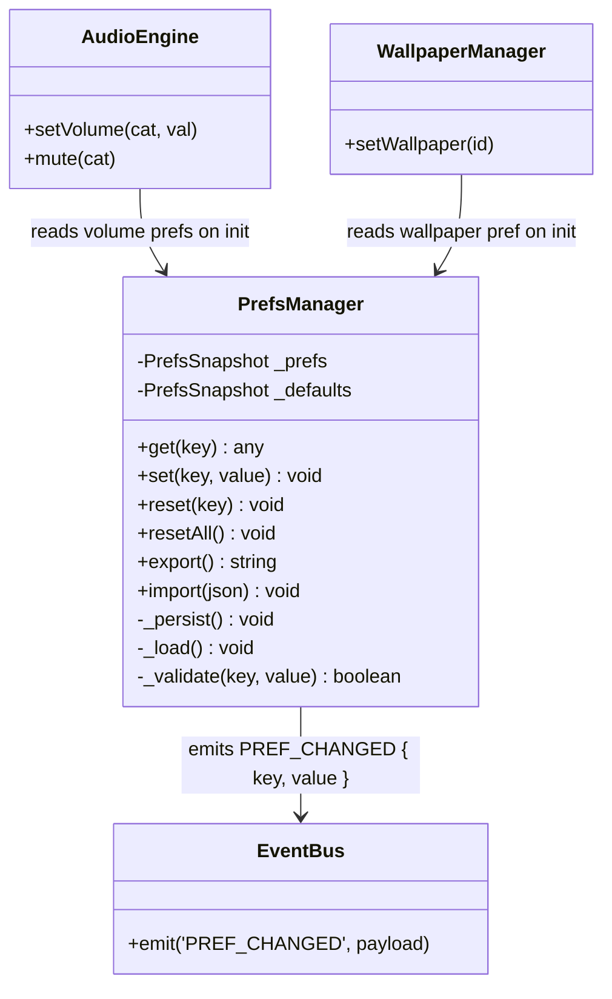
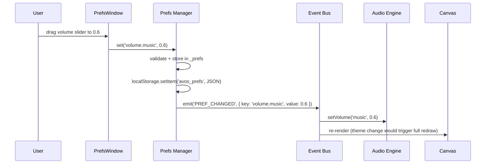

# System Design: Preferences / Settings Manager

## Purpose
A single, typed store for all user-configurable settings. Currently settings
are scattered (theme in CSS variables, volume in audio engine, etc.). This
system centralises them so any feature can read/write preferences through
one API, with automatic localStorage persistence and live change propagation
via the event bus.

---

## Public API

```js
// src/systems/prefs.js

get(key)                     // → any  (typed value or default)
set(key, value)              // persist + emit PREF_CHANGED
reset(key)                   // reset to default
resetAll()                   // reset all to defaults
getAll()                     // → PrefsSnapshot
export()                     // → JSON string (for backup)
import(json)                 // restore from JSON string
```

---

## Data shapes

```js
PrefsSnapshot {
  // Appearance
  theme:          string,          // 'dark' | 'dracula' | 'nord' | 'monokai' | 'solarized' | 'gruvbox' | 'cga' | 'ega'
  palette:        string,          // for CGA/EGA: '4color' | '16color'
  fontSize:       number,          // terminal font size px (default 14)
  scanlines:      boolean,         // CRT scanline overlay
  pixelFont:      boolean,         // use bitmap pixel font

  // Clock & locale
  clockFormat:    '12h' | '24h',
  timezone:       string,          // IANA tz string

  // Audio (mirrors audio engine defaults)
  volume: {
    master:   number,
    sfx:      number,
    music:    number,
    ambient:  number,
  },
  muted: {
    master:   boolean,
    sfx:      boolean,
    music:    boolean,
    ambient:  boolean,
  },

  // Terminal
  promptStyle:    string,          // e.g. '$' | '>' | '❯' | custom
  historySize:    number,          // max saved commands (default 500)
  tabWidth:       number,          // spaces per tab (default 2)

  // Desktop
  wallpaper:      string,          // wallpaper id or 'none'
  animWallpaper:  boolean,         // allow animated wallpapers
  screensaver:    string,          // screensaver id
  screensaverTimeout: number,      // idle seconds before screensaver (default 120)

  // Notifications
  toastsEnabled:  boolean,
  soundOnNotify:  boolean,

  // Accessibility
  reduceMotion:   boolean,
  highContrast:   boolean,
}
```

---

## Diagrams

### Architecture



### Settings window layout (canvas sketch)

```
┌────────────── PREFERENCES ─────────────────┐
│ [Appearance] [Audio] [Terminal] [Desktop]  │  ← tab bar
├─────────────────────────────────────────────┤
│ Theme        [▼ Dracula          ]          │
│ Font size    [──●────────────] 14px         │
│ Scanlines    [✓]                            │
│ Clock format ( ) 12h  (●) 24h              │
├─────────────────────────────────────────────┤
│             [Reset defaults]  [Export]      │
└─────────────────────────────────────────────┘
```

### Change propagation



---

## Integration points

| Depends on | Reason |
|-----------|--------|
| Event bus | emits PREF_CHANGED for any subscriber |
| localStorage | persistence across sessions |

| Used by | Reason |
|---------|--------|
| Audio engine | reads volume/mute prefs on init, updates on PREF_CHANGED |
| Wallpaper Manager | reads wallpaper/screensaver prefs |
| DesktopCanvas | reads theme, scanlines, fontSize, reduceMotion |
| Terminal | reads promptStyle, historySize, tabWidth |
| Notification system | reads toastsEnabled, soundOnNotify |
| Screensaver Engine | reads screensaver, screensaverTimeout |
| Preferences window | full UI for editing all settings |

---

## Implementation notes

- **Dotted key paths:** `set('volume.music', 0.6)` — support nested keys
  with dot notation. `get('volume')` returns the full sub-object.
- **Validation:** reject invalid values silently (log warning) and keep the
  existing value. Validate type and range (e.g. fontSize must be 10–24).
- **Migration:** store a `_version` field. On load, if version is older,
  run a migration function to fill in new default keys without losing
  existing settings.
- **Export/import:** export is a plain JSON file download. Import reads the
  JSON, validates it, merges with defaults for any missing keys, and emits
  PREF_CHANGED for all changed keys.
- **Reactive consumers:** consumers should subscribe to PREF_CHANGED and
  update live — don't require a page reload. E.g. theme change should
  re-render the canvas immediately.
