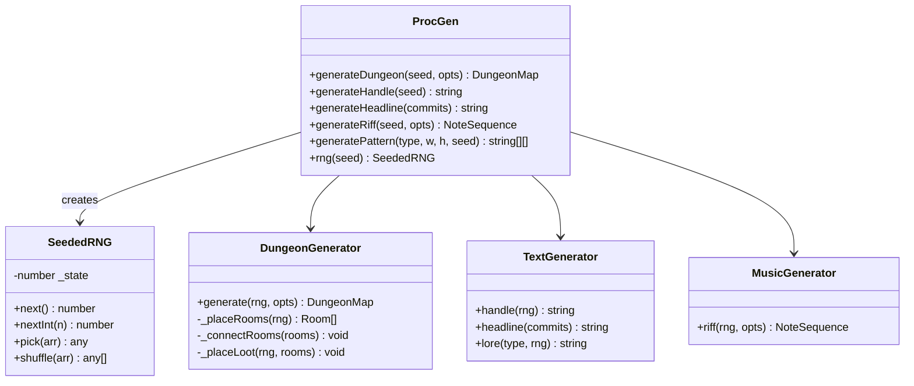
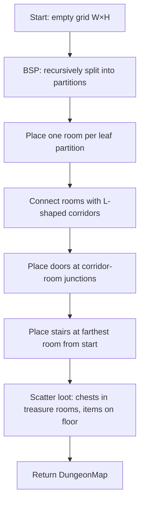
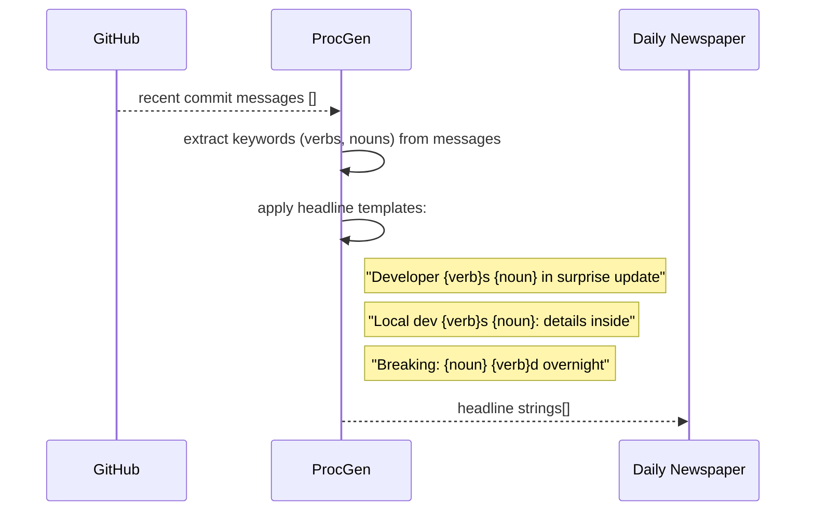

# System Design: Procedural Generation Engine

## Purpose
Supply on-demand generated content throughout the OS: dungeon maps for the
terminal dungeon crawler, fake commit-message headlines for the daily
newspaper, random visitor handles, ASCII art patterns, procedural chiptune
riffs, and NPC dialogue. All generators are seeded (reproducible given the
same seed) and stateless — call with a seed, get deterministic output.

---

## Public API

```js
// src/systems/procgen.js

// Dungeon maps
generateDungeon(seed, opts?)     // → DungeonMap
  // opts: { width?, height?, rooms?, style? }

// Text generation
generateHandle(seed?)            // → string  ('pixel-fox-2847')
generateHeadline(commits)        // → string  (fake news from GitHub commits)
generateLore(type, seed?)        // → string  ('history' | 'changelog' | 'npc_name')
generateMOTD(seed?)              // → string
generateNPCDialogue(npcId, context?) // → string

// ASCII art
generatePattern(type, w, h, seed?) // → string[][]  (char grid)
  // type: 'noise' | 'maze' | 'mandelbrot' | 'wave'

// Music
generateRiff(seed?, opts?)       // → NoteSequence
  // opts: { bars?, key?, tempo?, style? }

// Utilities
rng(seed)                        // → SeededRNG  (use for custom generators)
```

---

## Data shapes

```js
DungeonMap {
  width:    number,
  height:   number,
  tiles:    TileType[][],     // 2D grid
  rooms:    Room[],
  exits:    { north?, south?, east?, west? },  // paths to adjacent maps
  loot:     LootItem[],
  seed:     number,
}

TileType = 'wall' | 'floor' | 'door' | 'stairs_up' | 'stairs_down' | 'chest' | 'trap'

Room {
  x: number, y: number,
  w: number, h: number,
  type: 'start' | 'normal' | 'boss' | 'treasure',
}

NoteSequence {
  bpm:    number,
  key:    string,
  notes:  Note[],
}

Note {
  frequency: number,
  duration:  number,   // ms
  volume:    number,
}

SeededRNG {
  next()         // → number  (0–1)
  nextInt(n)     // → integer 0–n
  pick(arr)      // → random element
  shuffle(arr)   // → shuffled copy
}
```

---

## Diagrams

### Architecture



### Dungeon generation (BSP)



### Handle generation

```
Adjectives: pixel, neon, cyber, turbo, ghost, void, retro, glitch, ...
Animals:    fox, cat, owl, wolf, hawk, crab, newt, bat, ...
Number:     rng.nextInt(9999)

Format: '{adjective}-{animal}-{number}'
e.g. 'pixel-fox-2847', 'neon-owl-0193', 'ghost-bat-7741'
```

### Headline generation from commits



### Chiptune riff generation

```mermaid
flowchart TD
  A[seed → rng] --> B[pick key from scale\ne.g. C minor pentatonic]
  B --> C[pick tempo 80–160 BPM]
  C --> D[generate N bars of notes]
  D --> E[for each beat: pick scale degree\nfrom weighted distribution]
  E --> F[add occasional rest, octave jump]
  F --> G[return NoteSequence]
  G --> H[audio engine: play via synth()]
```

---

## Integration points

| Depends on | Reason |
|-----------|--------|
| Nothing | fully stateless — pure functions |

| Used by | Reason |
|---------|--------|
| Terminal dungeon crawler | generates room maps |
| Identity system | generates visitor handles |
| Daily newspaper app | generates headlines from GitHub commits |
| AI system | lore + NPC dialogue generation |
| Wallpaper Manager | procedural wallpaper patterns |
| Audio engine | procedural riff playback via synth() |
| VFS | /etc/motd content function |

---

## Implementation notes

- **Seeded RNG:** use a simple Mulberry32 or xoshiro128** PRNG. Seed with
  `Date.now()` for random results or a fixed string hash for reproducible
  output. A 20-line implementation is sufficient.
- **Determinism:** always seed generators from a deterministic input when
  reproducibility matters (e.g. dungeon for a given day should be the same
  for all visitors — seed with `YYYY-MM-DD`).
- **Handle collision:** handles are stored in Firebase under `/identities`.
  If the generated handle is already taken, increment the number suffix
  until a free slot is found (max 10 attempts, then fall back to a UUID suffix).
- **Dungeon size:** start small (40×25 tiles, 5–8 rooms). Depth level scales
  size: level 1 = 40×25, level 5 = 80×50.
- **Headline templates:** store 20+ template strings in `procgen.config.js`.
  Keep them intentionally ambiguous so any commit message produces plausible
  "news". Comic effect is the goal.
- **ASCII patterns:** return a 2D char array — let the caller decide how to
  render (terminal, canvas, etc.).
