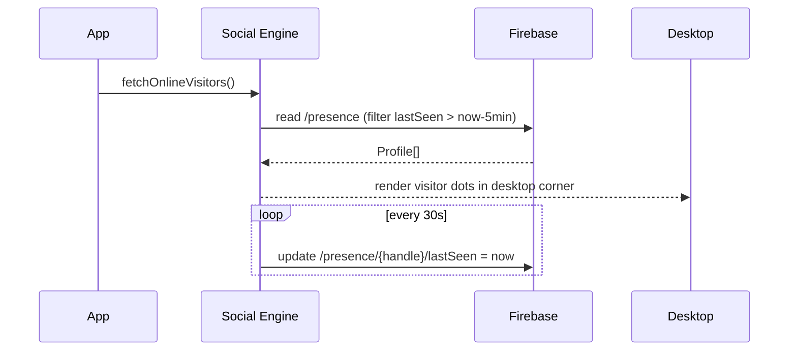
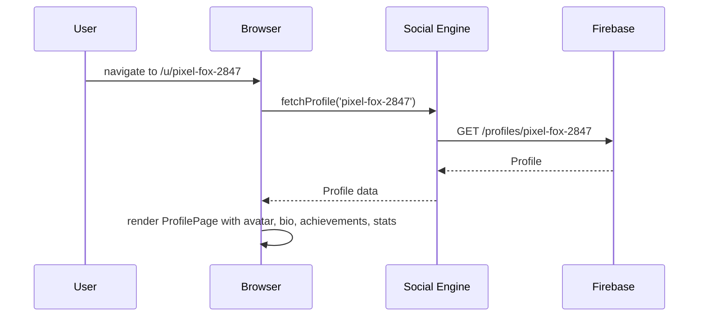
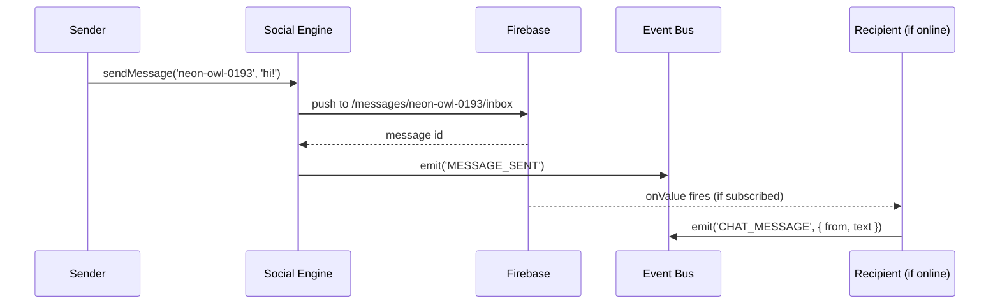

# System Design: Profile & Social UI Engine

## Purpose
Give visitors a persistent identity and a public-facing profile. Builds on
the Identity system (which generates handles and tracks XP) by adding avatar
editing, a public profile page at `/u/:handle`, online presence dots, a
visitor roster on the desktop, and a lightweight messaging inbox. Makes the
OS feel like a living community rather than a static portfolio.

---

## Public API

```js
// src/systems/social.js

// Own profile
getProfile()                 // → Profile  (current visitor's profile)
setAvatar(pixelData)         // save 8×8 pixel art avatar → Firebase
setDisplayName(name)         // set display name (distinct from handle)
setBio(text)                 // short bio (max 140 chars)

// Other profiles
fetchProfile(handle)         // → Promise<Profile | null>
fetchOnlineVisitors()        // → Promise<Profile[]>  (active in last 5 min)

// Inbox
getMessages()                // → Message[]
sendMessage(handle, text)    // → Promise<void>
markRead(messageId)
deleteMessage(messageId)

// Social graph (lightweight)
follow(handle)               // → Promise<void>
unfollow(handle)
getFollowing()               // → string[]  (handles)
getFollowers()               // → string[]
```

---

## Data shapes

```js
Profile {
  handle:       string,
  displayName?: string,
  bio?:         string,
  avatar:       number[][],    // 8×8 pixel grid, each cell = palette index
  xp:           number,
  level:        number,
  achievements: string[],      // unlocked achievement ids
  joinedAt:     number,
  lastSeen:     number,
  online:       boolean,
}

Message {
  id:           string,
  fromHandle:   string,
  toHandle:     string,
  text:         string,
  sentAt:       number,
  read:         boolean,
}
```

---

## Diagrams

### Architecture

```mermaid
classDiagram
  class SocialEngine {
    -Profile _ownProfile
    +getProfile() Profile
    +setAvatar(pixelData) void
    +fetchProfile(handle) Promise
    +fetchOnlineVisitors() Promise
    +sendMessage(handle, text) Promise
    +follow(handle) Promise
  }

  class AvatarEditor {
    +render(ctx, x, y, profile)
    +edit(ctx, x, y) PixelData
  }

  class ProfilePage {
    +render(ctx, profile)
    +openFor(handle) void
  }

  class Firebase {
    +profiles/{handle}
    +messages/{handle}/inbox
    +presence/{handle}
  }

  SocialEngine --> Firebase
  SocialEngine --> AvatarEditor
  SocialEngine --> ProfilePage
```

### Avatar editor (8×8 canvas grid)

```
┌──────────────────────────────┐
│  ┌──┬──┬──┬──┬──┬──┬──┬──┐  │
│  │  │██│  │  │  │  │██│  │  │
│  ├──┼──┼──┼──┼──┼──┼──┼──┤  │
│  │  │  │  │██│██│  │  │  │  │  ← 8×8 pixel grid
│  └──┴──┴──┴──┴──┴──┴──┴──┘  │
│  Palette: [■][■][■][■][■]   │
│           [Save] [Cancel]    │
└──────────────────────────────┘
```

### Presence & online roster



### Public profile page flow



### Message send flow



---

## Integration points

| Depends on | Reason |
|-----------|--------|
| Identity system | handle, XP, level are owned there |
| Firebase Realtime | profiles, messages, presence stored here |
| Event bus | listens for ACHIEVEMENT_UNLOCKED (to add to profile), emits CHAT_MESSAGE |
| Achievement engine | profile displays unlocked achievements |

| Used by | Reason |
|---------|--------|
| Desktop | online presence dots in corner |
| Notification system | new message badge + toast |
| AI system | "who else is online?" queries |
| Chat room | sender identity and avatars |
| Public profile pages (`/u/:handle`) | rendered via React route |

---

## Implementation notes

- **Avatar storage:** store the 8×8 grid as a flat 64-element array of
  palette indices (0–15) in Firebase. ~64 bytes per avatar — negligible.
  Render by drawing 1px squares (scaled up) on a small canvas.
- **Palette:** use the OS 16-colour palette (same as CGA/EGA mode) for
  avatars. Ensures all avatars look cohesive.
- **Public profile route:** add `/u/:handle` as a React route that renders
  a minimal "recruiter-friendly" profile card outside the OS chrome. Useful
  for sharing.
- **Message cap:** keep last 50 messages per inbox in Firebase. Delete
  older messages automatically via a cleanup function or TTL rule.
- **Presence heartbeat:** update `lastSeen` every 30s. On `visibilitychange`
  (tab hidden), stop the heartbeat and set `online: false` immediately.
- **Follow graph:** store as a simple array under `/profiles/{handle}/following`.
  No recommendation engine — just a flat list the user builds manually.
