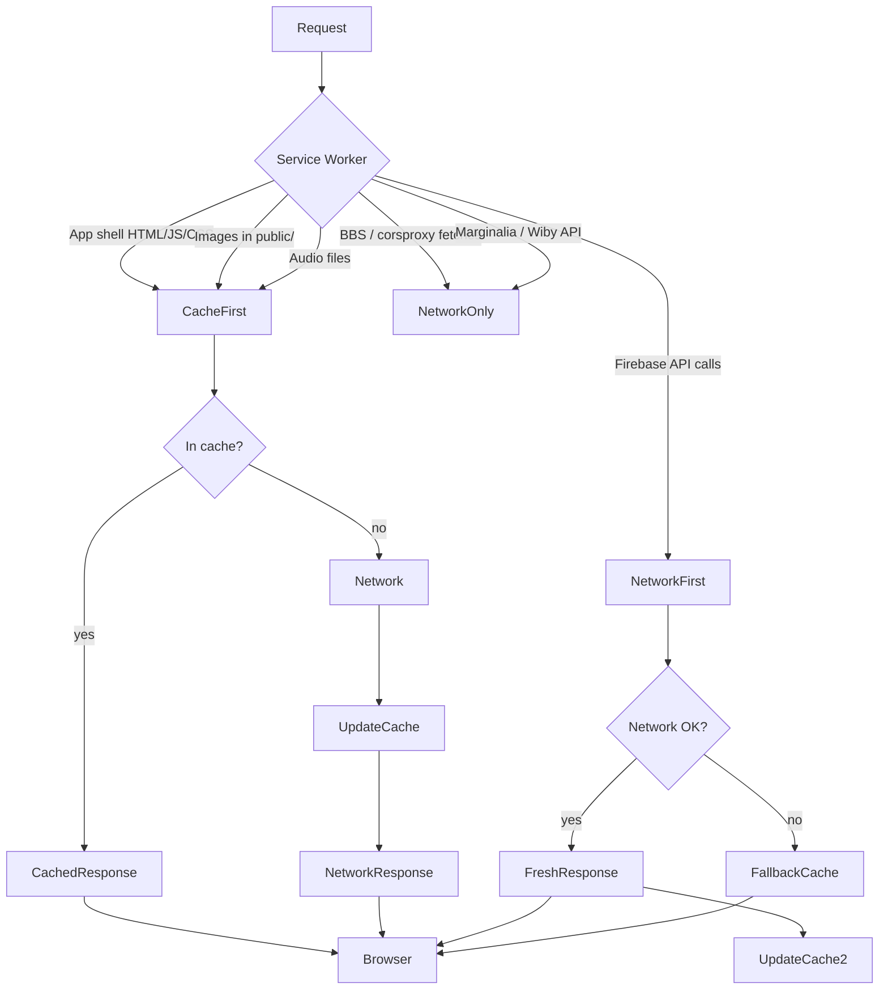
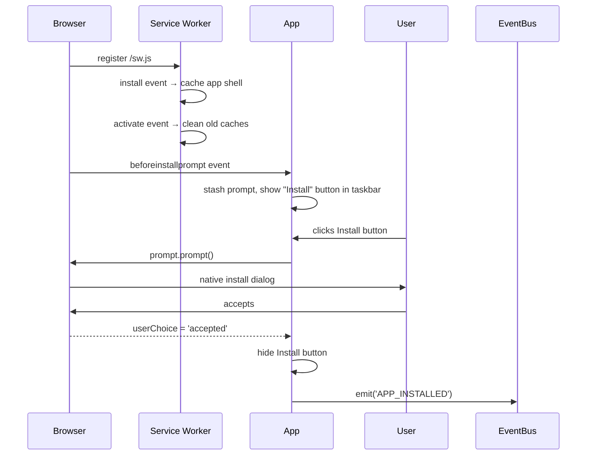
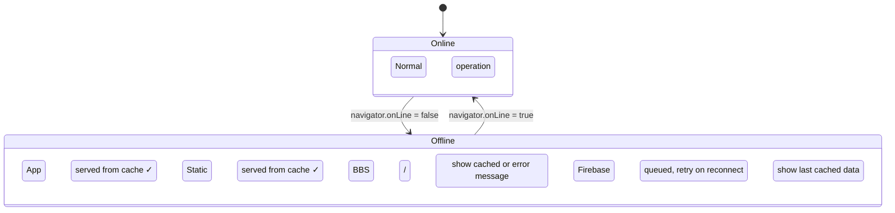
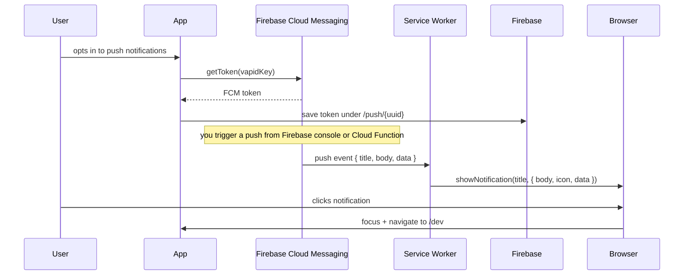

# System Design: PWA Layer

## Purpose
Make the OS installable as a Progressive Web App — install to home screen on mobile
and desktop, work offline with cached assets, and optionally receive push notifications
via Firebase Cloud Messaging. Entirely additive: nothing else in the app depends on
this system.

---

## Public API

```js
// src/systems/pwa.js

isInstalled()                 // → boolean (running in standalone mode)
canInstall()                  // → boolean (browser has a deferred install prompt)
promptInstall()               // → Promise<'accepted'|'dismissed'>
isOffline()                   // → boolean
getServiceWorkerStatus()      // → 'installing'|'waiting'|'active'|'unsupported'
```

```js
// Service worker: public/sw.js  (separate file, not bundled)
// Registers itself, manages cache, handles push events
```

---

## Files to create

```
public/
├── manifest.json             ← PWA manifest
├── sw.js                     ← service worker
├── icons/
│   ├── icon-192.png          ← pixel art OS icon, 192×192
│   ├── icon-512.png          ← pixel art OS icon, 512×512
│   └── icon-maskable-512.png ← safe-zone version for Android adaptive icons
```

---

## manifest.json

```json
{
  "name": "AVOS — Andrew's Virtual OS",
  "short_name": "AVOS",
  "description": "A pixel-art portfolio operating system",
  "start_url": "/dev",
  "display": "standalone",
  "orientation": "any",
  "background_color": "#0d0d1a",
  "theme_color": "#0d0d1a",
  "icons": [
    { "src": "/icons/icon-192.png", "sizes": "192x192", "type": "image/png" },
    { "src": "/icons/icon-512.png", "sizes": "512x512", "type": "image/png" },
    {
      "src": "/icons/icon-maskable-512.png",
      "sizes": "512x512",
      "type": "image/png",
      "purpose": "maskable"
    }
  ],
  "screenshots": [
    { "src": "/screenshots/desktop.png", "sizes": "1280x720", "label": "Desktop view" },
    { "src": "/screenshots/mobile.png",  "sizes": "390x844",  "label": "Mobile view" }
  ],
  "categories": ["entertainment", "portfolio", "games"]
}
```

---

## Diagrams

### Cache strategy



### Install flow



### Offline behaviour



### Push notification flow (optional)



---

## Integration points

| Depends on | Reason |
|-----------|--------|
| Nothing | entirely additive |

| Enables | Reason |
|---------|--------|
| Install to home screen | manifest + SW registration |
| Offline mode | cache-first strategy for app shell |
| Push notifications | FCM token registration + SW push handler |
| Notification system | push events surface as OS toasts when app is open |

---

## Implementation notes

- **Registration:** register `sw.js` in `src/index.tsx` on mount, inside
  `if ('serviceWorker' in navigator)`. Use `process.env.PUBLIC_URL + '/sw.js'`
  for the correct path in both dev and prod.
- **Cache versioning:** include a version constant in `sw.js`. On `activate`, delete
  caches with old version names to prevent stale assets.
- **`start_url: "/dev"`:** the PWA should open directly in dev mode, not the main
  terminal site. This makes the installed app feel like a dedicated OS experience.
- **Icons:** draw the pixel art OS icon at 512×512 (pixelated rendering) and generate
  192×192 by downscaling. The maskable version needs the icon within the inner 80%
  safe zone on a solid `#0d0d1a` background.
- **`display: "standalone"`:** hides browser chrome. On iOS this requires
  `<meta name="apple-mobile-web-app-capable" content="yes">` in `index.html`.
- **Offline Firebase:** Firebase JS SDK handles offline persistence natively if
  `enableIndexedDbPersistence()` is called. This gives free offline queuing for writes.
- **Dev mode:** service workers interfere with hot-reload in development. Scope the
  registration to `process.env.NODE_ENV === 'production'` or use a dev-specific SW
  that passes through all requests.
