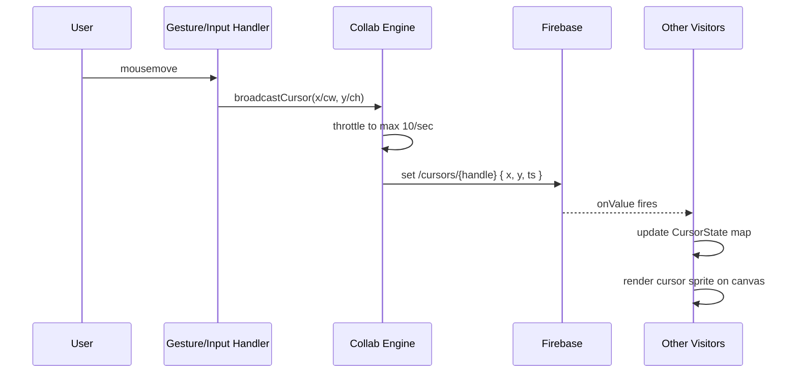
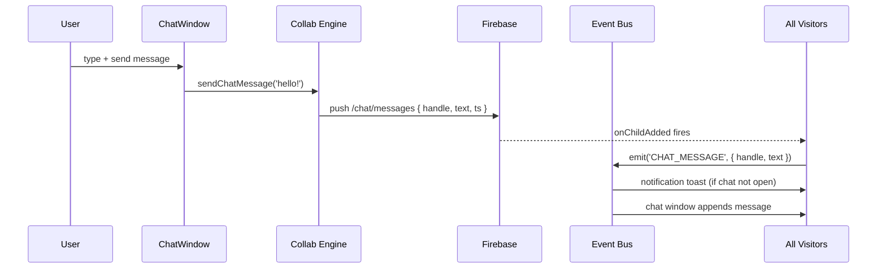
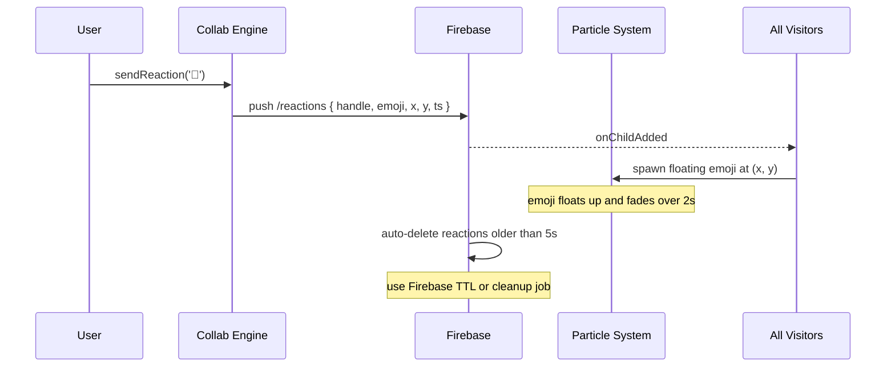
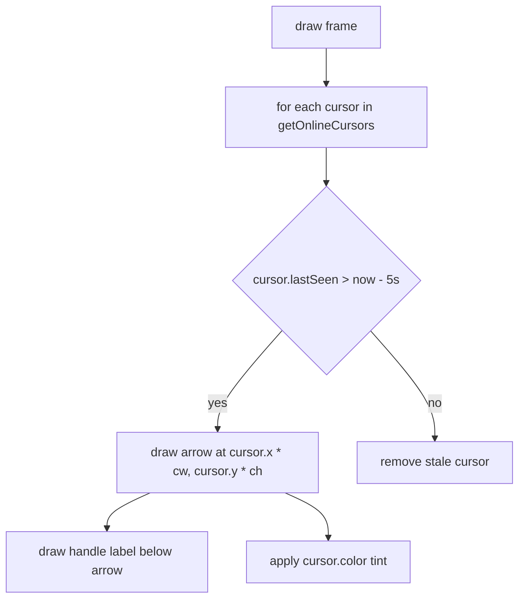

# System Design: Real-Time Collaboration Engine

## Purpose
Make the OS feel like a living shared space: show other visitors' cursors
floating on the desktop, enable a live multi-user chat room, support emoji
reactions broadcast to all connected visitors, and lay groundwork for
co-op arcade sessions. Built entirely on Firebase Realtime Database's
live subscription model with ephemeral presence data.

---

## Public API

```js
// src/systems/collab.js

// Presence & cursors
joinSession()                // register presence + start cursor broadcast
leaveSession()               // remove presence on disconnect
broadcastCursor(x, y)        // send cursor position to all visitors
getOnlineCursors()           // → CursorState[]  (live, updated via Firebase)

// Reactions
sendReaction(emoji)          // broadcast a floating emoji to all visitors
onReaction(handler)          // listen for incoming reactions

// Chat
sendChatMessage(text)        // → Promise<void>
onChatMessage(handler)       // live listener for new messages
getChatHistory(limit?)       // → Promise<ChatMessage[]>

// Co-op (future hook)
joinGameSession(gameId)      // → Promise<GameSessionId>
broadcastGameInput(input)    // send input frame to co-op partner
onGameInput(handler)         // receive partner's input
leaveGameSession()
```

---

## Data shapes

```js
CursorState {
  handle:   string,
  x:        number,          // canvas %, 0–1 (normalised to viewport)
  y:        number,
  color:    string,          // unique per visitor
  lastSeen: number,
}

Reaction {
  handle:   string,
  emoji:    string,
  x:        number,          // origin x (canvas %)
  y:        number,
  ts:       number,
}

ChatMessage {
  id:       string,
  handle:   string,
  text:     string,          // max 280 chars
  ts:       number,
  color:    string,          // handle's assigned color
}
```

---

## Diagrams

### Architecture

```mermaid
classDiagram
  class CollabEngine {
    -string _handle
    -Map~string,CursorState~ _cursors
    +joinSession() void
    +broadcastCursor(x, y) void
    +getOnlineCursors() CursorState[]
    +sendReaction(emoji) void
    +sendChatMessage(text) Promise
    -_subscribeCursors() void
    -_subscribeChat() void
    -_heartbeat() void
  }

  class Firebase {
    +presence/{handle}
    +cursors/{handle}
    +chat/messages
    +reactions (ephemeral)
  }

  class EventBus {
    +emit('CURSOR_UPDATE')
    +emit('CHAT_MESSAGE')
    +emit('REACTION', { emoji, x, y })
  }

  CollabEngine --> Firebase : reads/writes
  CollabEngine --> EventBus : emits updates
```

### Cursor broadcast loop



### Chat message flow



### Floating emoji reaction



### Cursor rendering (canvas)



---

## Firebase schema (collab namespace)

```
/cursors/{handle}
  x:        number (0–1)
  y:        number (0–1)
  ts:       number

/chat/messages/{pushId}
  handle:   string
  text:     string
  ts:       number
  color:    string

/reactions/{pushId}
  handle:   string
  emoji:    string
  x:        number
  y:        number
  ts:       number

/presence/{handle}           ← owned by identity system
```

---

## Integration points

| Depends on | Reason |
|-----------|--------|
| Firebase Realtime | all collab data lives here |
| Identity system | handle, color used in all messages |
| Event bus | emits CHAT_MESSAGE, REACTION, CURSOR_UPDATE |
| Gesture/Input handler | cursor position source |
| Particle physics | floating emoji reactions rendered as particles |

| Used by | Reason |
|---------|--------|
| DesktopCanvas | renders other visitors' cursors |
| Chat room window | live message feed |
| Notification system | new message badge + toast |
| Profile/Social engine | online presence |
| Analytics | online visitor count |

---

## Implementation notes

- **Cursor throttle:** send at most 10 updates/second (100ms debounce).
  Firebase free tier has bandwidth limits — don't hammer it with raw
  mousemove at 60fps.
- **Cursor normalisation:** store `x/canvasWidth` and `y/canvasHeight`
  (0–1 range) so cursors render correctly even if visitors have different
  canvas sizes.
- **Stale cursor cleanup:** remove cursor entries from the rendered list
  if `lastSeen > 5s`. Firebase `onDisconnect` removes the `/cursors/{handle}`
  entry when the visitor disconnects.
- **Chat moderation:** no profanity filter initially — this is a niche
  portfolio, not a public forum. Add rate limiting (max 5 messages per
  10s per handle).
- **Reaction TTL:** use a Firebase Cloud Function or client-side cleanup
  job to delete `/reactions` entries older than 10 seconds. Don't let
  the reactions collection grow unbounded.
- **Co-op gaming:** the `joinGameSession` / `broadcastGameInput` API is a
  placeholder. Implement after single-player arcade is solid. Latency will
  be the primary challenge — target < 100ms RTT.
