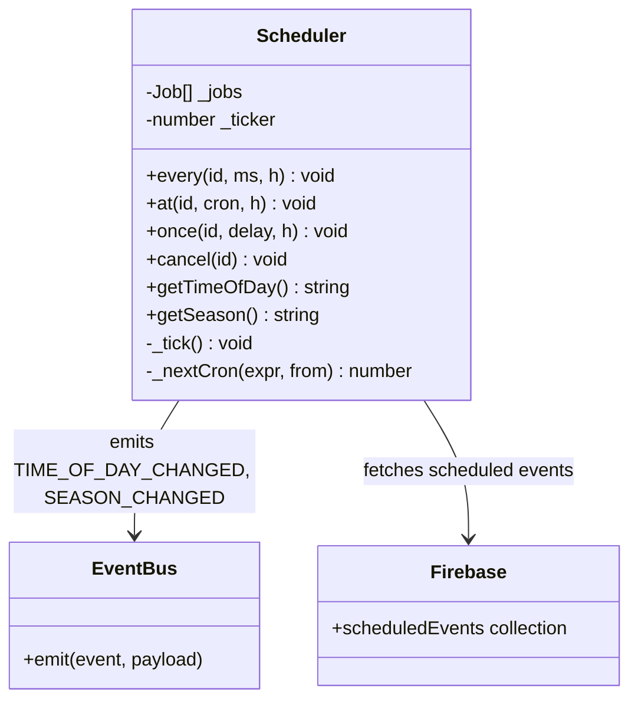
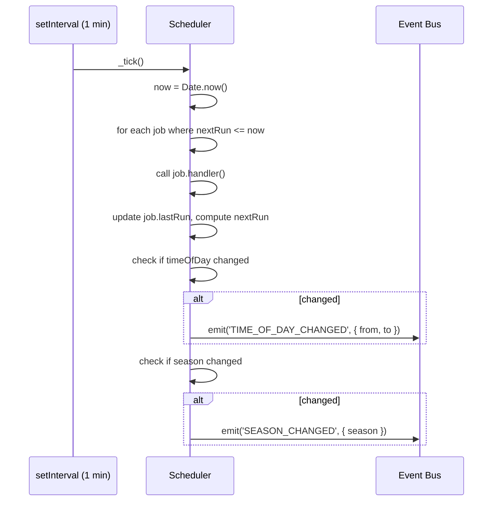

# System Design: Time & Event Scheduler

## Purpose
Provide time-aware behaviour across the OS: daily MOTD rotation, time-of-day
palette shifts, seasonal skins, scheduled system messages from Firebase, crop
growth timers, and real-world event hooks (e.g. "it's Friday, deploy
carefully"). A single scheduler owns all time-based logic so features don't
each manage their own `setTimeout` / `setInterval` soup.

---

## Public API

```js
// src/systems/scheduler.js

// Schedule jobs
every(id, intervalMs, handler)    // repeating job
at(id, cronExpr, handler)         // cron-style job  (minute resolution)
once(id, delayMs, handler)        // one-shot delayed job
cancel(id)                        // remove a job

// Time helpers
getTimeOfDay()                    // → 'dawn' | 'morning' | 'afternoon' | 'evening' | 'night'
getSeason()                       // → 'spring' | 'summer' | 'autumn' | 'winter'
getDayOfWeek()                    // → 0–6 (0 = Sunday)
isWeekend()                       // → boolean
getLocalDate()                    // → Date (user's local timezone)

// MOTD
getMOTD()                         // → string  (today's message)
setMOTD(text)                     // override MOTD (admin/debug only)

// Remote events
fetchScheduledEvents()            // → Promise<ScheduledEvent[]>  (from Firebase)
```

---

## Data shapes

```js
Job {
  id:         string,
  type:       'every' | 'at' | 'once',
  intervalMs?: number,
  cron?:      string,        // e.g. '0 9 * * 1'  (Mon 09:00)
  handler:    () => void,
  lastRun?:   number,
  nextRun:    number,
}

ScheduledEvent {
  id:         string,
  triggerAt:  number,        // Unix ms
  type:       'toast' | 'theme' | 'wallpaper' | 'motd',
  payload:    object,        // depends on type
}

TimeContext {
  timeOfDay:  string,
  season:     string,
  dayOfWeek:  number,
  isWeekend:  boolean,
  hour:       number,
  month:      number,
}
```

---

## Diagrams

### Architecture



### Tick loop



### Time-of-day palette shifts

```
00:00 – 05:59  → night   (deep navy, cool blues)
06:00 – 08:59  → dawn    (orange/pink sky tones)
09:00 – 16:59  → morning/afternoon (bright, normal theme)
17:00 – 19:59  → evening (amber/warm tones)
20:00 – 23:59  → night   (deep navy)
```

### Seasonal calendar

| Season | Months | Effects |
|--------|--------|---------|
| Spring | Mar–May | green palette, blossom particles |
| Summer | Jun–Aug | bright, sunflower wallpaper available |
| Autumn | Sep–Nov | amber palette, leaf particles, pumpkin crops |
| Winter | Dec–Feb | snow wallpaper, blue tones, snowdrop crops |

---

## Built-in scheduled jobs

| id | schedule | handler |
|----|----------|---------|
| `motd_rotate` | daily 00:00 | pick next MOTD from list |
| `time_check` | every 1 min | detect timeOfDay change |
| `season_check` | daily 00:00 | detect season change |
| `crop_tick` | every 1 min | farm engine growth tick |
| `weather_check` | every 15 min | maybe change farm weather |
| `visitor_log` | every 5 min | refresh /var/log/visitors.log |
| `remote_events` | every 10 min | fetch Firebase scheduled events |

---

## Integration points

| Depends on | Reason |
|-----------|--------|
| Event bus | emits TIME_OF_DAY_CHANGED, SEASON_CHANGED, MOTD_UPDATED |
| Firebase Realtime | fetches remote scheduled events |
| Preferences Manager | reads timezone preference |

| Used by | Reason |
|---------|--------|
| Farming engine | crop growth ticks, weather ticks |
| Wallpaper Manager | season-based auto-wallpaper, time-of-day palette |
| VFS | /etc/motd content function reads getMOTD() |
| Notification system | sends scheduled toast messages |
| Canvas renderers | time-of-day colour tinting |

---

## Implementation notes

- **Tick resolution:** 1-minute `setInterval`. Sufficient for MOTD, seasons,
  and most scheduling. Crop growth uses its own finer-grained accounting
  within `farming.tick()`.
- **MOTD list:** hardcode 30+ MOTD strings in `scheduler.config.js`,
  cycling by `dayOfYear % motds.length`. Allows seasonal overrides by
  checking the current date first.
- **Cron parser:** implement a minimal subset — `* * * * *` fields for
  minute, hour, day-of-month, month, day-of-week. No need for seconds or
  complex ranges. A 50-line parser is sufficient.
- **Remote events:** Firebase `/scheduledEvents` collection lets you push
  a toast or theme change to all connected visitors without a deploy. Useful
  for special occasions (New Year greeting, etc.).
- **Friday easter egg:** built-in job at `0 17 * * 5` (Friday 5pm) emits
  a toast: "It's Friday. Be careful deploying to prod."
- **Hydration:** on page load, immediately call `_tick()` once to fire any
  jobs that should have run while the tab was closed.
