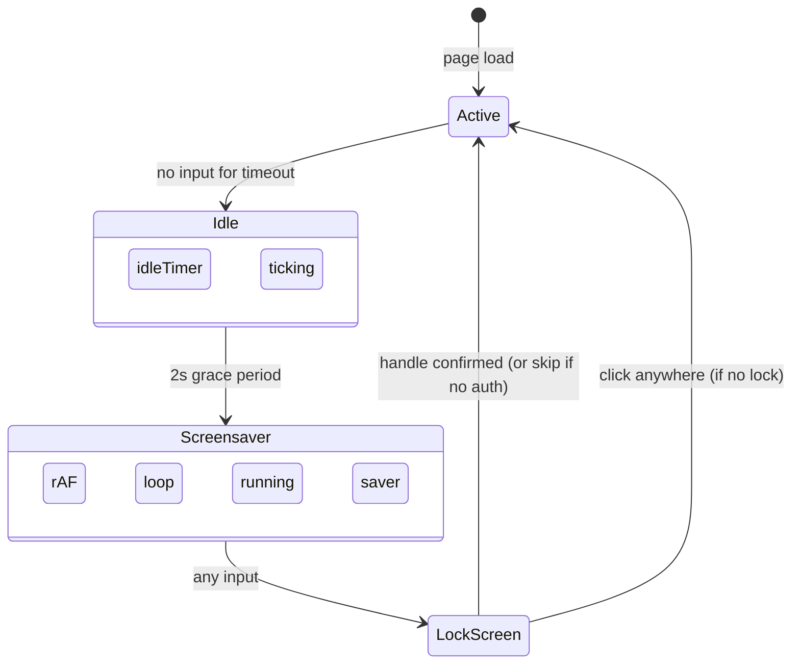
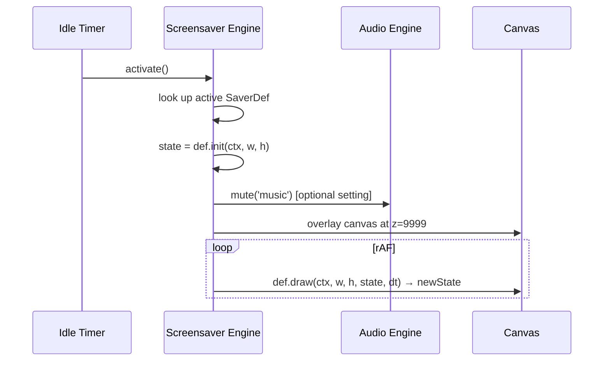
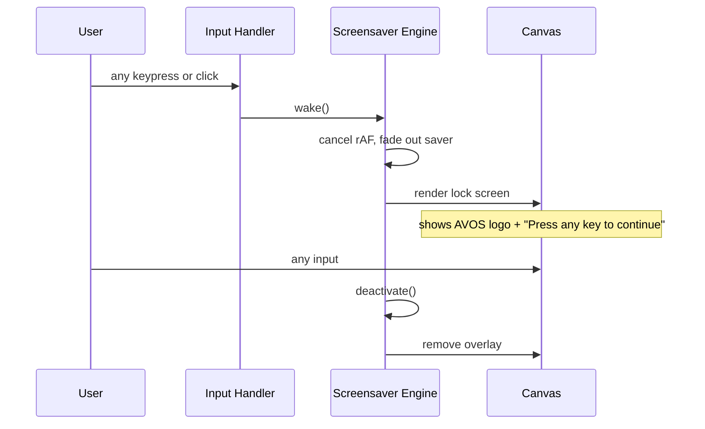

# System Design: Screensaver Engine

## Purpose
Activate a fullscreen canvas animation after a configurable idle timeout,
and display a lock screen with handle re-entry on wake. Screensavers are
registered modules (same pattern as arcade games) — a small library of
built-in savers plus the ability to add more. Keeps the OS feeling alive
even when nobody is at the keyboard.

---

## Public API

```js
// src/systems/screensaver.js

// Control
activate(id?)                // immediately activate (optional id override)
deactivate()                 // dismiss screensaver + show lock screen
wake()                       // called on any user input → deactivate if active
isActive()                   // → boolean

// Registry
registerSaver(def)           // add a screensaver module
getSavers()                  // → SaverDef[]
setActiveSaver(id)           // persist choice to prefs

// Idle tracking
resetIdleTimer()             // call on any user input
getIdleSeconds()             // → number
```

---

## Data shapes

```js
SaverDef {
  id:         string,
  name:       string,
  thumbnail:  string,        // small preview path

  // Lifecycle hooks
  init(ctx, w, h): SaverState,
  draw(ctx, w, h, state, dt): SaverState,
}

SaverState {
  // opaque — each saver manages its own state
}
```

---

## Diagrams

### Built-in screensavers

| id | name | description |
|----|------|-------------|
| `matrix` | Matrix Rain | green falling characters |
| `starfield` | Starfield | parallax stars |
| `dvd` | DVD Bounce | AVOS logo bouncing |
| `pipes` | Pipes | connecting pipe animation |
| `plasma` | Plasma | colour wave |
| `clock` | Big Clock | large pixel clock |
| `fireworks` | Fireworks | particle bursts |

### Idle state machine



### Activation flow



### Wake & lock screen



---

## Integration points

| Depends on | Reason |
|-----------|--------|
| Preferences Manager | reads screensaver id and timeout |
| Gesture/Input handler | any input calls wake() / resetIdleTimer() |
| Audio engine | optionally mutes music during screensaver |

| Used by | Reason |
|---------|--------|
| DesktopCanvas | screensaver overlay drawn above everything |
| Preferences window | saver picker with preview |

---

## Implementation notes

- **Idle detection:** call `resetIdleTimer()` on every pointer move and
  keydown (via Gesture/Input handler). Use a single `setTimeout` that
  restarts on each reset. No polling.
- **Overlay canvas:** the screensaver draws on a separate `<canvas>` that
  covers the full viewport at `z-index: 9999`. Don't draw on the main
  desktop canvas — easier to remove on wake.
- **Fade in/out:** apply a CSS `opacity` transition (300ms) on the overlay
  canvas for smooth activation/deactivation.
- **Lock screen:** minimal — just the AVOS logo and a prompt. No password.
  The "lock" is purely aesthetic.
- **Dev mode:** disable screensaver when `process.env.NODE_ENV ===
  'development'` to avoid it triggering during debugging.
- **Saver performance:** each `draw()` call should complete in < 8ms to
  maintain 60fps. Savers run in isolation from the main desktop rAF.
