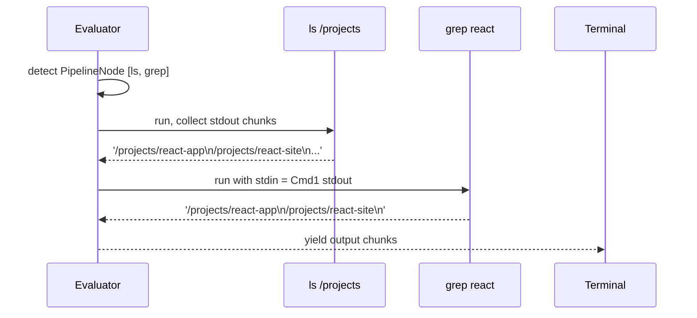
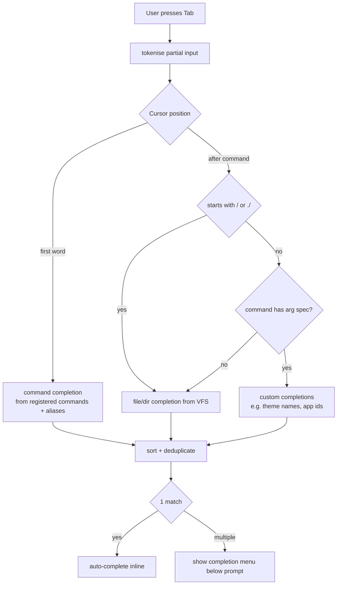

# System Design: Advanced Shell Parser

## Purpose
Replace the current single-string `split(' ')[0]` command dispatch with a
proper shell parser that supports pipes, I/O redirection, command chaining,
variable expansion, glob patterns, aliases, and tab completion. The parser
output is a structured AST that the terminal evaluates, enabling complex
one-liners like `ls /projects | grep react > /tmp/react-projects.txt`.

---

## Public API

```js
// src/systems/shell.js

// Parsing
parse(raw)                   // → AST  (throws ParseError on syntax error)
tokenise(raw)                // → Token[]  (lower-level, for tab completion)

// Evaluation
evaluate(ast, context)       // → AsyncGenerator<OutputChunk>
  // context: { cwd, env, vfs, aliases, onPipe }

// Tab completion
complete(partial, context)   // → string[]  (sorted completion candidates)
completeFile(partial, cwd)   // → string[]  (path completions from VFS)

// Aliases
setAlias(name, expansion)    // define alias
removeAlias(name)
getAliases()                 // → { [name]: string }

// History
addHistory(raw)              // append to history list
getHistory()                 // → string[]
historySearch(prefix)        // → string[]  (matches from most recent)

// Environment
setEnv(key, value)
getEnv(key)                  // → string | undefined
getEnvAll()                  // → { [key]: string }
```

---

## Data shapes

```js
Token {
  type:   'word' | 'pipe' | 'redirect_out' | 'redirect_append'
        | 'redirect_in' | 'and' | 'or' | 'semicolon'
        | 'background' | 'string' | 'variable' | 'glob',
  value:  string,
  raw:    string,            // original text (for error reporting)
}

// AST nodes
CommandNode {
  type:     'command',
  argv:     string[],        // after expansion
  stdin?:   string,          // redirect source path
  stdout?:  string,          // redirect target path
  append?:  boolean,         // >> vs >
  bg?:      boolean,         // & suffix
}

PipelineNode {
  type:     'pipeline',
  commands: CommandNode[],
}

ListNode {
  type:     'list',
  items:    Array<{ node: PipelineNode | CommandNode, op: '&&' | '||' | ';' }>,
}

OutputChunk {
  type:     'stdout' | 'stderr',
  text:     string,
}

ParseError {
  message:  string,
  col:      number,
}
```

---

## Diagrams

### Parse pipeline

```mermaid
flowchart LR
  A[Raw string\n\"ls /p | grep r > out.txt\"] --> B[Tokeniser]
  B --> C[Token[]]
  C --> D[Parser]
  D --> E[AST]
  E --> F[Expander\nvariables, globs, aliases]
  F --> G[Expanded AST]
  G --> H[Evaluator]
  H --> I[AsyncGenerator<OutputChunk>]
```

### AST example

```
"ls /projects | grep react && echo done"

ListNode
  ├─ PipelineNode (op: &&)
  │    ├─ CommandNode { argv: ['ls', '/projects'] }
  │    └─ CommandNode { argv: ['grep', 'react'] }
  └─ CommandNode (op: end)
       └─ CommandNode { argv: ['echo', 'done'] }
```

### Pipe evaluation



### Tab completion flow



### Variable expansion

```mermaid
flowchart TD
  A[token of type 'variable'\ne.g. $HOME] --> B[look up in env map]
  B -- found --> C[replace with value]
  B -- not found --> D[replace with empty string]
  C --> E[continue expansion]
  D --> E
  E --> F{token contains glob */?/[}
  F -- yes --> G[expand against VFS ls]
  F -- no --> H[pass through as literal]
```

---

## Supported syntax reference

| Syntax | Example | Effect |
|--------|---------|--------|
| Pipe | `ls \| grep foo` | stdout of left → stdin of right |
| Redirect out | `ls > file.txt` | stdout to file in VFS |
| Redirect append | `echo hi >> log.txt` | append to VFS file |
| And chain | `mkdir foo && cd foo` | run right only if left succeeds |
| Or chain | `cat x \|\| echo missing` | run right only if left fails |
| Semicolon | `clear; ls` | run sequentially |
| Background | `sleep 5 &` | run without blocking prompt |
| Variable | `echo $HOME` | expand env var |
| Glob | `ls *.txt` | expand matched paths from VFS |
| Alias | `alias ll='ls -la'` | define shorthand |
| History | `!!` | repeat last command |
| Subshell | `echo $(pwd)` | expand stdout of inner command |

---

## Integration points

| Depends on | Reason |
|-----------|--------|
| Virtual Filesystem | file completions, redirect targets, glob expansion |
| Command registry | maps command names to handler functions |

| Used by | Reason |
|---------|--------|
| Terminal | replaces current raw string dispatch |
| Achievement engine | parse events (e.g. 'used pipe for first time') |

---

## Implementation notes

- **Incremental:** don't break existing commands. The evaluator maps
  `CommandNode.argv[0]` to the existing command registry — no changes to
  individual command handlers.
- **Error recovery:** `parse()` should return a descriptive `ParseError`
  with column offset so the terminal can underline the bad token.
- **History cap:** keep last 500 entries in memory, persist last 100 to
  localStorage under `'avos_history'`.
- **Alias expansion:** expand aliases before parsing to avoid recursive
  alias loops (max 10 expansion depth, then error).
- **Glob:** implement against VFS `ls()` — return `[original]` if no
  matches (bash behaviour). Expansion happens in the Expander pass, not
  the tokeniser.
- **Background jobs:** `&` suffix — fire the command and return the
  prompt immediately. Output lines are buffered and flushed to the
  terminal when the job completes, prefixed with `[1] done:`.
