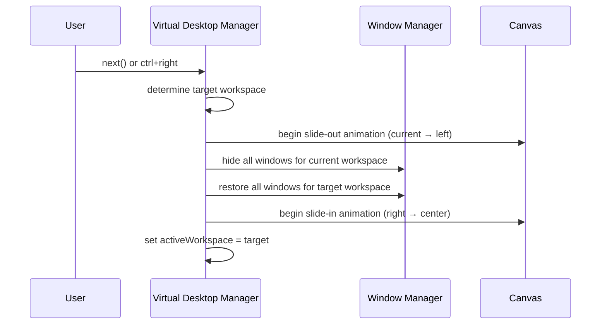
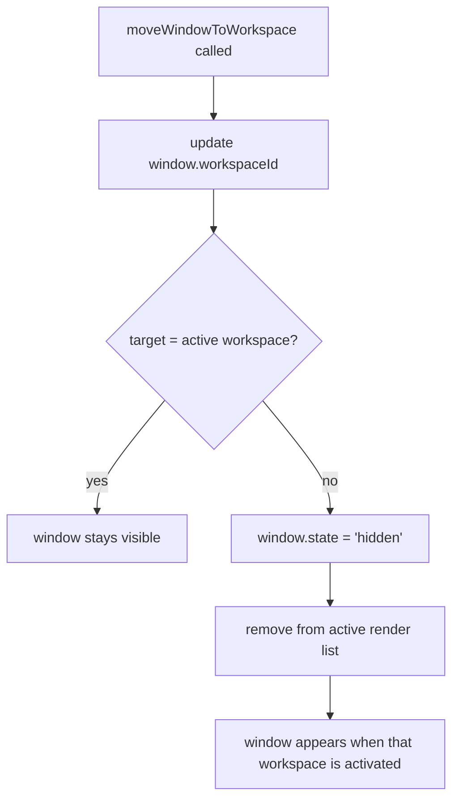
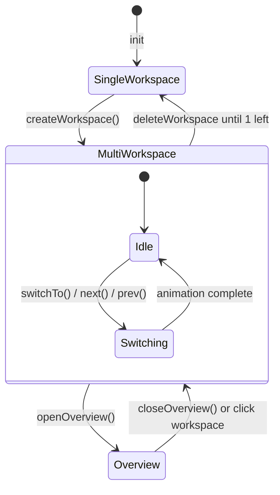

# System Design: Virtual Desktop Manager

## Purpose
Add Spaces-style virtual desktop switching to the OS desktop. Each workspace
is an independent window layout with its own wallpaper and a named context
(e.g. "Work", "Games", "Browser"). Users switch workspaces via keyboard
shortcut, a switcher overlay, or swipe gestures on mobile. Workspace state
is persisted locally.

---

## Public API

```js
// src/systems/vdesktop.js

// Workspace management
createWorkspace(name, opts?)  // → workspaceId
deleteWorkspace(id)
renameWorkspace(id, name)
getWorkspaces()               // → Workspace[]
getActiveWorkspace()          // → Workspace

// Switching
switchTo(id)                  // animate transition to workspace
next()                        // cycle to next workspace
prev()                        // cycle to previous workspace

// Window assignment
moveWindowToWorkspace(windowId, workspaceId)
getWindowsForWorkspace(workspaceId)  // → WindowState[]
pinWindow(windowId)           // show window in all workspaces

// Exposé / overview
openOverview()                // show all workspaces tiled
closeOverview()
isOverviewOpen()              // → boolean
```

---

## Data shapes

```js
Workspace {
  id:         string,
  name:       string,
  wallpaper:  string,          // wallpaper id (can differ per workspace)
  icon:       string,          // emoji or short label for switcher UI
  order:      number,          // display order
}

WorkspaceLayout {
  workspaceId: string,
  windows:     WindowState[],  // snapshot for this workspace
}
```

---

## Diagrams

### Workspace switcher UI (canvas overlay)

```
┌──────────────── WORKSPACES ──────────────┐
│  [1: Desktop ★]  [2: Games]  [3: Browse] │  ← switcher strip
│       ↑ active                           │
└──────────────────────────────────────────┘
```

### Exposé overview (Spaces-style)

```
┌─────────────────────────────────────────┐
│  ┌─────────┐  ┌─────────┐  ┌─────────┐ │
│  │ Desktop │  │  Games  │  │ Browser │ │  ← miniature previews
│  │[windows]│  │[windows]│  │[windows]│ │
│  └─────────┘  └─────────┘  └─────────┘ │
│       click to switch workspace         │
└─────────────────────────────────────────┘
```

### Workspace switch animation



### Window movement between workspaces



### State machine



---

## Integration points

| Depends on | Reason |
|-----------|--------|
| Window Manager | owns window list; VDM filters by workspaceId |
| Wallpaper Manager | per-workspace wallpaper |
| Gesture/Input handler | swipe left/right for workspace switch |
| Preferences Manager | persist workspace layout |

| Used by | Reason |
|---------|--------|
| DesktopCanvas | only renders windows for active workspace |
| Taskbar | shows workspace indicator / switcher |
| Keyboard shortcuts | ctrl+left/right to switch |

---

## Implementation notes

- **Default state:** start with one workspace ("Desktop"). Creating a
  second workspace is opt-in via preferences or a keyboard shortcut.
- **Persistence:** save workspace definitions and window assignments to
  localStorage under `'avos_workspaces'`.
- **Pinned windows:** windows pinned (`pinWindow`) always appear in all
  workspaces — useful for the clock, taskbar overlays, or the AI assistant.
- **Overview rendering:** scale each workspace canvas to ~30% size using
  `ctx.scale()` + clip. Draw a border around the active workspace.
- **Transition animation:** simple horizontal translate over 200ms. Use
  `ctx.save()` / `ctx.translate()` / `ctx.restore()` — no CSS transforms
  on the canvas.
- **Mobile:** swipe left/right between workspaces as the primary navigation
  pattern (mirrors iOS app switcher). No overview mode on mobile — just
  a dot indicator at the top.
