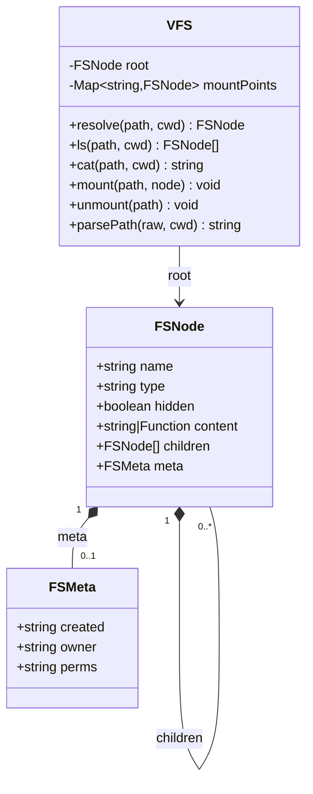
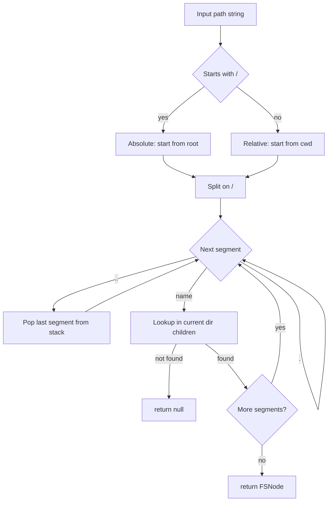
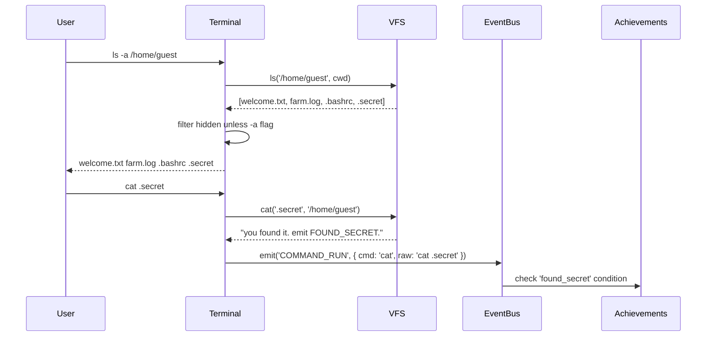
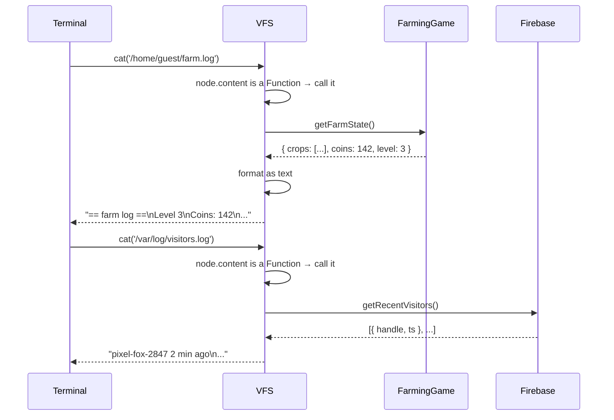

# System Design: Virtual Filesystem

## Purpose
A single in-memory tree that is the authoritative source for the fake OS filesystem.
Currently the terminal's fake filesystem is embedded directly in the terminal codebase
and not navigable beyond basic `cat`/`ls`. This system makes the tree shared, navigable
(`cd` across sessions), and extensible — so the dungeon crawler, lore system, hidden
easter egg files, and farming game log all read from the same structure.

---

## Public API

```js
// src/systems/vfs.js

// Navigation
resolve(path, cwd?)         // → FSNode | null  (absolute or relative path)
ls(path, cwd?)              // → FSNode[]       (directory listing)
cat(path, cwd?)             // → string | null  (file contents; null if dir or missing)
exists(path, cwd?)          // → boolean

// Mutation (runtime-only, not persisted)
mount(path, node)           // attach a subtree at runtime (farming log, generated lore)
unmount(path)               // detach a mounted subtree
writeFile(path, content)    // create or overwrite a file node at path
mkdir(path)                 // create a directory node at path

// Shell helpers
parsePath(raw, cwd)         // → string  (resolve '..' and '.' components)
isHidden(node)              // → boolean (name starts with '.')
```

---

## Data shapes

```js
FSNode {
  name:       string,
  type:       'file' | 'dir',
  hidden?:    boolean,      // true for dotfiles; ls hides these unless -a flag
  content?:   string | (() => string),  // file: static string or generator fn
  children?:  FSNode[],     // dir only
  meta?: {
    created:  string,       // ISO timestamp (for lore flavour)
    owner:    string,       // e.g. "root", "guest"
    perms:    string,       // e.g. "rw-r--r--" (display only)
  }
}
```

---

## Filesystem tree

```
/
├── home/
│   └── guest/              ← cwd on boot
│       ├── .bashrc         (hidden; cat shows terminal prompt config)
│       ├── .secret         (hidden; easter egg — "found_secret" achievement)
│       ├── farm.log        (generated: recent harvests + current plot state)
│       ├── welcome.txt     (intro message shown on first `cat`)
│       └── screenshots/    (future: saved canvas screenshots)
│
├── etc/
│   ├── motd                (message of the day; lore flavour, changes daily)
│   ├── hostname            ("avos-0.3.1")
│   └── os-release          (OS lore: version, codename, build date)
│
├── lore/
│   ├── history.txt         (fictional OS backstory)
│   ├── changelog.txt       (fake patch notes matching ARCHITECTURE.md)
│   ├── contributors.txt    (fake contributors with funny names)
│   └── manifesto.txt       (the OS's fictional design philosophy)
│
├── projects/               (mirrors portfolio data — generated from portfolio.config.js)
│   ├── README.md
│   └── {project-slug}.txt  (one file per project with description + links)
│
├── usr/
│   └── games/
│       ├── snake           (executable; `./snake` launches Snake)
│       ├── tron            (executable; `./tron` launches Tron)
│       └── README          (lists all games and how to run them)
│
├── var/
│   └── log/
│       ├── commands.log    (generated: last 20 commands run this session)
│       └── visitors.log    (generated: recent visitor handles from Firebase)
│
└── dev/
    ├── null                (cat /dev/null returns empty string)
    ├── random              (cat /dev/random returns a random hex string)
    └── urandom             (alias for random)
```

---

## Diagrams

### Node tree structure



### Path resolution



### Integration with terminal



### Dynamic content (generated files)



---

## Integration points

| Depends on | Reason |
|-----------|--------|
| portfolio.config.js | generates /projects/ subtree |
| Farming game | generates /home/guest/farm.log content |
| Firebase realtime | generates /var/log/visitors.log content |
| Event bus | emits events when hidden files are discovered |

| Used by | Reason |
|---------|--------|
| Terminal | `cat`, `ls`, `cd`, `pwd`, `find` commands |
| Dungeon crawler | maps directories to dungeon rooms, files to loot |
| Lore system | reads from /lore/ and /etc/ |
| Achievement engine | `found_secret` triggers on `cat /home/guest/.secret` |

---

## Implementation notes

- **Generated content:** `content` can be a `() => string` function so files like
  `farm.log` and `visitors.log` are computed fresh on every `cat`. This is better than
  trying to keep file content in sync with live state.
- **No persistence:** the VFS is rebuilt from its definition on every page load.
  Runtime mutations (`mount`, `writeFile`) are session-only. This keeps it simple —
  nothing to migrate or version.
- **Executables:** `usr/games/snake` etc. are files with a special meta flag
  `executable: true`. The terminal checks for this and routes `./snake` to the
  appropriate app opener.
- **`/dev/random`:** the content function returns `crypto.getRandomValues` bytes
  formatted as a hex string — it's a fun interactive file to `cat`.
- **Hidden files and `-a`:** `ls()` returns all nodes including hidden ones. The
  terminal command layer is responsible for filtering based on flags. VFS itself is
  flag-agnostic.
- **Mount points:** used by the farming game to attach its log, and potentially by
  future features that want to add runtime files without touching the static tree.
