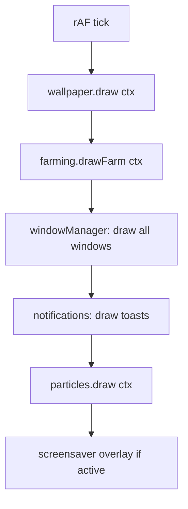
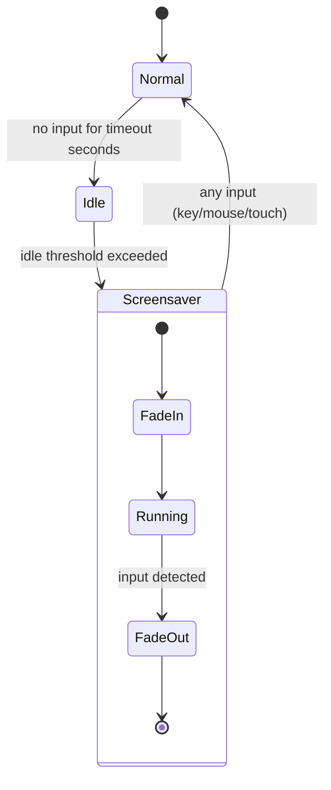

# System Design: Wallpaper Manager

## Purpose
Manage the desktop background layer: a gallery of static pixel-art wallpapers,
animated procedural wallpapers (starfield, matrix rain, plasma), and a
screensaver mode that activates on idle. The active wallpaper is drawn first
in the rAF loop, beneath the farming game layer and windows.

---

## Public API

```js
// src/systems/wallpaper.js

// Selection
setWallpaper(id)             // set active wallpaper (persisted to prefs)
getWallpaper()               // → WallpaperDef
getGallery()                 // → WallpaperDef[]

// Rendering hook (called from DesktopCanvas rAF loop)
draw(ctx, cw, ch, dt)        // draw current wallpaper for this frame

// Screensaver
activateScreensaver()        // switch to screensaver mode
deactivateScreensaver()      // return to normal wallpaper
isScreensaverActive()        // → boolean
```

---

## Data shapes

```js
WallpaperDef {
  id:         string,
  name:       string,
  type:       'static' | 'animated' | 'procedural',
  src?:       string,        // image path for static wallpapers
  draw?:      (ctx, cw, ch, state, dt) => WallpaperState,
  initState?: () => WallpaperState,
  thumbnail:  string,        // small preview image path
  season?:    string,        // auto-activate during this season
}

WallpaperState {
  // opaque per-wallpaper state (e.g. star positions for starfield)
}
```

---

## Diagrams

### Wallpaper catalogue

| id | name | type | description |
|----|------|------|-------------|
| `default` | Night Sky | static | dark pixel-art cityscape |
| `grid` | Terminal Grid | static | dark scanline grid |
| `starfield` | Starfield | procedural | parallax scrolling stars |
| `matrix` | Matrix Rain | procedural | green falling characters |
| `plasma` | Plasma | procedural | animated colour wave |
| `farm_day` | Farm Day | static | seasonal farm scene |
| `farm_night` | Farm Night | static | moonlit farm |
| `cga` | CGA Demo | procedural | retro 4-colour pattern |
| `solid_black` | Void | static | pure black |
| `solid_dark` | Dark Navy | static | #0d0d1a solid |

### Render pipeline position



### Screensaver state machine



---

## Integration points

| Depends on | Reason |
|-----------|--------|
| Preferences Manager | reads/writes active wallpaper id, screensaver settings |
| Gesture/Input handler | any input wakes screensaver |

| Used by | Reason |
|---------|--------|
| DesktopCanvas | calls draw() first in rAF loop |
| Preferences window | wallpaper gallery picker |

---

## Implementation notes

- **Static wallpapers:** preload as `Image` objects on init. Draw with
  `ctx.drawImage(img, 0, 0, cw, ch)` with `imageSmoothingEnabled = false`.
- **Procedural wallpapers:** `initState()` creates initial particle/grid
  arrays. `draw()` mutates and renders state each frame — no external RAF.
- **Season auto-swap:** check current season from the farming engine on
  each day boundary and auto-switch to the season wallpaper if the user
  hasn't manually overridden.
- **Screensaver:** implemented as a separate wallpaper layer drawn on top
  with a black fade-in. The underlying wallpaper keeps ticking; screensaver
  is just an overlay.
- **Performance:** procedural wallpapers should be skipped (draw solid colour)
  if `prefs.reduceMotion` is true.
