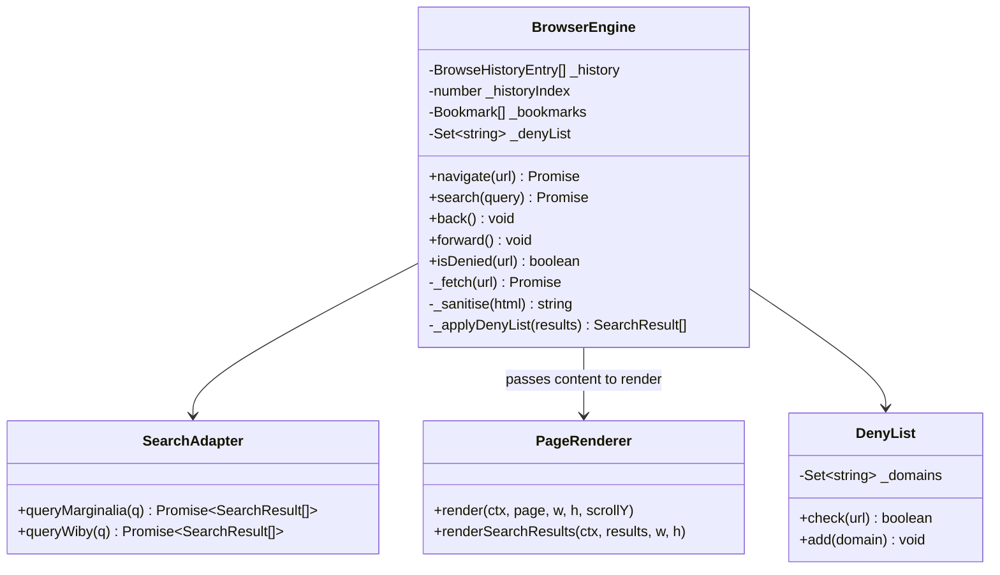
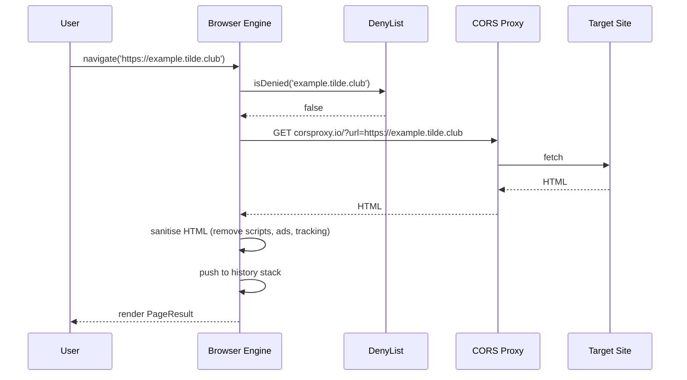
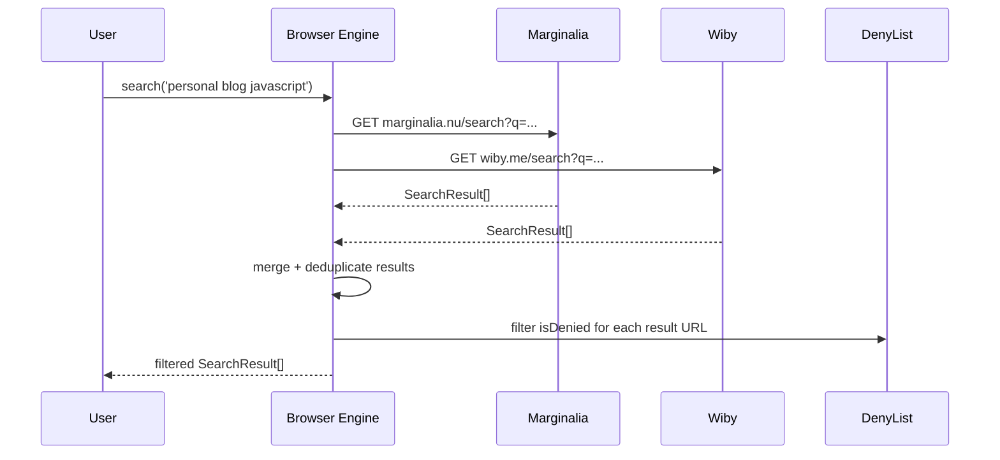
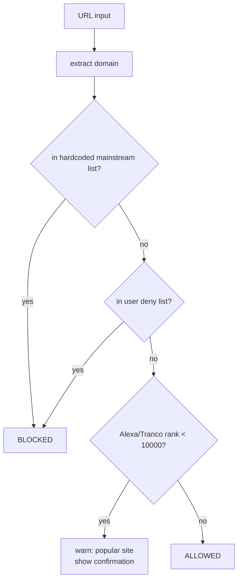
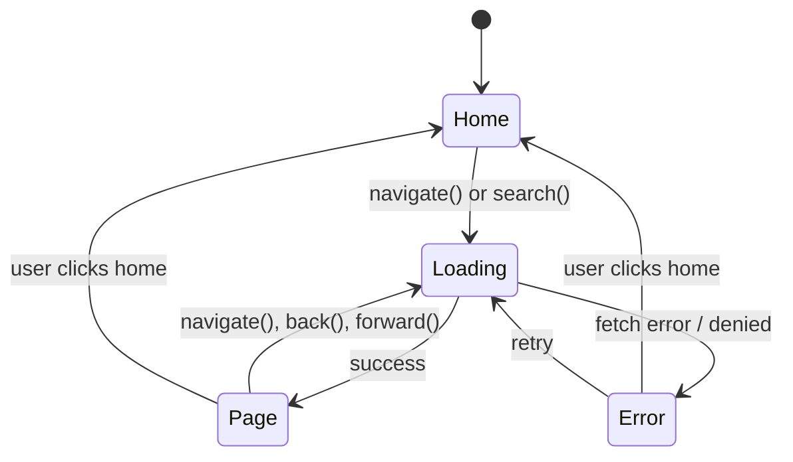

# System Design: Web Revival Browser Engine

## Purpose
An in-OS browser that celebrates the indie/personal web. It queries
Marginalia Search and Wiby.me for results — both index only non-commercial,
human-written content — and renders pages inside the OS window. A curated
deny-list blocks mainstream domains so discovery stays within the "web revival
network". Navigation, bookmarks, and a web-ring directory make it a genuine
browsing experience, not just an iframe wrapper.

---

## Public API

```js
// src/systems/browser.js

// Navigation
navigate(url)                // load a URL → Promise<PageResult>
back()                       // history back
forward()                    // history forward
reload()                     // reload current page
getHistory()                 // → BrowseHistoryEntry[]
getCurrentUrl()              // → string | null

// Search
search(query, engine?)       // query Marginalia or Wiby → Promise<SearchResult[]>
  // engine: 'marginalia' | 'wiby' | 'both'  (default 'marginalia')

// Bookmarks
addBookmark(url, title?)
removeBookmark(url)
getBookmarks()               // → Bookmark[]

// Web rings / directory
getRingDirectory()           // → RingEntry[]  (curated indie sites)
getRandomSite()              // → string  (random site from directory)

// Deny list
isDenied(url)                // → boolean
addToDenyList(domain)        // (admin / easter egg only)
```

---

## Data shapes

```js
PageResult {
  url:        string,
  title:      string,
  content:    string,        // sanitised HTML or plain text
  loadedAt:   number,
  via:        'direct' | 'proxy',
  error?:     string,
}

SearchResult {
  url:        string,
  title:      string,
  snippet:    string,
  engine:     'marginalia' | 'wiby',
}

BrowseHistoryEntry {
  url:        string,
  title:      string,
  visitedAt:  number,
}

Bookmark {
  url:        string,
  title:      string,
  addedAt:    number,
}

RingEntry {
  url:        string,
  title:      string,
  description:string,
  tags:       string[],
}
```

---

## Diagrams

### Architecture



### Navigation flow



### Search flow



### Deny list decision



### Browser window state machine



---

## Mainstream deny list (seed)

```
google.com, youtube.com, facebook.com, twitter.com, instagram.com,
reddit.com, amazon.com, wikipedia.org, tiktok.com, linkedin.com,
netflix.com, twitch.tv, github.com, stackoverflow.com, medium.com,
substack.com, spotify.com, apple.com, microsoft.com, cloudflare.com
```
> Intent: keep discovery within indie/personal/niche sites.
> Not a moral judgement — these sites are just not the point of this browser.

---

## Integration points

| Depends on | Reason |
|-----------|--------|
| CORS proxy (corsproxy.io) | fetch cross-origin pages |
| Marginalia Search API | indie web search |
| Wiby.me API | text-web search |
| Audio engine | page-load click SFX, back/forward sounds |
| Window Manager | browser window open/close |

| Used by | Reason |
|---------|--------|
| Desktop icon | "Browser" app |
| Terminal | `open https://...` command |
| Web-ring directory | curated site list |

---

## Implementation notes

- **Sanitisation:** strip all `<script>`, `<iframe>`, `<object>`, `<embed>`,
  `onclick`, `onerror`, and external resource references from fetched HTML
  before rendering. Use a DOM parser (`DOMParser`) not regex.
- **Rendering:** render sanitised HTML as a styled canvas overlay or inside
  a sandboxed `<iframe sandbox="allow-same-origin">`. Canvas rendering is
  more on-brand but complex; iframe is simpler and safer.
- **CORS proxy:** wrap all fetches in corsproxy.io (or a self-hosted worker).
  Cache responses for 10 minutes to avoid hammering small indie sites.
- **Deny list enforcement:** apply at both navigation AND search result
  filtering so denied domains never appear anywhere in the UI.
- **Marginalia API:** `https://marginalia.nu/search?query=<q>&format=json`
  returns JSON results. No key required.
- **Wiby API:** `https://wiby.me/search/?q=<q>` returns HTML — parse with
  the same regex approach as the PICO-8 BBS parser.
- **History:** maintain a simple array + index for back/forward. Cap at 50
  entries.
- **Web-ring directory:** hardcode an initial 30–50 curated URLs in
  `browser.config.js`. Let users add to it via `addBookmark`.
