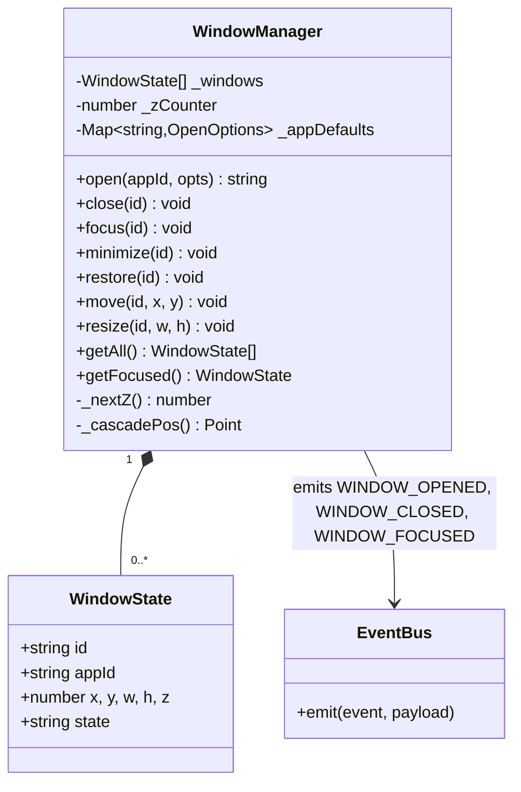
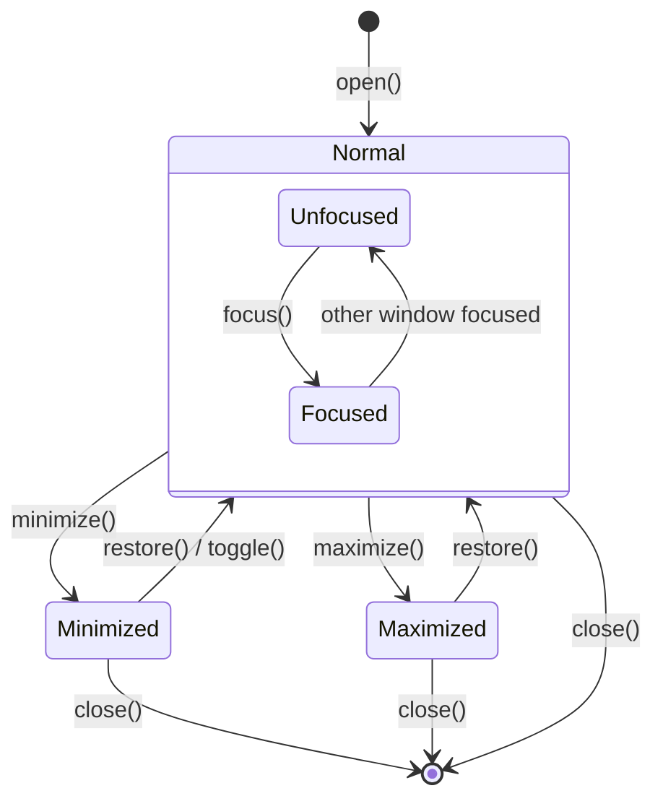
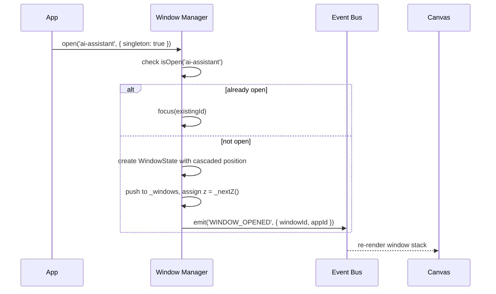
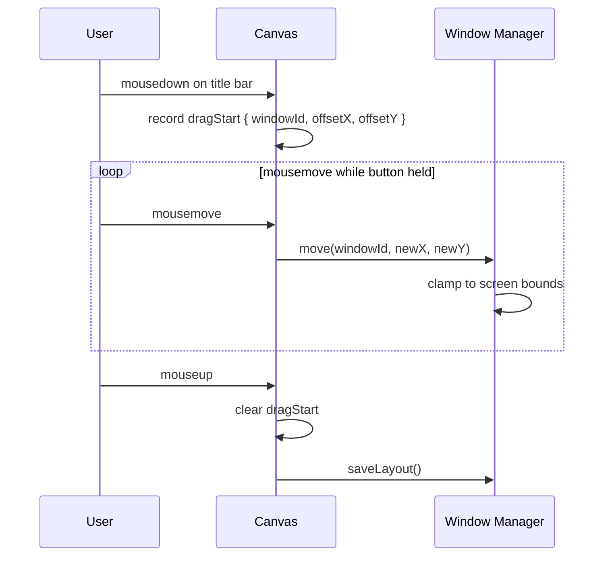
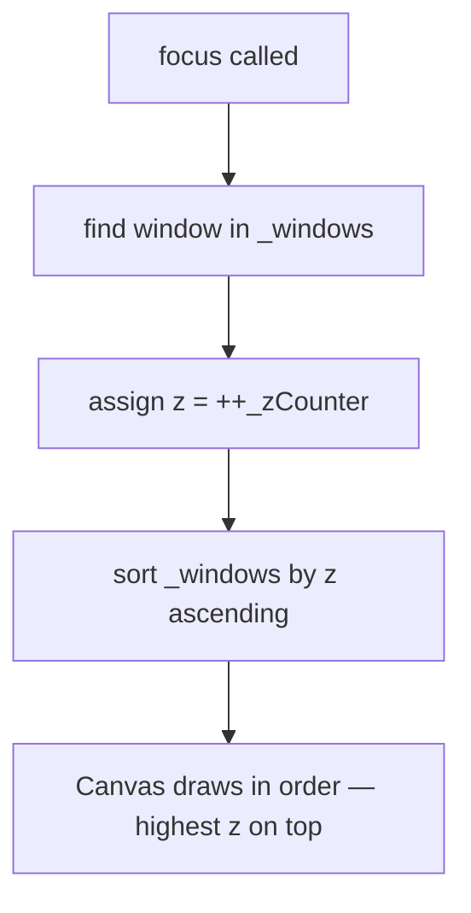

# System Design: Window Manager

## Purpose
Centralise all window lifecycle and layout logic: open, close, focus, minimise,
maximise, drag, resize, z-order, and snap. Currently windows are ad-hoc state
blobs inside `DesktopCanvas.js`; this system extracts them into a shared registry
so every app opens and interacts with windows identically, and features like
virtual desktops and window persistence are possible.

---

## Public API

```js
// src/systems/wm.js

// Lifecycle
open(appId, options?)        // → windowId  (creates + focuses window)
close(windowId)              // remove window
closeAll(appId?)             // close all (or all for one app)
focus(windowId)              // bring to front
minimize(windowId)           // send to taskbar
restore(windowId)            // un-minimize
toggle(appId)                // open if closed, focus if open, restore if minimised

// Layout
move(windowId, x, y)         // set top-left position
resize(windowId, w, h)       // set size (clamped to screen bounds)
maximize(windowId)           // fill screen
snapLeft(windowId)           // 50% left half
snapRight(windowId)          // 50% right half
center(windowId)             // center on screen

// Query
getWindow(windowId)          // → WindowState | null
getAll()                     // → WindowState[]
getFocused()                 // → WindowState | null
isOpen(appId)                // → boolean
isMinimized(windowId)        // → boolean

// Persistence
saveLayout()                 // persist positions/sizes to localStorage
restoreLayout()              // reload saved layout
```

---

## Data shapes

```js
WindowState {
  id:         string,          // uuid
  appId:      string,          // e.g. 'terminal', 'ai-assistant', 'pico8'
  title:      string,
  x:          number,          // canvas px from left
  y:          number,          // canvas px from top
  w:          number,          // width in canvas px
  h:          number,          // height in canvas px
  z:          number,          // z-index (higher = on top)
  state:      'normal' | 'minimized' | 'maximized',
  resizable:  boolean,
  closable:   boolean,
  icon?:      string,          // emoji or sprite id for taskbar
  meta?:      object,          // app-specific payload (e.g. { cartId })
}

OpenOptions {
  title?:     string,
  x?:         number,          // default: centered + cascade offset
  y?:         number,
  w?:         number,          // default: per-app default size
  h?:         number,
  resizable?: boolean,         // default true
  singleton?: boolean,         // if true, re-focus existing instead of opening new
  meta?:      object,
}
```

---

## Diagrams

### Registry structure



### Window lifecycle



### Open flow



### Drag & resize (canvas hotspot)



### Z-order (focus stack)



---

## Integration points

| Depends on | Reason |
|-----------|--------|
| Event bus | emits WINDOW_OPENED, WINDOW_CLOSED, WINDOW_FOCUSED, WINDOW_MINIMIZED |
| localStorage | persist/restore window layout |

| Used by | Reason |
|---------|--------|
| DesktopCanvas | calls getAll() each frame to draw window stack |
| All apps | call open() / close() / toggle() |
| Taskbar | calls getAll() to render minimized app buttons |
| Virtual Desktop Manager | reads/writes window-to-workspace assignments |
| Achievement engine | WINDOW_OPENED count for achievements |

---

## Implementation notes

- **Singleton windows:** apps like Terminal and AI Assistant should set
  `singleton: true` — `open()` re-focuses the existing window rather than
  spawning a second one.
- **Cascade offset:** each new window spawns 20px right and 20px down from
  the previous, wrapping when it would go off-screen.
- **Clamp on resize:** `move()` and `resize()` must clamp so no window can
  be dragged fully off-screen. Leave at least 40px of title bar visible.
- **Z-counter:** a monotonically increasing integer — never reset, just
  increment. Avoids sorting conflicts.
- **Minimise animation:** emit `WINDOW_MINIMIZED` and let the canvas layer
  run a shrink-to-taskbar tween over ~200ms before removing from render.
- **Layout persistence:** only save `{ appId, x, y, w, h }` — not z or
  transient state. Restore positions on next `open()` of the same appId.
- **Mobile:** `WindowManager` is desktop-only. `MobileCanvas` uses a
  fullscreen-card stack model; expose a thin shim (`openMobile(appId)`) that
  pushes to the mobile card stack instead.
